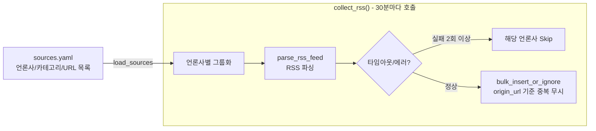
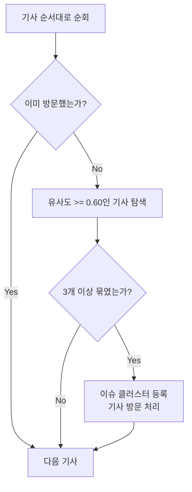

## 들어가며

|  |  |
|:---:|:---:|
| 연합뉴스 RSS | 뉴시스 RSS |

뉴스낵의 모든 콘텐츠는 언론사의 최신 뉴스 기사로부터 시작된다. AI 생성 품질은 입력 데이터의 품질에 직접적으로 의존하므로, 수집 파이프라인의 안정성과 정확성은 서비스 전체의 신뢰도와 직결된다.

이 글에서는 언론사 RSS 피드를 통해 기사를 주기적으로 수집하고, 이를 TF-IDF 기반 군집화로 이슈 단위로 압축하는 과정을 다룬다. 표면적으로는 URL에서 데이터를 꺼내오는 단순한 작업처럼 보이지만, 실제 운영 환경에서는 타임아웃 방어, 중복 방지, 포토뉴스 제거 등 다양한 방어 로직이 필요하다.

---

## 1부: 뉴스 기사 수집

### 전체 수집 흐름

수집 파이프라인의 전체 흐름은 다음과 같다.



핵심은 **세 가지 영역으로의 분리**다.

1. **설정(`sources.yaml`)**: 언론사별 RSS 피드 URL 목록을 코드 밖으로 분리해 코드 수정 없이 언론사를 추가·제거할 수 있다.
2. **파싱(`parse_rss_feed`)**: 단일 URL에서 기사를 추출하는 순수 로직. 타임아웃과 에러는 이 함수 밖에서 처리한다.
3. **저장(`bulk_insert_or_ignore`)**: DB 저장은 리포지토리 계층에 위임해 중복 방지 로직이 파싱 코드를 오염시키지 않는다.

### 언론사 목록 관리

수집 대상은 `sources.yaml` 파일 한 곳에서 관리한다.

```yaml
# newsnack_etl/collector/sources.yaml
- source: "연합뉴스"
  url: "https://www.yna.co.kr/rss/politics.xml"
  category: "정치"
- source: "뉴시스"
  url: "https://www.newsis.com/RSS/economy.xml"
  category: "경제"
# ...
```

`load_sources()` 함수는 이 파일을 읽어 딕셔너리 리스트로 반환한다. `importlib.resources`를 사용해 패키지 내부 리소스로 묶어 배포 후에도 경로 문제 없이 접근할 수 있도록 처리했다.

### 핵심 설계 결정: `feedparser` 단독 사용의 한계

초기에는 `feedparser.parse(url)`에 URL을 직접 넘기는 방식으로 구현했다. 이것이 `feedparser`의 가장 일반적인 사용법이다.

```python
# 초기 방식 (개선 전)
feed = feedparser.parse(url)
```

그런데 이 방식에는 치명적인 문제가 있다. `feedparser` 내부의 HTTP 클라이언트가 네트워크 통신을 처리하므로, **개발자가 `User-Agent`나 `Timeout`을 직접 제어할 수 없다.** 특정 언론사 서버가 응답을 수십 초 동안 보내지 않아도 `feedparser`는 무한정 기다린다.

이를 해결하기 위해 `requests.get()`을 선행 호출하는 방식으로 전환했다. 네트워크 통신의 제어권을 직접 가져온 것이다.

```python
# rss_parser.py (개선 후)
RSS_REQUEST_TIMEOUT_SECONDS = 10

USER_AGENT = {
    'User-Agent': 'Mozilla/5.0 (Windows NT 10.0; Win64; x64) ...'
}

def parse_rss_feed(url: str, source: str, category_id: int) -> List[Dict]:
    try:
        # 제어권을 requests로 가져와 User-Agent와 타임아웃을 명시적으로 지정
        resp = requests.get(url, headers=USER_AGENT, timeout=RSS_REQUEST_TIMEOUT_SECONDS)
        resp.raise_for_status()
        # 정상 응답받은 content를 feedparser로 파싱 (URL 아닌 content 전달)
        feed = feedparser.parse(resp.content)
    except Exception as e:
        logger.warning(f"[TIMEOUT/ERROR] {source} {url}: {e}")
        raise  # 상위 collect_rss()에서 실패 카운트 처리
    
    articles = []
    for entry in feed.entries:
        title = entry.get('title', '제목 없음')
        if is_photo_article(title):  # 포토뉴스 필터 (아래에서 설명)
            continue
        # ...
    return articles
```

### 중복 방지: `ON CONFLICT DO NOTHING`

RSS 피드는 30분마다 수집하는데, 언론사가 피드를 갱신하지 않으면 이전에 수집한 기사와 완전히 동일한 내용이 또 들어온다. 이를 DB 레벨에서 막기 위해 **`origin_url`에 Unique 제약**을 걸고, PostgreSQL의 `ON CONFLICT DO NOTHING`을 활용한다.

```python
# article_repository.py
def bulk_insert_or_ignore(self, articles: List[Dict[str, Any]]) -> int:
    stmt = insert(RawArticle).values(articles)
    # origin_url이 이미 존재하면 해당 행 삽입을 조용히 무시
    stmt = stmt.on_conflict_do_nothing(index_elements=['origin_url'])
    result = self.db.execute(stmt)
    return result.rowcount  # 실제로 삽입된 행 수만 반환
```

`collect_rss()` 내에서는 이 반환값으로 새로 추가된 기사 수와 스킵된(중복) 기사 수를 구분해 로그로 남긴다.

```
[INFO] Source: 연합뉴스 | New: 12 | Skip: 3 | Total: 15
[INFO] Source: 뉴시스    | New: 0  | Skip: 20 | Total: 20
```


### 트러블슈팅 1: 15분의 늪 — 언론사 단위 서킷 브레이킹

어느 날 DAG 실행 기록을 확인해보니 로컬에서 1분이면 끝나던 `news_collection_dag`가 15분 넘게 실행되는 것을 확인했다.


Airflow 로그를 분석하자 원인이 드러났다. 특정 언론사(프레시안)에서 요청이 지연되는 것이었다.

```
[2026-02-17, 02:00:33 UTC] {rss_parser.py:116} INFO - Collecting from 시사저널 - 국제...
[2026-02-17, 02:00:33 UTC] {rss_parser.py:133} INFO - Source: 시사저널 | New: 0 | Skip: 20 | Total: 20
[2026-02-17, 02:00:33 UTC] {rss_parser.py:116} INFO - Collecting from 프레시안 - 정치...
[2026-02-17, 02:02:44 UTC] {rss_parser.py:133} INFO - Source: 프레시안 | New: 0 | Skip: 0 | Total: 0
[2026-02-17, 02:02:44 UTC] {rss_parser.py:116} INFO - Collecting from 프레시안 - 경제...
[2026-02-17, 02:04:57 UTC] {rss_parser.py:133} INFO - Source: 프레시안 | New: 0 | Skip: 0 | Total: 0
[2026-02-17, 02:04:57 UTC] {rss_parser.py:116} INFO - Collecting from 프레시안 - 사회...
[2026-02-17, 02:07:10 UTC] {rss_parser.py:133} INFO - Source: 프레시안 | New: 0 | Skip: 0 | Total: 0
[2026-02-17, 02:07:10 UTC] {rss_parser.py:116} INFO - Collecting from 프레시안 - 문화...
[2026-02-17, 02:09:23 UTC] {rss_parser.py:133} INFO - Source: 프레시안 | New: 0 | Skip: 0 | Total: 0
[2026-02-17, 02:09:23 UTC] {rss_parser.py:116} INFO - Collecting from 프레시안 - 스포츠...
[2026-02-17, 02:11:36 UTC] {rss_parser.py:133} INFO - Source: 프레시안 | New: 0 | Skip: 0 | Total: 0
[2026-02-17, 02:11:36 UTC] {rss_parser.py:116} INFO - Collecting from 프레시안 - 국제...
[2026-02-17, 02:13:49 UTC] {rss_parser.py:133} INFO - Source: 프레시안 | New: 0 | Skip: 0 | Total: 0
[2026-02-17, 02:13:50 UTC] {rss_parser.py:116} INFO - Collecting from 뉴스토마토 - 정치...
[2026-02-17, 02:13:50 UTC] {rss_parser.py:133} INFO - Source: 뉴스토마토 | New: 0 | Skip: 70 | Total: 70
```

10초 타임아웃을 추가하였지만, 그것만으로는 부족했다. 카테고리가 10개인 언론사라면 타임아웃을 10번(100초)씩 대기해야 한다. 특정 출처에서 문제가 발생한 상황이라면, 나머지 카테고리 역시 동일한 결과가 예상되기 때문이다.

해법은 **언론사 단위의 서킷 브레이킹**이다. 한 언론사에서 연속 2회 실패가 발생하면 해당 언론사의 남은 카테고리를 즉시 스킵한다.

```python
# rss_parser.py — collect_rss() 내부
RSS_MAX_SOURCE_REQUEST_FAILS = 2

for source, src_list in sources_by_source.items():
    fail_count = 0
    for src in src_list:
        try:
            articles = parse_rss_feed(src['url'], src['source'], cat_id)
            ...
        except Exception:
            fail_count += 1
            logger.exception(f"Error processing {src['source']} (fail_count={fail_count})")
            if fail_count >= RSS_MAX_SOURCE_REQUEST_FAILS:
                logger.warning(f"{source}에서 {RSS_MAX_SOURCE_REQUEST_FAILS}회 이상 실패, 남은 카테고리 스킵")
                break  # 내부 루프 탈출 → 다음 언론사 그룹으로
        finally:
            time.sleep(0.1)  # 언론사 서버 부하 방지를 위한 인터벌
```


두 방어막(타임아웃 + 서킷 브레이킹)을 배포한 뒤, **15분이었던 DAG 소요 시간이 다시 1분대로 정상화**되었다.

### 트러블슈팅 2: 포토뉴스 오염 — 제목 기반 필터링

파이프라인을 운영하다 예상치 못한 문제가 발견됐다. **포토뉴스가 이슈로 뽑혀 AI 콘텐츠로 만들어진 것**이다.


|||
|이름이 같은 포토뉴스|포토뉴스 본문|

포토뉴스는 본문 텍스트가 없거나 단 몇 줄 수준이다. AI는 이 빈약한 원문을 토대로 기사를 작성해야 하므로 **사실과 다른 내용을 창작**해버린다. 실제로 특정 언론사의 포토뉴스 피드(`photo.xml`)가 기존 `sources.yaml`에 등록되어 있어 문제가 발생하고 있었다.

1차 대응은 해당 피드 URL을 `sources.yaml`에서 제거하는 것이었다. 하지만 포토뉴스는 일반 카테고리 피드에도 섞여 올라온다. 근본적인 해결책이 필요했다.

분석해보니 대부분의 포토뉴스는 제목이 패턴으로 시작한다는 공통점이 있었다.


```
[포토], [사진], (포토), [포토뉴스], [경향포토], [포토 종합], [포토에세이]
```

이를 정규식 필터로 파싱 단계에서부터 원천 차단했다.

```python
# rss_parser.py
PHOTO_ARTICLE_TITLE_PATTERNS = re.compile(
    r"^\[사진\]|^\[포토\]|^\(포토\)|"
    r"^\[포토뉴스\]|^\[경향포토\]|^\[포토 종합\]|^\[포토에세이\]"
)

def is_photo_article(title: str) -> bool:
    return bool(PHOTO_ARTICLE_TITLE_PATTERNS.match(title))
```

초기에는 정규식에서 대괄호(`[`, `]`)가 **문자셋**으로 해석되어 필터가 동작하지 않았다. 이스케이프 처리(`\[`, `\]`)로 해결했다. 이후 포토뉴스는 DB에 저장되지 않으며 이후 모든 처리에서 완전히 배제된다.

---

## 2부: 이슈 클러스터링

### 왜 군집화가 필요한가

수집 파이프라인이 매 30분마다 기사를 쌓는다면, 군집화 DAG(`issue_clustering_dag`)는 정해진 시간(조간·석간 직전)에 그 기사 풀을 소화하는 역할을 한다. 아무런 처리 없이 수집된 모든 기사를 AI에 넘기면 두 가지 문제가 생긴다.

- **중복 콘텐츠**: 같은 사건을 다루는 50개 기사가 모두 별개 콘텐츠로 만들어진다.
- **불필요한 API 비용**: 동일 내용에 LLM API를 50번 호출한다.

유사한 기사들을 하나의 **이슈**로 묶어 이슈 단위로 AI를 호출함으로써 이 두 문제를 동시에 해결한다.

### 전처리: 카테고리별 분할

바로 전체 기사를 유사도 연산에 넣으면 안 된다. '정치' 기사와 '연예' 기사에 우연히 같은 단어(예: "대통령")가 등장하면 엉뚱하게 묶일 수 있다.

가장 먼저 DB에서 꺼내온 기사를 카테고리별로 분리한다. 이후 같은 카테고리 내에서만 유사도 비교가 이루어진다.

```python
# 카테고리별로 기사 그룹화
from collections import defaultdict
articles_by_category = defaultdict(list)
for article in unissued_articles:
    articles_by_category[article.category_id].append(article)
```

### TF-IDF 벡터화

텍스트 유사도를 컴퓨터가 비교하려면 기사 제목을 숫자 벡터로 변환해야 한다. `scikit-learn`의 `TfidfVectorizer`를 사용했다.

단순 단어 빈도수(TF)만 쓰면 "오늘", "속보", "발표" 같이 모든 기사에 공통으로 등장하는 단어가 가장 높은 가중치를 갖게 되어 유사도 계산이 왜곡된다. **TF-IDF(Term Frequency-Inverse Document Frequency)** 는 여기에 역문서빈도(IDF) 가중치를 곱하여 특정 문서에서만 밀도 높게 등장하는 핵심 단어(예: "엔비디아", "금리 폭락")에 높은 점수를 준다.

```python
from sklearn.feature_extraction.text import TfidfVectorizer

titles = [article.title for article in articles]
# 2글자 이상 단어만 사용 (조사 등 불필요한 단음절 제거)
vectorizer = TfidfVectorizer(token_pattern=r'(?u)\b\w\w+\b')
tfidf_matrix = vectorizer.fit_transform(titles)
```

결과로 각 기사 제목이 `[0.0, 0.12, 0.0, 0.87, ...]` 형태의 실수 벡터로 변환된 `N × vocab_size` 행렬이 만들어진다.

### 코사인 유사도와 탐욕적 군집화

벡터 간 거리는 **코사인 유사도**로 측정한다. 두 벡터가 이루는 각도의 코사인 값으로, 1에 가까울수록 의미가 유사하다. 벡터의 크기가 다르더라도 방향만 같으면 유사하다고 판단하므로, 기사 길이의 차이에 영향받지 않는다는 것이 장점이다.

```python
from sklearn.metrics.pairwise import cosine_similarity
cosine_sim = cosine_similarity(tfidf_matrix)  # N × N 행렬
```

군집화 알고리즘은 **탐욕적(Greedy) 방식**을 택했다. K-Means처럼 수렴 조건을 만족할 때까지 반복 계산하는 알고리즘과 달리, 한 번의 선형 순회로 군집을 확정한다. 실시간 파이프라인에서 처리 속도가 중요하고, 뉴스 기사의 군집화에는 "유사 기사를 단일 패스로 묶는다"는 단순한 제약으로도 충분히 유효하다는 판단이었다.



```python
# clusterer.py
def cluster_articles_by_similarity(
    articles: List[RawArticle],
    threshold: float = 0.60,  # 유사도 임계값
    min_size: int = 3          # 최소 클러스터 크기
) -> List[List[RawArticle]]:

    titles = [a.title for a in articles]
    vectorizer = TfidfVectorizer(token_pattern=r'(?u)\b\w\w+\b')
    tfidf_matrix = vectorizer.fit_transform(titles)
    cosine_sim = cosine_similarity(tfidf_matrix)

    visited = [False] * len(articles)
    clusters = []

    for i in range(len(articles)):
        if visited[i]:
            continue

        similar_indices = [
            j for j, score in enumerate(cosine_sim[i])
            if score >= threshold and not visited[j]
        ]

        if len(similar_indices) >= min_size:
            clusters.append([articles[idx] for idx in similar_indices])
            for idx in similar_indices:
                visited[idx] = True

    return clusters
```

`threshold=0.60`, `min_size=3`은 실제 수집 데이터를 보며 조정한 값이다. 유사 기사가 3개 미만인 사건은 사회적 화제성이 낮아 이슈 콘텐츠로 만들 필요가 없다고 판단했다.

### DB 반영: 이슈 등록과 기사 연결

군집화 결과는 두 단계로 DB에 반영된다.

1. `issue` 테이블에 새 이슈 레코드를 `INSERT`한다.
2. 군집에 묶인 기사들의 `issue_id` 외래키를 방금 생성된 이슈 ID로 일괄 `UPDATE`한다.

```python
# issue_repository.py (핵심 로직)
for cluster in clusters:
    # 1. 이슈 생성
    new_issue = Issue(category_id=cluster[0].category_id, ...)
    db.add(new_issue)
    db.flush()  # ID를 바로 얻기 위해 flush

    # 2. 연관 기사 일괄 업데이트
    article_ids = [a.id for a in cluster]
    article_repo.link_articles_to_issue(article_ids, new_issue.id)
```

이로써 흩어져 있던 기사 풀이 소수의 이슈로 압축된다. 이후 파이프라인(`content_generation_dag`)은 이 이슈 단위로 AI 서버에 콘텐츠 생성을 요청한다.


## 마치며

수집 파이프라인은 눈에 보이지는 않지만 전체 서비스 품질을 좌우한다. 타임아웃 방어와 서킷 브레이킹은 외부 시스템(언론사 서버)의 불안정성이 우리 파이프라인을 멈추지 못하도록 하고, 포토뉴스 필터는 AI가 허위 사실을 만들어낼 가능성을 원천 차단한다. 그 위에 TF-IDF 군집화로 중복을 제거함으로써 AI 서버는 정제된 이슈 데이터만을 받아 안정적이고 효율적으로 동작할 수 있는 구조가 완성된다.
