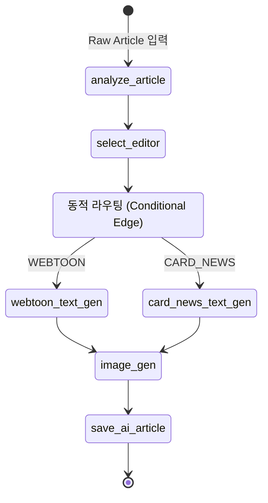

> 이 글은 뉴스낵 AI 엔진의 두 가지 주요 워크플로우 중 **AI 기사 작성 워크플로우**의 구축 과정을 설명합니다.


_뉴스낵 첫 화면_

## 들어가며

뉴스낵은 Airflow 기반의 파이프라인을 통해 매일 다양한 언론사에서 수집된 기사들을 유사한 내용끼리 묶어 '이슈' 단위로 관리한다. AI 엔진은 이렇게 묶인 기사들을 토대로 뉴스툰이나 오늘의 뉴스낵을 생성하는 기능을 제공한다. 

개발 초기에는 단순한 프롬프트 호출만으로 이 과정을 구현하려고 했으나, 뉴스의 유형에 따라 다른 처리가 필요해지고 생성 단계도 복잡해지면서 기존 방식으로는 명확한 한계를 느꼈다.

## 배경 및 의사결정

제일 먼저 고려했던 방법은 Gemini SDK 다이렉트 호출이나 LangChain 체인이었다. 이 방법들은 단순한 플로우에서는 적합했지만 뉴스낵 엔진은 보다 다차원적인 플로우를 요구했다.

1. **조건부 분기:** 수집된 뉴스의 카테고리와 특성을 스스로 판단한 후, 해당 기사를 '웹툰 로직'으로 보낼지 '카드뉴스 로직'으로 보낼지 동적으로 라우팅해야 했다.

    |  |  |
    |:---:|:---:|
    | 카드뉴스 예시 | 웹툰 예시 |

2. **데이터 관리의 유연성:** 콘텐츠 생성 과정에서는 기사 제목, 기사 본문, 기사 카테고리 등의 초기 데이터 뿐 아니라, 각 단계에서 생성되는 중간 결과물들을 효율적으로 관리해야 했다.

이러한 두 가지 상이하고 복잡한 요구사항을 하나의 프레임워크에서 관리하기 위해, AI 워크플로우를 효율적으로 제어할 수 있는 **LangGraph(StateGraph)**를 메인 오케스트레이터로 도입했다. 모든 데이터는 하나의 `State` 객체를 통해 교환하도록 강제하여 로직이 엉키는 것을 방지했다.
  

본 포스팅에서는 이 중 첫 번째 과제였던 **동적 분기 중심의 'AI 기사 워크플로우'**가 어떠한 시스템 흐름을 거쳐 동작하며, 각 단계에서 어떤 기술적 고민을 해결했는지 다룬다.

---

## 핵심 구조: Graph State와 워크플로우 아키텍처

AI 기사 작성 워크플로우는 기사를 분석하여 에디터를 배정받고, 대본을 작성한 뒤 이미지 생성을 거치는 일련의 흐름이다. 가장 먼저 설계한 부분은 워크플로우를 관통하는 상태(`State`)와 노드 간의 **조건부 라우팅 설정**이었다. 전체 워크플로우는 다음과 같다.



단순히 `if-else` 코드 블록으로 제어하던 기존 방식에서 벗어나 노드와 엣지(Edge)로 역할을 명확히 격리함으로써, 훗날 새로운 포맷의 콘텐츠를 추가할 때도 그래프에 노드 하나만 새로 연결하면 되는 높은 확장성을 확보했다.

## 워크플로우 주요 과정

### **0단계: 편향성 제거를 위한 컨텍스트 병합**

|||
|:---:|:---:|
|정치 기사 예시 1|정치 기사 예시 2|

워크플로우 처리에 앞서 해결해야 할 도메인적인 고민이 있었다. AXZ와의 미팅과 멘토링 과정에서 "단일 기사 기반으로 콘텐츠를 생성하면, 특정 언론사와 기자의 견해로 인해 **콘텐츠에 편향성**이 짙어질 수 있다"는 우려사항이 여러 차례 제기되었다.

우리 팀은 콘텐츠의 중립성을 확보하기 위해 로직을 변경했다. AI에 기사 1편을 주입하는 것이 아니라, 해당 '이슈'에 속한 다양한 언론사의 기사들을 모두 활용하도록 했다. 워크플로우를 시작하기 전, 조회된 여러 기사의 본문을 하나의 거대한 텍스트로 합치는 전략을 취했다.

```python
# app/services/workflow_service.py

# 이슈 및 관련 기사 조회
issue = db.query(Issue).filter(Issue.id == issue_id).first()
raw_articles = issue.articles

# 모든 기사의 본문을 하나로 통합
merged_content = "\n\n---\n\n".join([
    f"기사 제목: {article.title}\n본문: {article.content}"
    for article in raw_articles
])
```

이렇게 다양한 소스를 통합하고 LLM이 교차 검증함으로써 특정 시각에 치우치지 않은 객관적인 콘텐츠를 작성할 수 있게 되었다.

### **1단계: 기사 분석 및 동적 라우팅** (`analyze_article_node`)

워크플로우의 시작점인 `analyze_article` 노드는 유입된 원본 기사의 본문을 읽고, 이를 바탕으로 짧은 요약문과 최종 제목을 생성하는 역할을 담당한다. 

가장 중요한 역할은 해당 기사가 서사성이 짙은 **웹툰**에 어울리는지, 아니면 정보 전달 성격이 짙은 **카드뉴스**에 어울리는지 분류(`content_type`)하는 것이다. 노드의 반환값에 따라 그래프의 흐름을 가르는 라우팅 엣지를 시스템에 등록했다.

```python
# app/engine/graph.py
workflow.add_conditional_edges(
    "select_editor",
    # 노드에서 식별해낸 콘텐츠 타입에 따라 다음 실행 노드를 동적으로 결정
    lambda x: "webtoon" if x["content_type"] == "WEBTOON" else "card_news",
    {"webtoon": "webtoon_text_gen", "card_news": "card_news_text_gen"}
)
```

### 2단계: **페르소나 주입 및 대본 작성** (`webtoon_text_creator_node`)

기사 분석이 끝나고 에디터까지 배정받고 나면, 실제 대본을 작성하는 노드에 진입한다. 취합할 내용이 길고 다양한 종류의 프롬프트가 주입되는 이 단계에서는 **프롬프트 관리의 일관성 유지와 LLM의 환각 현상** 방어가 핵심 과제였다.

#### 프롬프트 관심사 분리 (DB vs Code)
당초 시스템의 모든 프롬프트를 DB로 관리하려 했다. 그러나 "3줄로 팩트만 요약해 줘" 같은 기능 집중형 프롬프트는 본질적으로 소스코드 안의 로직(`summarize()`)과 다를 바 없다. 결과적으로 우리는 프롬프트 관리를 이원화했다.
- **페르소나 프롬프트 (에디터 말투, 성향):** A/B 테스트 및 비개발자 운영이 쉽도록 DB(`Editor` 테이블)에서 관리.
- **기능 프롬프트 (요약, 추출 로직):** Git을 통한 형상 관리 및 즉각 롤백을 위해 코드 레포지토리(`app/config/prompts/`)에서 관리.

#### 구조적 출력(Structured Output)으로 형식 파괴 방어
에디터의 말투를 주입해 대본을 생성할 때, 독자에게 보여줄 **'한국어 대사'**와, 다음 노드에서 이미지를 생성할 때 쓸 **'영어 시각 묘사(프롬프트)'**를 한 번에 지시했다. 그러자 한글과 영어가 뒤섞이거나, JSON 포맷을 깨뜨리는 환각이 빈번하게 발생했다. 

이를 방어하기 위해 Pydantic 모델과 LangChain의 `with_structured_output`을 결합하여 엄격한 규격을 강제했다.

```python
# app/engine/nodes.py
from pydantic import BaseModel

class EditorContentResponse(BaseModel):
    final_body: str          # 한국어 대사 (서비스 노출용)
    image_prompts: list[str] # 영어 이미지 묘사 명령 (다음 노드 전달용)

editor_llm = llm.with_structured_output(EditorContentResponse)

async def webtoon_text_creator_node(state: AiArticleState):
    # DB에서 관리되는 에디터 말투와, 코드에서 관리되는 지시문을 조합 결합
    template = create_webtoon_template(state['editor']['persona_prompt'])
    
    formatted_messages = template.format_messages(
        title=state['final_title'], content=state['raw_article_context']
    )

    # 텍스트가 아닌, Pydantic으로 제약된 구조화된 JSON 응답값을 안전하게 반환받음
    response = await editor_llm.ainvoke(formatted_messages)

    return {
        "final_body": response.final_body,
        "image_prompts": response.image_prompts
    }
```
결론적으로 AI가 어떠한 수식어를 동원해 답변하려 하더라도, 미리 강제한 구조에 맞게만 결과를 파싱하여 반환받도록 형식의 안정성을 높일 수 있었다.

### **3단계: 병렬 이미지 처리와 롤백 전략** (`image_gen_node`)

텍스트 생성을 무사히 통과한 데이터는 마지막 관문인 이미지 생성 노드에 도착한다. 웹툰이나 카드뉴스에 들어갈 4컷 이미지를 한 장씩 순차적으로 그리면 응답 속도가 크게 낮아지므로, 비동기 병렬 처리 구문(`asyncio.gather`)을 사용했다.

```
ERROR: 12:10:05 - app.engine.nodes - Error generating image 3: 'NoneType' object is not iterable
```

이때 직면한 치명적인 문제는 바로 **부분 성공**이었다. 외부 모델의 타임아웃 등으로 4장 중 1장이라도 실패할 경우, 제대로 처리되지 않은 3장짜리 반쪽짜리 콘텐츠만으로 워크플로우가 종료되며 **서비스에 불완전한 콘텐츠가 노출**되었다.

이를 막기 위해 외부 리소스를 호출하는 레이어와 LangGraph 노드 간의 예외 통제 기준을 아래와 같이 강력하게 재설계했다.

```python
# app/engine/tasks/image.py
async def generate_images(state: AiArticleState):
    tasks = [
        generate_image_task(prompts[i]) 
        for i in range(4)
    ]
    
    # 1. 4장의 이미지를 비동기로 동시에 요청(return_exceptions=True 로 전체 중단 방지)
    results = await asyncio.gather(*tasks, return_exceptions=True)

    for i, result in enumerate(results):
        if isinstance(result, Exception):
            # 2. 한 장이라도 예외(Exception)라면 예외를 Throw하여, 워크플로우 자체를 즉시 실패/롤백 처리
            raise ValueError(f"이미지 {i} 생성 실패: {result}") from result
        images.append(result)
        
    # 3. 모든 생성 검증이 끝난 후 스토리지 지연 업로드
    return {"image_urls": images}
```

- **부분 실패 배제 및 전체 롤백:** 4컷이 온전한 한 세트가 아니면 아예 등록되지 못하도록 에러를 발생시키고 워크플로우 실행을 멈춰 안정적인 트랜잭션을 담보했다.
- **지능적 재시도 로직 확충:** 단순히 한 번 실패했다고 워크플로우를 롤백해버리면, 통신 문제 한 번에 앞서 진행한 텍스트 생성 비용까지 모두 버려진다. 이를 막기 위해 이미지 통신 레이어에는 지수적 백오프 기반의 재시도 데코레이터를 적용하여 일시적 장애는 스스로 수용할 수 있게 완충 지대를 두었다.
- **지연 동기화 처리:** 한 장이 만들어질 때마다 무작정 S3에 올리면 뒷단에서 에러가 났을 때 공간만 낭비하는 찌꺼기 파일이 생긴다. 파일 저장은 4장의 이미지 배열이 메모리에 온전히 수집된 성공 시점에만 수행하도록 순서를 지연시켜 리소스 낭비를 막았다.

### **최종 결과**

|||
|:---:|:---:|
|원본기사 1|원본기사 2|

위와 같은 원본 기사에 대해 워크플로우를 거쳐 아래와 같은 결과물이 생성되었다.

|||
|||

## 마치며

결론적으로, 뉴스낵의 AI 기사 작성 워커플로우는 복잡한 다중 분기 로직을 노드 형태로 명확하게 제어할 수 있게 되었다. 나아가 각 단계에서 발생할 수 있는 환각 문제나 통신 실패를 상태(State)와 예외 처리를 통해 하나의 트랜잭션 단위로 묶어내며 시스템의 전체적인 안정성을 크게 높였다.

분기형 로직을 안정적으로 구성한 이후에는 앞선 기사들을 다시 모아 오디오 브리핑으로 통합해야 하는 과제가 남아있었다. 다음 포스팅에서는 해당 작업인 '오늘의 뉴스낵 생성 워크플로우'에 대한 설계와 오디오 타임라인 최적화 과정을 다룰 계획이다.

## 참고 자료

- [LangGraph 공식 문서](https://docs.langchain.com/oss/python/langgraph/overview)
- [LangChain 공식 문서 - Structured Output](https://docs.langchain.com/oss/python/langchain/structured-output)
- [Gemini 공식 문서 - Image Generation](https://ai.google.dev/gemini-api/docs/image-generation)
