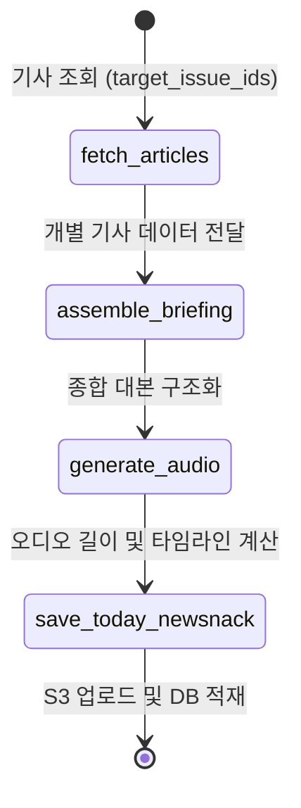

> [**이전 글**](../newsnack-langgraph-workflow-1)에서 이어지는 글입니다. 이 글은 **오늘의 뉴스낵 생성 워크플로우** 구축기를 다룹니다.

## 들어가며

이전 포스팅에서 다루었던 AI 기사 작성 워크플로우가 동적인 분기 중심이었다면, 이번에 다룰 '오늘의 뉴스낵' 워크플로우는 **여러 기사를 하나로 통합**하는 흐름에 초점을 맞추고 있다.

오늘의 뉴스낵은 사용자가 선택한 여러 개의 뉴스 기사들을 모아 하나의 자연스러운 **오디오 브리핑**으로 생성해 제공하는 핵심 기능이다. 이 과정에서 여러 개의 텍스트를 어떻게 효율적으로 하나의 음성으로 엮어낼 것인지, 그리고 클라이언트에게 재생 구간(타임라인)을 어떻게 정확하게 제공할 것인지에 대한 설계 및 기술적 고민을 순차적으로 담았다.

## 핵심 구조: Graph State 정의 및 통합 설계

분기가 중심이었던 1편의 워크플로우와 달리, 오늘의 뉴스낵 워크플로우는 단방향 흐름을 가진다. 우선 이 흐름을 제어하기 위해 `TodayNewsnackState` 상태 객체를 정의했다. 5건의 분절된 기사 데이터(`target_issue_ids`)가 이 파이프라인을 관통하며 한 편의 통합된 대본(`briefing_segments`)과 전체 오디오 데이터(`total_audio_bytes`)로 만들어진다.



이 모든 데이터 흐름은 LangGraph의 `State`를 통해 안전하게 파이프라인 상에서 공유되며, 예외 시 언제든 롤백이 가능하도록 제어된다.

## 1단계: 개별 기사 데이터 조회 (`fetch_articles`)

파이프라인의 시작점이다. API로부터 받은 대상 기사의 식별자 리스트(`target_issue_ids`)를 기반으로 DB에 접근하여 실제 기사 정보를 조회한다. 

이때 누락된 기사가 없는지 검증한 후, 다음 대본 생성 노드(`assemble_briefing`)가 원활하게 정보를 합칠 수 있도록 각 기사의 내용을 리스트 형태로 묶어 상태 객체에 주입한다.

## 2단계: 종합 대본 구조화 (`assemble_briefing`)

이제 배정받은 여러 기사를 모아 자연스러운 하나의 대본으로 재구성할 차례다. 하지만 여러 기사를 한 번에 프롬프트로 주입하면 LLM은 다음과 같은 환각 현상에 빠지곤 했다.

- **데이터 섞임 현상:** A 기사와 B 기사의 내용이 교차 오염됨.
- **누락 현상:** 5개의 기사 중 일부 덜 중요한 기사를 임의로 생략함.

이러한 포맷 파괴 현상을 통제하기 위해, 1편(AI 기사 워크플로우)에서 활용했던 Pydantic 기반의 구조적 출력(`with_structured_output`)을 다시 꺼내 들었다. 모델은 응답할 때 반드시 원본 기사의 고유 식별자(`article_id`)를 기준으로 매핑된 각 대본(`script`)을 리스트 형태로 반환하도록 규격화했다.

```python
# app/engine/schemas.py
class BriefingSegment(BaseModel):
    article_id: int
    script: str  # 아나운서가 읽을 자연스러운 대본 스크립트

class BriefingResponse(BaseModel):
    segments: list[BriefingSegment]
```

이를 통해 입력받은 정보의 개수와 출력하는 결과 구간의 수를 강제로 1:1 대응시켜, 데이터가 누락되거나 포맷이 깨질 가능성을 아키텍처 레벨에서 차단했다.

## 3단계: TTS 단일 호출과 타임라인 역산 (`generate_audio`)


압축된 대본들을 어떻게 이질감 없이 하나의 오디오로 변환할 것인가가 이번 워크플로우 최적화의 핵심 구간이다. 클라이언트는 오디오 브리핑에서 현재 말하고 있는 기사의 썸네일을 화면에 띄워줘야했다. 이를 위해서는 전체 시간 중 **기사별 재생 시간 (시작/종료 타임라인)** 값이 필수적이었다.

### 기존 대안 (다중 호출 방식)
처음에는 단순하게 **기사마다 TTS API를 호출해서 만들어진 여러 오디오 파일들의 길이를 더한 뒤, 서버에서 하나로 이어 붙이는** 방식(대안 A)을 생각했다.

하지만 이 방식에는 문제가 있었다. 여러 번의 API 호출로 인한 네트워크 비용 문제를 차치하더라도, 각 발화가 개별적으로 처리되면서 기사들 사이의 **목소리 톤**이 달라지고 **맥락의 흐름**이 끊기며 부자연스러웠다. 대본에 타임스탬프를 명시한 후 TTS API 호출 시에 해당 시간대로 발화하도록 요청하는 방식(대안 B) 역시 TTS 모델이 요청을 제대로 처리하지 못하여 채택할 수 없었다.

### 최적화 솔루션: 글자 수 비율 기반 '타임라인 역산'
결과물의 부자연스러움을 막기 위해 **"전체 대본을 하나로 통합하여 TTS를 단 1번만 호출한다"**는 제약 조건을 세웠다. 필연적으로 개별 구간을 구분할 기준점이 사라지게 되었지만, 이를 비율에 따른 **역산 계산** 알고리즘으로 해결했다.

어차피 텍스트를 읽는 속도는 본문의 길이에 철저히 비례한다. 따라서 반환된 전체 오디오 길이에 대해, 각 기사의 텍스트 비중을 구하여 곱해주기만 하면 되었다. 오차율을 줄이기 위해 단순 문자열 길이가 아니라 **소리 나지 않는 띄어쓰기(공백)를 제거한 순수 글자 수 기준**으로 비중을 나누었다.

```python
# app/utils/audio.py
def calculate_article_timelines(briefing_segments: list, total_duration: float):
    # 1. 공백을 제외한 순수 발화 글자 수 기반 가중치 기준 마련
    total_chars = sum(len(segment['script'].replace(" ", "")) for segment in briefing_segments)
    
    current_time = 0.0
    final_briefing_articles = []
    
    for segment in briefing_segments:
        # 2. 해당 기사의 글자 수 비중 계산
        pure_script = segment['script'].replace(" ", "")
        char_ratio = len(pure_script) / total_chars if total_chars > 0 else 0
        
        # 3. 비중에 따른 개별 소요 시간(Duration) 할당
        duration = total_duration * char_ratio
        
        # ... 타임라인 할당 및 누적 시간 갱신 로직 생략
        current_time += duration
        
    return final_briefing_articles
```

### 인메모리 기반 오디오 길이 계산
위 역산 계산식을 수행하기 위해서는 반드시 "전체 오디오 누적 길이(`total_duration`)"를 측정해야 했다. 이를 알아내고자 오디오를 로컬 디스크에 임시 저장했다가 다시 읽는 방식은 큰 파일 I/O 병목을 유발했다. 우리는 API로부터 수신한 바이너리 바이트 데이터를 직접 `io.BytesIO` 파싱하여 메모리 상에서 바로 길이를 반환하도록 로직을 단축했다.

```python
def get_audio_duration_from_bytes(audio_bytes: bytes, format="mp3") -> float:
    """디스크 I/O를 배제하고 바이너리 데이터로부터 직접 오디오 길이를 측정"""
    audio = AudioSegment.from_file(io.BytesIO(audio_bytes), format=format)
    return len(audio) / 1000.0  # ms 단위를 초 단위로 변환해 반환
```

결과적으로 전체 맥락이 부드럽게 이어지는 쾌적한 오디오를 제공하면서도, API 추가 통신 없이 기사별 정확한 재생 구간을 클라이언트에게 보장할 수 있었다.

```json
[
   {
      "title":"코스피 5300대 강보합 마감",
      "start_time":0.0,
      "end_time":33.4,
      "article_id":103,
      "thumbnail_url":"https://example.com/images/test0/0.png"
   },
   {
      "title":"한미, 특위 구성에 관세 해법 찾나",
      "start_time":33.4,
      "end_time":65.63,
      "article_id":101,
      "thumbnail_url":"https://example.com/images/test1/0.png"
   },
   {
      "title":"LG家 구연경·윤관, 미공개 정보 주식거래 1심 무죄",
      "start_time":65.63,
      "end_time":96.01,
      "article_id":99,
      "thumbnail_url":"https://example.com/images/test2/0.png"
   }
]
```

## 4단계: 리소스 최적화 및 적재 지연 (`save_today_newsnack`)

앞선 파이프라인이 진행되는 도중, 예기치 못한 노드 통신 에러가 발생할 가능성에 대비해야 했다. 

아마존 S3와 같은 외부 스토리지 업로드나 DB 쓰기 작업이 중간 노드에서 먼저 성급히 이루어지는 것을 설계 단계에서 차단했다. 모든 데이터 가공은 메모리 인스턴스 상호 간의 `State`로만 교환되며, 프로세스가 100% 무사히 완료된 최종 관문(`save_today_newsnack`)에서만 일괄적으로 파일 업로드와 트랜잭션을 실행하도록 적재 시점을 지연시켰다.


_완성된 오늘의 뉴스낵_

## 마치며

오늘의 뉴스낵 생성 파이프라인을 고도화하면서, 통일된 목소리로 맥락을 이어나가는 고품질의 브리핑을 위해 '단일 호출' 방식을 고수했다. 이로 인해 필연적으로 따라왔던 기사별 구간 정보 이탈 문제는 '순수 발화 글자 수 기반 역산 분배'라는 수학적 방법으로 해결했다. 

분기 처리가 중심이었던 1편의 AI 기사 작성 워크플로우부터, 파편화된 데이터를 하나로 결합하는 이번 오늘의 뉴스낵 생성 워크플로우까지. 이 모든 과정을 통해 LangGraph의 상태 기반 시스템 모델링이 거대한 입출력 파이프라인의 데이터 흐름을 얼마나 직관적이고 견고하게 제어할 수 있는지를 체감했다.

## 참고 자료

- [Gemini API - Text to Speech](https://ai.google.dev/gemini-api/docs/speech-generation)
