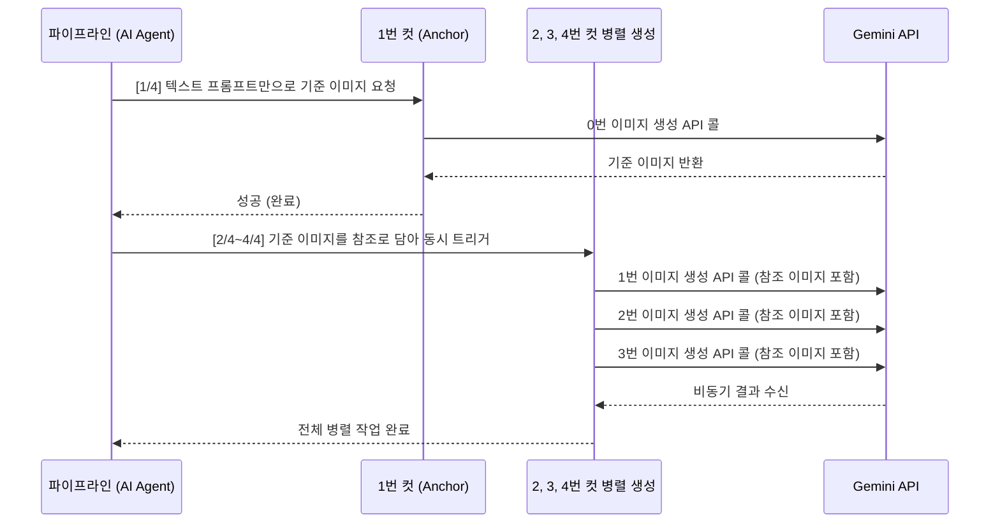

## 들어가며


_AI에게 4장을 요청했더니 만들어낸 1장의 4컷 만화_

뉴스낵은 기사 본문을 바탕으로 AI가 상황에 맞는 4컷짜리 뉴스툰(웹툰, 카드뉴스)를 그려낸다. 하지만 단순히 LLM에게 "만화 4장을 그려달라"고 요청하면 4장 미만의 이미지가 생성되는 경우가 허다했다.

그렇다면 각각의 장면 프롬프트 4개를 따로 처리하면 어떨까? 하지만 이 방식은 다른 문제를 야기한다. AI는 호출마다 무작위 시드(Seed)를 사용하기 때문에 웹툰 1컷의 캐릭터가 2컷에서는 다른 사람으로 변해버리거나 카드뉴스의 배경 색상과 폰트가 달라지는 **작화 일관성 결여** 문제가 발생한다.

|||
|||

결국 '컷 간의 작화 통일'과 '빠른 속도'를 모두 잡기 위해 비동기 병렬 구조의 이미지 생성 전략을 고민하게 되었다.

## 문제 상황: 병렬과 순차 사이의 딜레마

작화 불일치 문제를 막는 가장 단순한 방법은, 웹툰 이미지를 순차적으로 생성하며 앞선 이미지를 기반으로 다음 이미지를 그리게 하는 것이다. 최신 모델인 `gemini-3-pro-image-preview`가 최대 14개의 이미지를 컨텍스트(Reference)로 인식하고 스타일을 복제할 수 있다는 사실을 알고 이 방법을 사용하기로 했다.
  
하지만 4장을 **순차적으로 생성**하면 장당 약 1분이 소요되어, 결과적으로 전체 4분 이상을 소모하는 병목이 발생했다. 대량의 뉴스를 처리해야 하는 데이터 파이프라인에서 단일 기사의 이미지 4장에 4분씩 소요되는 성능은 현실적으로 서비스에 적용하기 어려웠다.

## 해결 방법: 하이브리드 전략 (1장 선생성 + 3장 병렬 생성)

이러한 성능 병목을 해결하기 위해, 순차 생성과 병렬 생성의 장점만을 취합하는 **'1장 생성 후 3장 참조 병렬 생성'**이라는 하이브리드 아키텍처를 도입했다.



동작 방식은 다음과 같다.
1. 가장 첫 번째 장면은 순수하게 텍스트 프롬프트만 주입하여 기준이 되는 앵커 이미지(Anchor Image)를 먼저 생성한다.
2. 앵커 이미지 생성이 완료되면, 해당 이미지를 메모리 상에서 2~4번 컷의 입력값에 주입한다.
3. 이후 2, 3, 4번 이미지는 `asyncio.gather`를 통해 **비동기로 동시에(병렬) API를 호출한다.**

```python
# app/engine/nodes/ai_article.py (image_gen_node 내부)
async def image_gen_node(state: AiArticleState):
    prompts = state['image_prompts']

    # 1. 앵커(Anchor) 이미지 선행 생성
    anchor_image = await generate_google_image_task(
        0, prompts[0], content_type,
        ref_image=agent_ref_image
    )

    images = [anchor_image]

    # 2. 앵커 이미지를 참조로 삼아 나머지 3장 병렬 생성
    tasks = [
        generate_google_image_task(
            i, prompts[i], content_type,
            ref_image=anchor_image
        )
        for i in range(1, 4)
    ]
    results = await asyncio.gather(*tasks, return_exceptions=True)
    images.extend(results)

    return {"images": images}
```

이 구조를 채택한 덕분에, 기준점을 공유하여 그림체가 통일된 뉴스툰 컷을 보장하면서도, 총 소요 시간을 순차 생성 대비 절반 수준으로 단축할 수 있었다.

|||
|---|---|
|||

## 동시성 제어: API 과부하 회피와 Semaphore

병렬 처리를 적용하면서 마주친 또 다른 문제는 구글 측의 **Rate Limit**과 일시적인 서버 과부하(`503 UNAVAILABLE`)였다.

여러 기사에 대한 AI 기사 생성 요청이 동시에 들어오면, 각각의 생성 태스크가 `asyncio.gather`를 통해 3장의 이미지를 한 번에 병렬로 요청하므로 순간적으로 구글 API 서버에 과도한 트래픽이 집중되었다.

```text
ERROR: 11:56:42 - app.engine.tasks.image - Error generating image 0: 503 UNAVAILABLE. {'error': {'code': 503, 'message': 'This model is currently experiencing high demand. Spikes in demand are usually temporary. Please try again later.', 'status': 'UNAVAILABLE'}}
```

이를 제어하기 위해 `asyncio.Semaphore`를 도입했다. 세마포어는 특정 리소스에 동시에 접근할 수 있는 코루틴 수를 제한하는 동기화 도구다. `async with _image_semaphore:` 블록 안으로 진입하려면 반드시 허용된 슬롯이 비어 있어야 하며, 이를 초과하는 요청은 자동으로 대기(`await`)한다.

```python
# app/engine/tasks/image.py

# 서버 전체에서 동시에 Image API를 점유할 수 있는 최대 코루틴 수를 3으로 제한
_image_semaphore = asyncio.Semaphore(3)

async def generate_google_image_task(idx: int, prompt: str, ...) -> Image.Image:
    # Semaphore가 허용하는 슬롯이 빌 때까지 대기 후 진입
    async with _image_semaphore:
        @retry(
            stop=stop_after_attempt(3),
            wait=wait_exponential(multiplier=1, min=2, max=10),
            retry=retry_if_exception_type((ServiceUnavailable, ValueError)),
            reraise=True
        )
        async def _call_api():
            response = await client.aio.models.generate_images(...)
            # 빈 응답(Silent Failure)을 명시적으로 감지하여 재시도 유도
            if not response.parts:
                raise ValueError(f"Gemini API returned empty parts for image {idx}.")
            return response

        return await _call_api()
```

세마포어를 통해 서버 내에서 동시에 API를 점유할 수 있는 코루틴 개수를 물리적으로 제한했다. 동시다발적인 병렬 요청이 발생하더라도, 애플리케이션 내부에서 요청 속도를 조절하여 안정적으로 API를 호출할 수 있게 되었다. `@retry` 데코레이터를 통한 지수 백오프(Exponential Backoff) 재시도 로직과 결합하여, `503` 오류가 발생하더라도 자동으로 재시도하여 최종 성공률을 높였다.

## 부록: S3 저장 경로 설계 — UUID vs 대표 기사 ID

이미지 생성 파이프라인을 설계하면서 한 가지 추가 고민이 생겼다. **AI가 생성한 이미지들을 S3에 저장할 때 폴더(Key) 이름을 뭘로 쓸 것인가?**

간단한 방법은 "원본 기사들 중 대표 기사의 ID"를 매핑하여 폴더명으로 쓰는 것이다. 하지만 이 방식은 몇 가지 문제를 야기한다.

- **논리적 불일치**: 여러 기사를 취합하여 생성한 새로운 콘텐츠임에도 불구하고, 단일 기사 ID를 사용하면 해당 콘텐츠가 하나의 기사에만 종속된 것으로 오해를 유발할 수 있다.
- **중복 및 충돌 가능성**: 동일한 기사가 다른 이슈에 포함될 경우 폴더명이 충돌하여 기존 이미지가 덮어씌워질 위험이 존재한다.
- **높은 결합도**: AI 콘텐츠의 생명주기가 원본 기사 ID에 강하게 결합된다. 원본 데이터가 데이터 웨어하우스(e.g., BigQuery)로 이관되거나 삭제될 경우 관리가 복잡해진다.

대안으로 **UUID 기반 Key 네이밍**을 채택했다. 콘텐츠 생성이 시작되는 시점에 UUID를 하나 발급하고, 이를 해당 AI 콘텐츠의 식별자로 삼는 방식이다.

```python
import uuid

content_uuid = str(uuid.uuid4())

# S3 저장 시: images/{uuid}/0.png
```

이로써 AI 콘텐츠는 원본 기사와 완전히 독립된 고유성을 갖게 되었다. 추후 날짜 Prefix(`{yyyy}/{mm}/{dd}/`)를 UUID 앞에 붙이면 데이터가 수십만 건이 쌓여도 특정 날짜의 이미지만 빠르게 조회하거나 관리할 수 있을 것이다(S3 파티셔닝).

## 마치며

이 과정을 통해 AI 엔진은 화풍의 일관성을 유지하면서도 전체 이미지 생성 속도를 크게 개선할 수 있었다.

단순한 AI 프롬프트 설계를 넘어 비동기 동시성 제어 로직을 결합하여 성능 병목 현상을 해결했다. 특히 `asyncio.Semaphore`를 활용하여 외부 API 호출 속도를 제어하고 서버의 안정성을 높이는 세밀한 리소스 관리가 대규모 데이터 파이프라인 구축에 필수적이라는 점을 확인했다.

## 참고 자료

- [Gemini API - Image Generation](https://ai.google.dev/gemini-api/docs/image-generation)
- [Python - Synchronization Primitives](https://docs.python.org/3/library/asyncio-sync.html)
