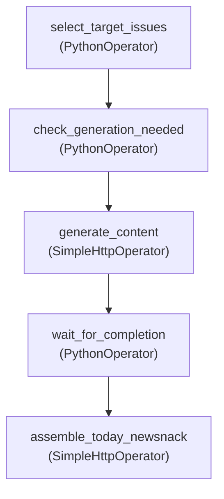

## 들어가며


뉴스낵은 매시간 언론사 RSS를 수집하고, 매일 2회 기사들을 바탕으로 상위 이슈를 선별하고, 각 이슈들에 대한 AI 기사(뉴스툰)를 만든 후, 최종적으로 오늘의 뉴스낵까지 만드는 **긴 호흡의 데이터 생성 프로세스**를 거친다.

초기에는 단순 Linux `Cron` 스크립트나 FastAPI의 백그라운드 태스크로 구동하려 했으나 여러 한계에 직면했다.
수많은 배치 작업 중 **어떤 단계에서 에러가 터졌는지 추적**하기 어려웠고, 선행 작업(AI 기사 생성)이 완료되지도 않았는데 후행 작업(오늘의 뉴스낵 생성)이 실행되는 등 **태스크 간의 선후행 조건 제어**가 불가능했다. 또한 간헐적인 네트워크 오류에 대비한 **재시도 로직**을 일일이 하드코딩해야 하는 운영 리소스의 낭비가 심각했다.


이러한 이유로 파이프라인의 시각화와 에러 복구를 체계적으로 지원하는 워크플로우 오케스트레이션 프레임워크인 **Apache Airflow**를 전격 도입했다. 이 글에서는 Airflow를 활용해 뉴스낵의 **콘텐츠 생성 파이프라인**을 설계한 과정을 정리한다.


## 설계 원칙: 관리자(Airflow)와 작업자(FastAPI)의 구분


_시스템 아키텍처 중 일부 (Airflow와 FastAPI의 관계)_

Airflow 도입을 결정하면서 가장 먼저 설계의 원칙을 세웠다. **"Airflow는 관리자, FastAPI는 작업자"**. 즉 Airflow가 무엇을, 언제 할지 지시하고, FastAPI는 어떻게 AI 콘텐츠를 만들지에만 집중하는 역할 분담이다.

초기에는 반대 방향의 설계도 검토했다. FastAPI가 이슈 선정부터 AI 생성까지 모두 자율적으로 수행하고, Airflow는 단순히 스케줄 트리거 용도로만 쓰는 방식이다. 하지만 이 방식에는 치명적인 단점이 있었다.

- **데이터 흐름의 불투명성**: FastAPI가 스스로 대상을 선정하고 실행하면, 현재 백그라운드에서 이번 배치로 '어떤 이슈'들을 처리하고 있는지 스케줄러(Airflow) 입장에서는 블랙박스가 된다.
- **단계별 파이프라인 제어 불가**: 콘텐츠가 모두 생성된 뒤에 '오늘의 뉴스낵(오디오 브리핑)'을 조립해야 하는데, 이 과정이 하나의 거대한 백그라운드 로직에 묶여있으면 조립 단계에서만 장애가 나도 전체 파이프라인을 처음부터 다시 실행해야 하는 문제가 생긴다.
- **유연한 타임아웃 및 조건부 제어의 어려움**: 작업 특성상 AI 생성 대기 시간이 길어질 수 있다. "10분 대기 후, 5개 중 최소 3개 이상만 성공했다면 다음 단계(조립)로 넘어간다"와 같은 안전망 로직을 서버 스레드나 백그라운드 태스크에서 구현하는 것은 비효율적이다.

> "AI 처리는 FastAPI에서 수행하되, **'대상 선정'과 '단계별 작업 지시/대기'라는 큰 그림은 Airflow에서 관리해야 한다."**

이 원칙을 토대로, Airflow Task들이 처리 대상 `issue_id` 목록을 직접 선정하여 FastAPI에 전달하고, FastAPI는 전달받은 ID로만 LangGraph 파이프라인을 실행한 뒤 결과를 DB에 저장하는 흐름으로 확정했다.

### 서비스 간 통신: gRPC vs REST

두 서비스 간의 통신 프로토콜로 **gRPC**도 검토했다. 기술적으로 gRPC는 Protocol Buffers를 사용하므로 JSON보다 페이로드가 전송하고 처리 속도가 빠르다. 그러나 다음 이유로 **HTTP REST**를 선택했다.

- **개발 비용**: `.proto` 파일 정의 → 양쪽 서버에서 코드 생성 → 통신 설정까지, 초기 세팅만으로 상당한 시간이 소요된다. 요구사항이 바뀌어 파라미터가 변경되면 `.proto`를 다시 수정하고 양쪽을 재배포해야 한다.
- **요청 횟수**: gRPC의 성능 이점은 초당 수만 건의 요청이 오가는 대규모 MSA에서 두드러진다. 하루 2~4회 배치만 처리하는 현 서비스에서 JSON 직렬화 오버헤드는 전체 처리 시간의 측정 오차 수준이다.
- **운영 관측성**: `SimpleHttpOperator`를 통해 Airflow UI에서 HTTP 요청 파라미터와 응답 코드를 직접 확인할 수 있어 디버깅이 훨씬 용이하다.

## 아키텍처 설계: 왜 '가벼운' Airflow가 필요했는가?

보통 Airflow를 검색하면 CeleryExecutor와 Redis 브로커가 결합된 무거운 분산 환경이 표준으로 소개된다. 하지만 우리 팀은 자원이 매우 제한된 `t3.small`(2GB RAM) 기반의 단일 EC2가 워커 겸 스케줄러를 감당해야 했다.

```text
[ec2-user@ip-10-0-3-161 ~]$ docker ps
CONTAINER ID   IMAGE                      COMMAND                  CREATED      STATUS      PORTS                                       NAMES
b7523e99c9f8   newsnack-pipeline:latest   "/usr/bin/dumb-init …"   6 days ago   Up 6 days   0.0.0.0:8081->8080/tcp, :::8081->8080/tcp   newsnack-pipeline-airflow-webserver-1
a51f276d31e3   newsnack-pipeline:latest   "/usr/bin/dumb-init …"   6 days ago   Up 6 days   8080/tcp                                    newsnack-pipeline-airflow-scheduler-1
```

이러한 제한된 환경에 맞춰 아키텍처를 간소화했다.
- **Redis 제거, LocalExecutor 채택**: 분산 큐잉이 불필요한 단일 노드 스케일에서 Redis는 불필요한 자원 낭비였다. 워커를 스케줄러 내부에 두어 병렬 처리를 수행하는 `LocalExecutor` 전략을 채택하여 컨테이너 수를 줄였다.
- **RDS 재활용**: Airflow 구동 시 필요한 메타데이터 DB(DAG 이력 저장)를 위해 별도 컨테이너를 추가하지 않고, 메인 백엔드가 쓰는 AWS RDS 인스턴스에 `airflow` 전용 논리 데이터베이스를 생성해 연결했다. 인프라 일관성을 유지하고 백업 안전성도 함께 확보했다.

## Airflow 핵심 개념과 DAG 설계

Airflow는 파이썬 코드를 통해 작업 흐름을 제어한다. 여기서 가장 중요한 세 가지 핵심 개념은 다음과 같다.
- **DAG (Directed Acyclic Graph)**: 작업(Task)들의 실행 순서와 의존성을 정의한 '단방향 비순환 그래프'다. 전체 파이프라인의 뼈대 역할을 한다.
- **Task**: DAG 안에 포함된 개별 작업 단위다. 
- **Operator**: Task가 실제로 '무엇'을 할지 정의한 템플릿이다. 파이썬 함수를 실행하면 `PythonOperator`, HTTP 통신을 하면 `SimpleHttpOperator`를 사용한다.

이 개념들을 조합하여, 매일 07:30과 17:30에 AI 콘텐츠 생성을 담당하는 `content_generation_dag`를 설계했다. 



### 단계별 Task 구현 로직

파이프라인의 비용 효율과 유연성을 모두 잡은 파이썬 DAG 코드의 구성은 다음과 같다.

#### 1) 대상 추출 (`select_target_issues`)
먼저 `PythonOperator`를 통해 DB에 접속하여 최근 24시간 내 화제성(기사 개수)이 가장 높은 Top 5 이슈를 추출한다. 
향후 자금 스케일링을 위해 대상 개수(`TOP_NEWSNACK_COUNT`)는 하드코딩하지 않고 Airflow UI에서 동적으로 조절할 수 있는 **Variable** 객체를 통해 가져오도록 설계했다. 추출된 ID 목록은 Airflow Task 간 데이터 공유 메모리인 **XCom**에 적재(`xcom_push`)된다.

```python
# dags/content_generation_dag.py
def select_target_issues(ti, **context):
    target_count = int(Variable.get("TOP_NEWSNACK_COUNT", default_var=5))
    pg_hook = PostgresHook(postgres_conn_id='newsnack_db_conn')
    
    # DB 쿼리를 통해 화제성 상위 이슈 추출
    query = """
        SELECT i.id, i.processing_status, COUNT(ra.id) as article_count
        FROM issue i ... (생략)
        ORDER BY article_count DESC LIMIT %s
    """
    results = pg_hook.get_records(query, parameters=(target_count,))
    
    # ... (상태별 분리 로직 생략)
    
    # 다음 태스크(AI 호출 등)로 데이터를 넘기기 위해 XCom에 저장 
    ti.xcom_push(key='target_issues', value=target_ids)
    return target_ids
```

#### 2) AI 콘텐츠 호출 (`generate_content`)
이제 선정된 이슈 ID를 AI 서버로 전달할 차례다. 외부 API 호출에 특화된 `SimpleHttpOperator`를 사용하여 `POST /ai-articles` 엔드포인트를 호출한다.
이때 `xcom_pull` 템플릿 문법을 사용해 앞선 Task에서 Push했던 `target_issues` 배열을 요청 바디(Payload)에 실어 보낸다.


```python
    generate_content = SimpleHttpOperator(
        task_id='generate_content',
        http_conn_id='ai_server_api',
        endpoint='/ai-articles',
        method='POST',
        # Jinja 템플릿 파싱을 통해 XCom 변수를 JSON 문자열로 즉시 바인딩
        data='{"issue_ids": {{ task_instance.xcom_pull(task_ids="select_target_issues", key="target_issues") | tojson }} }',
        headers={"Content-Type": "application/json", "x-api-key": "{{ var.value.AI_SERVER_API_KEY }}"},
        response_check=lambda response: response.status_code == 202,
    )
```


이후 AI 기사 생성이 끝나기를 기다리는 `wait_for_completion` 단계를 거쳐, 5개가 온전히 완료되면 `POST /today-newsnack` API를 두드려 최종 오디오 브리핑을 조립(`assemble_today_newsnack`)하며 파이프라인이 종료된다.

## 트러블슈팅

파이프라인 구축은 순조롭게 진행되었으나, 실제로 AI 서버와 처음 연동하는 순간 외부 HTTP 통신과 스케줄러 내부에서 예기치 못한 이슈들이 발생했다.

### 문제 1. `SimpleHttpOperator` 인증 실패 (HTTP 403)와 비동기 응답(202) 거부

#### 증상

AI 서버에 콘텐츠 생성을 요청하는 Task(`generate_content`)가 실행되자마자 Airflow Task 로그에 두 가지 에러가 연속으로 쏟아졌다.

```text
# 에러 1 - API Key 인증 실패
requests.exceptions.HTTPError: 403 Client Error: Forbidden
for url: http://10.0.10.228:8000/ai-articles

# 에러 2 - 응답 코드 검증 실패
AirflowException: Response check returned False.
# 응답 본문 (log_response=True로 확인)
{"status":"accepted","message":"콘텐츠 생성 작업이 백그라운드에서 시작되었습니다."}
```

#### 원인 분석 — 인증 실패 (403)

초기 코드에서는 API Key를 Airflow Connection의 `extra` 필드에 저장하고, `extra_dejson`을 통해 꺼내는 방식으로 헤더를 구성했다.


```python
# ❌ 초기 코드
common_api_headers = {
    "Content-Type": "application/json",
    "x-api-key": "{{ conn.ai_server_api.extra_dejson.get('X-API-Key') }}"
}
```


문제는 `conn.ai_server_api.extra_dejson.get('X-API-Key')`의 반환값이 `str`이 아닌 `dict` 타입이었다는 점이다. `SimpleHttpOperator`의 헤더는 **순수한 문자열 타입만 허용**하는데, 파싱된 dict 객체가 통째로 들어오다 보니 HTTP 헤더 조립 단계에서 타입 에러로 인해 API Key가 아예 누락된 채 요청이 발송되고 있었다.

#### 원인 분석 — 응답 코드 검증 실패 (AirflowException)

첫 번째 에러를 고치고 나자 두 번째 문제가 드러났다. Airflow Task 로그에서 응답 본문(`{"status":"accepted", ...}`)은 정상적으로 수신하고 있었지만, `Response check returned False`라며 Task를 실패 처리했다.

원인은 `SimpleHttpOperator`가 기본적으로 **HTTP 200(OK)만을 '성공 응답'으로 인식**하도록 설계되어 있다는 점이었다. 뉴스낵 AI 서버는 무거운 비동기 생성 작업을 백그라운드로 시작하면서 즉각 `202 Accepted`로 응답하는 아케텍처를 택하고 있었는데, Airflow가 이를 실패로 간주하고 Task를 종료시켜버린 것이다.

#### 해결

두 문제를 각각 수정했다.


```python
# ✅ 수정된 코드 (인증 + 응답 코드 처리)
generate_content = SimpleHttpOperator(
    task_id='generate_content',
    http_conn_id='ai_server_api',
    endpoint='/ai-articles',
    method='POST',
    data='{"issue_ids": {{ task_instance.xcom_pull(...) | tojson }} }',
    headers={
        "Content-Type": "application/json",
        # Connection 대신 Airflow Variable로 변경: 자동 Fernet 암호화 + 로그 마스킹 지원
        "x-api-key": "{{ var.value.AI_SERVER_API_KEY }}"
    },
    # 202 Accepted를 명시적으로 정상 완료 코드로 등록
    response_check=lambda response: response.status_code == 202,
    log_response=True,
)
```


- **인증 해결**: `conn.extra_dejson` 방식 대신, Airflow Variable(`Admin > Variables`)에 API Key를 등록하여 `{{ var.value.AI_SERVER_API_KEY }}` 템플릿으로 가져오는 방식으로 교체했다. Airflow는 키 이름에 `api_key`가 포함된 Variable을 자동으로 민감 정보로 감지하여 UI 및 로그에서 **자동 마스킹(`***`)** 처리한다.
- **응답 코드 해결**: `response_check` 파라미터에 람다 식을 주입하여 응답 코드 202를 명시적으로 허용했다.

---

### 문제 2. DAG 중복 실행 (Scheduled + Manual 동시 트리거)

#### 증상

개발 도중 DAG를 Pause(정지) 상태로 두었다가 테스트를 위해 Airflow UI의 `Trigger` 버튼을 눌렀을 때, Run이 2개씩 동시에 생성되어 뉴스 수집이 이중으로 수행되는 현상이 반복됐다.

로그에서 확인된 실행 이력을 보면, Trigger를 **딱 한 번** 눌렀음에도 불구하고 두 종류의 Run이 생성되어 있었다.


```text
dag_id              | run_id                                   | state
====================+==========================================+=========
news_collection_dag | manual__2026-02-08T09:45:15...           | success  ← trigger로 생성
news_collection_dag | scheduled__2026-02-08T09:00:00           | success  ← 자동으로 생성??
```

#### 원인 분석

처음에는 DAG 코드 레벨의 `catchup=False` 설정을 먼저 의심했다. 하지만 컨테이너 내부에서 직접 확인해보니 DAG는 의도대로 `catchup=False`로 인식하고 있었다.

```bash
docker exec newsnack-pipeline-airflow-scheduler-1 \
  python -c "
from airflow.models import DagBag
dag = DagBag('/opt/airflow/dags').get_dag('news_collection_dag')
print(f'DAG catchup: {dag.catchup}')
"
# 출력: DAG catchup: False  ← 코드 레벨 설정 자체는 정상
```

더 깊게 파고들어 Airflow 전역 설정 파일(`airflow.cfg`)을 직접 확인했다.

```bash
docker exec newsnack-pipeline-airflow-scheduler-1 \
  cat $AIRFLOW_HOME/airflow.cfg | grep catchup_by_default

# 출력 결과
catchup_by_default = True  ← ⚠️ 전역 설정이 True로 되어 있었음
```

근본 원인은 이름이 비슷해서 혼동하기 쉬운 **두 가지 별개의 `catchup` 설정이 충돌**하는 것이었다.

| 설정 이름 | 위치 | 역할 |
|---|---|---|
| `catchup` | DAG 코드 | **초기 배포 시** `start_date`부터 현재까지의 모든 과거 스케줄을 실행할지 결정 |
| `catchup_by_default` | `airflow.cfg` | **pause 후 unpause 시** 그 사이에 놓친 가장 최근 스케줄을 보상 실행할지 결정 |

즉, Trigger 버튼 클릭 동작이 DAG를 unpause하는 동작을 함께 유발했고, `catchup_by_default=True`로 인해 Pause 기간 동안 놓쳤던 가장 최근 스케줄(`scheduled__09:00:00`) **1개가 자동으로 보상 실행**된 것이다. 여기에 Trigger 본래 목적인 `manual run` **1개가 추가로** 생성되어 총 2번 실행되는 현상이 발생했다.

#### 해결

DAG 코드를 수정하는 방식으론 이 문제를 해결할 수 없었다. 전역 설정인 `airflow.cfg`을 직접 수정하거나, 환경 변수를 통해 이를 Override하는 방식을 택했다.

```bash
# .env 파일에 환경변수 추가 (airflow.cfg 설정을 덮어씀)
AIRFLOW__SCHEDULER__CATCHUP_BY_DEFAULT=False
```

검증은 컨테이너 재시작 후 동일한 시나리오를 반복하여 수행했다.

```text
# 환경변수 적용 후 Trigger 발동 결과
dag_id              | run_id                                   | state
====================+==========================================+=========
news_collection_dag | manual__2026-02-08T09:53:39...           | success  ← 오직 1개만!
```

## 마치며

Airflow 도입으로 데이터의 수집, 가공, AI 생성에 이르는 파이프라인을 DAG로 일관되게 관리할 수 있었다. 그 결과 "어느 태스크에서 에러가 발생했고, 무엇을 재시도해야 하는가"를 콘솔 로그가 아닌 UI에서 직관적으로 파악하고 대처하는 관측성을 확보했다.

단순 Linux Cron을 넘어, 복잡한 태스크 간의 의존성을 XCom과 Operator로 엮어내는 워크플로우 관리 역량은 1인 백엔드 환경에서 복잡한 파이프라인을 운영하는 핵심 기반이 됐다.

## 참고 자료
- [Airflow LocalExecutor 공식 문서](https://airflow.apache.org/docs/apache-airflow/stable/core-concepts/executor/local.html)
- [Airflow Catchup 설정 가이드](https://airflow.apache.org/docs/apache-airflow/stable/core-concepts/dag-run.html#catchup)
