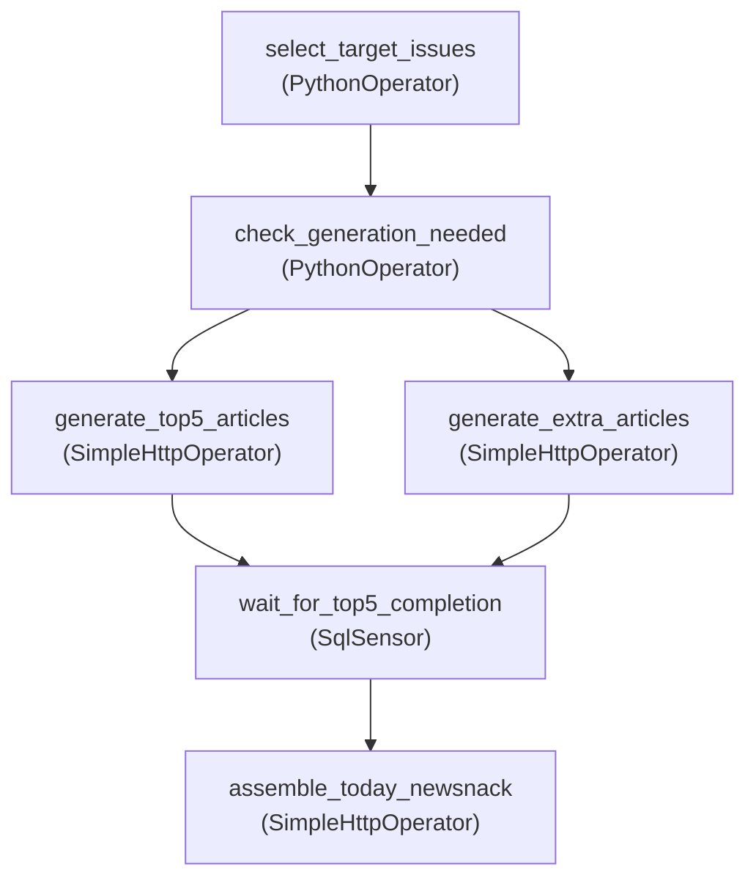

## 들어가며

뉴스낵은 매시간 언론사 RSS를 수집하고, 매일 2회 기사들을 바탕으로 상위 이슈를 선별하고, 각 이슈들에 대한 AI 기사(뉴스툰)를 만든 후, 최종적으로 오늘의 뉴스낵까지 만드는 **긴 호흡의 데이터 생성 프로세스**를 거친다.


초기에는 단순 Linux `Cron` 스크립트나 FastAPI의 백그라운드 태스크로 구동하려 했으나 여러 한계에 직면했다.
수많은 배치 작업 중 **어떤 단계에서 에러가 터졌는지 추적**하기 어려웠고, 선행 작업(AI 기사 생성)이 완료되지도 않았는데 후행 작업(오늘의 뉴스낵 생성)이 실행되는 등 **태스크 간의 선후행 조건 제어**가 불가능했다. 또한 간헐적인 네트워크 오류에 대비한 **재시도 로직**을 일일이 하드코딩해야 하는 운영 리소스의 낭비가 심각했다.


이러한 이유로 파이프라인의 시각화와 에러 복구를 체계적으로 지원하는 워크플로우 오케스트레이션 프레임워크인 **Apache Airflow**를 도입했다. 이 글에서는 Airflow를 활용해 뉴스낵의 **콘텐츠 생성 파이프라인** 초기 버전을 설계한 과정을 회고한다.


## 설계 원칙: 제어권의 분리

파이프라인을 설계하며 가장 먼저 고민한 것은 '어느 서비스가 어디까지 시스템을 제어할 것인가'였다. 초기 설계에서는 각 모듈의 역할을 다음과 같이 분리했다.

- **Airflow (트리거 및 흐름 제어)**: 매일 지정된 시간에 파이프라인을 실행하고, AI 생성 요청 및 완료 대기 등 전체적인 실행 흐름 관리를 수행한다.
- **FastAPI AI 서버 (데이터 제어 및 생성)**: Airflow의 트리거를 받으면 자체적으로 DB를 조회하여 최신 이슈를 선정하거나, 생성이 완료된 후 브리핑을 조립하는 등의 실질적인 데이터 핸들링을 자율적으로 수행한다.


_시스템 아키텍처 중 일부 (Airflow와 FastAPI의 관계)_

전체 로직을 FastAPI로 통합하는 방식도 고려했지만, 콘텐츠 조립 전 AI 기사가 모두 생성될 때까지 긴 시간을 안정적으로 대기하는 로직을 웹 서버에서 스레드를 점유하며 직접 구현하는 것은 비효율적이라고 판단했다. 따라서 실행의 흐름 관리는 Airflow가 담당하고, 세부적인 기사 선정과 데이터 조립은 AI 서버가 책임지는 분리된 구조를 선택했다.

### 서비스 간 통신: gRPC vs REST

두 서비스 간의 통신 프로토콜로 **gRPC**도 검토했다. 기술적으로 gRPC는 Protocol Buffers를 사용하므로 JSON보다 페이로드가 전송하고 처리 속도가 빠르다. 그러나 다음 이유로 **HTTP REST**를 선택했다.

- **개발 비용**: `.proto` 파일 정의 → 양쪽 서버에서 코드 생성 → 통신 설정까지, 초기 세팅만으로 상당한 시간이 소요된다. 요구사항이 바뀌어 파라미터가 변경되면 `.proto`를 다시 수정하고 양쪽을 재배포해야 한다.
- **요청 횟수**: gRPC의 성능 이점은 초당 수만 건의 요청이 오가는 대규모 MSA에서 두드러진다. 하루 2~4회 배치만 처리하는 현 서비스에서 JSON 직렬화 오버헤드는 전체 처리 시간의 측정 오차 수준이다.
- **운영 관측성**: `SimpleHttpOperator`를 통해 Airflow UI에서 HTTP 요청 파라미터와 응답 코드를 직접 확인할 수 있어 디버깅이 훨씬 용이하다.

## 아키텍처 설계: 왜 '가벼운' Airflow가 필요했는가?

보통 Airflow를 검색하면 CeleryExecutor와 Redis 브로커가 결합된 무거운 분산 환경이 표준으로 소개된다. 하지만 우리 팀은 자원이 매우 제한된 `t3.small`(2GB RAM) 기반의 단일 EC2가 워커 겸 스케줄러를 감당해야 했다.

```text
[ec2-user@ip-10-0-3-161 ~]$ docker ps
CONTAINER ID   IMAGE                      COMMAND                  CREATED      STATUS      PORTS                                       NAMES
b7523e99c9f8   newsnack-pipeline:latest   "/usr/bin/dumb-init …"   6 days ago   Up 6 days   0.0.0.0:8081->8080/tcp, :::8081->8080/tcp   newsnack-pipeline-airflow-webserver-1
a51f276d31e3   newsnack-pipeline:latest   "/usr/bin/dumb-init …"   6 days ago   Up 6 days   8080/tcp                                    newsnack-pipeline-airflow-scheduler-1
```

이러한 제한된 환경에 맞춰 아키텍처를 간소화했다.
- **Redis 제거, LocalExecutor 채택**: 분산 큐잉이 불필요한 단일 노드 스케일에서 Redis는 불필요한 자원 낭비였다. 워커를 스케줄러 내부에 두어 병렬 처리를 수행하는 `LocalExecutor` 전략을 채택하여 컨테이너 수를 줄였다.
- **RDS 재활용**: Airflow 구동 시 필요한 메타데이터 DB(DAG 이력 저장)를 위해 별도 컨테이너를 추가하지 않고, 메인 백엔드가 쓰는 AWS RDS 인스턴스에 `airflow` 전용 논리 데이터베이스를 생성해 연결했다. 인프라 일관성을 유지하고 백업 안전성도 함께 확보했다.

## Airflow 핵심 개념과 초기 DAG 설계

Airflow는 파이썬 코드를 통해 작업 흐름을 제어한다. 여기서 가장 중요한 세 가지 핵심 개념은 다음과 같다.
- **DAG (Directed Acyclic Graph)**: 작업(Task)들의 실행 순서와 의존성을 정의한 '단방향 비순환 그래프'다. 전체 파이프라인의 뼈대 역할을 한다.
- **Task**: DAG 안에 포함된 개별 작업 단위다. 
- **Operator**: Task가 실제로 '무엇'을 할지 정의한 템플릿이다. 파이썬 함수를 실행하면 `PythonOperator`, HTTP 통신을 하면 `SimpleHttpOperator`를 사용한다.

이 개념들을 조합하여, 매일 07:30과 17:30에 실행되는 `content_generation_dag`의 초기 구조를 설계했다. 초기 파이프라인은 핵심인 Top 5 메인 이슈 생성과, 피드를 채우기 위한 Extra 이슈 생성을 동시에 병렬로 요청하는 구조였다.



### 단계별 Task 구현 로직

#### 1) 텍스트 생성 외부 호출 (`generate_top5_articles`, `generate_extra_articles`)
대상 이슈들의 ID 목록을 바탕으로, 외부 API 호출에 특화된 `SimpleHttpOperator`를 사용하여 AI 서버의 `POST /ai-articles` 엔드포인트를 호출한다. 이 과정은 Top 5 기사와 Extra 기사에 대해 각각 병렬 Task로 실행된다.

#### 2) 기사 생성 완료 대기 (`wait_for_top5_completion`)
가장 핵심인 '오늘의 뉴스낵(브리핑)' 최종 조립을 위해서는, 선행 작업인 5건의 핵심 기사가 완전히 만들어져야 한다. 이를 위해 Airflow의 기본 오퍼레이터인 **`SqlSensor`**를 활용하여 데이터베이스를 폴링(Polling)하며 대기하도록 구성했다.


```python
# Task 4: 핵심 기사 생성 완료 대기 (SqlSensor)
wait_top5 = SqlSensor(
    task_id='wait_for_top5_completion',
    conn_id='newsnack_db_conn',
    sql="""
        # 초기 구현: 하나라도 완료된 것이 감지되면 통과
        SELECT COUNT(*) > 0 
        FROM issue 
        WHERE id = ANY(ARRAY[{{ task_instance.xcom_pull(task_ids='select_target_issues', key='top_5_issues') | join(',') }}])
        AND processing_status = 'COMPLETED'
    """,
    poke_interval=30,  # 30초마다 찔러봄(poke)
    timeout=600,       # 최대 10분 대기 타임아웃
    mode='poke',
)
```


#### 3) 오늘의 뉴스낵 조립 요청 (`assemble_today_newsnack`)
`SqlSensor` 대기 관문이 통과되면 `POST /today-newsnack` API를 호출하지만, 이때 구체적인 `issue_ids` 파라미터는 넘기지 않는다. AI 서버가 기존 설정된 분리 통제 구조에 따라, 최근 생성 완료된 기사들을 자신만의 기준(로직)으로 자체 취합하여 최종 오디오 브리핑을 조립하며 파이프라인이 종료된다.

## 트러블슈팅

파이프라인 구축은 순조롭게 진행되었으나, 실제로 AI 서버와 처음 연동하는 순간 외부 HTTP 통신과 스케줄러 내부에서 예기치 못한 이슈들이 발생했다.

### 문제 1. `SimpleHttpOperator` 인증 실패 (HTTP 403)와 비동기 응답(202) 거부

#### 증상

AI 서버에 콘텐츠 생성을 요청하는 Task(`generate_top5_articles`)가 실행되자마자 Airflow Task 로그에 두 가지 에러가 연속으로 쏟아졌다.

```text
# 에러 1 - API Key 인증 실패
requests.exceptions.HTTPError: 403 Client Error: Forbidden
for url: http://10.0.10.228:8000/ai-articles

# 에러 2 - 응답 코드 검증 실패
AirflowException: Response check returned False.
# 응답 본문 (log_response=True로 확인)
{"status":"accepted","message":"콘텐츠 생성 작업이 백그라운드에서 시작되었습니다."}
```

#### 원인 분석 — 인증 실패 (403)

초기 코드에서는 API Key를 Airflow Connection의 `extra` 필드에 저장하고, `extra_dejson`을 통해 꺼내는 방식으로 헤더를 구성했다.


```python
# ❌ 초기 코드
common_api_headers = {
    "Content-Type": "application/json",
    "x-api-key": "{{ conn.ai_server_api.extra_dejson.get('X-API-Key') }}"
}
```


문제는 `conn.ai_server_api.extra_dejson.get('X-API-Key')`의 반환값이 `str`이 아닌 파싱된 `dict` 객체의 문자열 표현(`"{...}"`)이었다는 점이다. `SimpleHttpOperator`의 **헤더는 순수한 문자열 값만 허용**하므로, 딕셔너리가 오작동하면서 HTTP 헤더 조립 단계에서 API 키가 누락된 채 요청이 발송되었다.

#### 원인 분석 — 응답 코드 검증 실패 (AirflowException)

첫 번째 에러를 고치고 나자 이번엔 `Response check returned False`라는 에러로 Task가 바로 실패(`Failed`) 처리되었다. 응답 본문(`{"status":"accepted", ...}`)은 정상이었으나, `SimpleHttpOperator`가 **기본적으로 HTTP 200(OK)만을 '정상 성공'으로 인식**하기 때문이었다.
우리 뉴스낵 AI 엔진은 무거운 텍스트 생성 작업을 백그라운드 태스크로 시작하며 즉시 `202 Accepted` 상태 코드를 뱉도록 설계되어 있어, 기본 오퍼레이터 규칙과 정면으로 충돌한 것이다.


#### 해결

두 문제를 각각 수정했다.


```python
# ✅ 수정된 코드 (인증 방식 교체 + 커스텀 응답 검증)
generate_top5 = SimpleHttpOperator(
    task_id='generate_top5_articles',
    http_conn_id='ai_server_api',
    endpoint='/ai-articles',
    method='POST',
    data='{"issue_ids": {{ task_instance.xcom_pull(...) | tojson }} }',
    headers={
        "Content-Type": "application/json",
        # Connection 대신 Airflow Variable로 교체: 자동 Fernet 암호화 + 로그 마스킹
        "x-api-key": "{{ var.value.AI_SERVER_API_KEY }}"
    },
    # 202 Accepted를 명시적으로 정상 완료 코드로 통과 허용
    response_check=lambda response: response.status_code == 202,
    log_response=True,
)
```


- **인증 해결**: `conn.extra_dejson` 방식 대신, Airflow Variable(`Admin > Variables`)에 API Key를 등록하여 가져오도록 교체했다. Airflow는 변수명에 `api_key`나 `secret`이 포함되면 UI 화면과 실행 로그에서 자동으로 마스킹(`***`) 처리를 해주는 보안 이점이 있다.
- **응답 코드 해결**: `response_check` 파라미터에 람다(Lambda) 식을 주입하여, `202` 응답이 올 경우 `False`가 아닌 `True`를 반환하도록 예외 처리 로직을 명시했다.

---

### 문제 2. DAG 중복 실행 (Scheduled + Manual 동시 트리거)

#### 증상

개발 도중 DAG를 Pause(정지) 상태로 두었다가 테스트를 위해 Airflow UI의 `Trigger` 버튼을 눌렀을 때, Run이 2개씩 동시에 생성되어 뉴스 수집이 이중으로 수행되는 현상이 반복됐다.

로그에서 확인된 실행 이력을 보면, Trigger를 **딱 한 번** 눌렀음에도 불구하고 두 종류의 Run이 생성되어 있었다.


```text
dag_id              | run_id                                   | state
====================+==========================================+=========
news_collection_dag | manual__2026-02-08T09:45:15...           | success  ← trigger로 생성
news_collection_dag | scheduled__2026-02-08T09:00:00           | success  ← 자동으로 생성??
```

#### 원인 분석

처음에는 DAG 코드 레벨의 `catchup=False` 설정을 먼저 의심했다. 하지만 컨테이너 내부에서 직접 확인해보니 DAG는 의도대로 `catchup=False`로 인식하고 있었다.

```bash
docker exec newsnack-pipeline-airflow-scheduler-1 \
  python -c "
from airflow.models import DagBag
dag = DagBag('/opt/airflow/dags').get_dag('news_collection_dag')
print(f'DAG catchup: {dag.catchup}')
"
# 출력: DAG catchup: False  ← 코드 레벨 설정 자체는 정상
```

더 깊게 파고들어 Airflow 전역 설정 파일(`airflow.cfg`)을 직접 확인했다.

```bash
docker exec newsnack-pipeline-airflow-scheduler-1 \
  cat $AIRFLOW_HOME/airflow.cfg | grep catchup_by_default

# 출력 결과
catchup_by_default = True  ← ⚠️ 전역 설정이 True로 되어 있었음
```

근본 원인은 이름이 비슷해서 혼동하기 쉬운 **두 가지 별개의 `catchup` 설정이 충돌**하는 것이었다.

| 설정 이름 | 위치 | 역할 |
|---|---|---|
| `catchup` | DAG 코드 | **초기 배포 시** `start_date`부터 현재까지의 모든 과거 스케줄을 실행할지 결정 |
| `catchup_by_default` | `airflow.cfg` | **pause 후 unpause 시** 그 사이에 놓친 가장 최근 스케줄을 보상 실행할지 결정 |

즉, Trigger 버튼 클릭 동작이 DAG를 unpause하는 동작을 함께 유발했고, `catchup_by_default=True`로 인해 Pause 기간 동안 놓쳤던 가장 최근 스케줄(`scheduled__09:00:00`) **1개가 자동으로 보상 실행**된 것이다. 여기에 Trigger 본래 목적인 `manual run` **1개가 추가로** 생성되어 총 2번 실행되는 현상이 발생했다.

#### 해결

DAG 코드를 수정하는 방식으론 이 문제를 해결할 수 없었다. 전역 설정인 `airflow.cfg`을 직접 수정하거나, 환경 변수를 통해 이를 Override하는 방식을 택했다.

```bash
# .env 파일에 환경변수 추가 (airflow.cfg 설정을 덮어씀)
AIRFLOW__SCHEDULER__CATCHUP_BY_DEFAULT=False
```

검증은 컨테이너 재시작 후 동일한 시나리오를 반복하여 수행했다.

```text
# 환경변수 적용 후 Trigger 발동 결과
dag_id              | run_id                                   | state
====================+==========================================+=========
news_collection_dag | manual__2026-02-08T09:53:39...           | success  ← 오직 1개만!
```

## 마치며

Airflow를 도입함으로써 데이터 파이프라인의 골조를 세우고 비동기 REST API 통신의 흐름을 모니터링할 수 있는 UI의 관측성을 확보했다. 단일 노드와 같은 물리적 자원 제약 상황에서도 `LocalExecutor`와 무거운 메시지 큐 제거 전략은 가벼운 스케일링을 증명했다.

그러나 파이프라인이 정식으로 운영 단계에 돌입하자, **데이터 상세 제어(이슈 선정)는 AI 서버에 방치해둔 초기 설계의 허점**이 드러나기 시작했다.
기다림에 융통성이 없는 `SqlSensor`는 작은 에러 하나로 전체 시스템을 중단시켰고, AI 엔진의 자율성은 타임아웃 상황에서 **데이터 정합성 문제**로 이어졌다. 이어지는 글에서는 이러한 1차 파이프라인의 분산 통제 한계를 깨닫고, 시스템 리팩토링 및 지능형 대기 패턴(Smart Wait)을 통해 파이프라인을 복원해 낸 과정을 다룬다.

## 참고 자료
- [Airflow LocalExecutor 공식 문서](https://airflow.apache.org/docs/apache-airflow/stable/core-concepts/executor/local.html)
- [Airflow Catchup 설정 가이드](https://airflow.apache.org/docs/apache-airflow/stable/core-concepts/dag-run.html#catchup)
