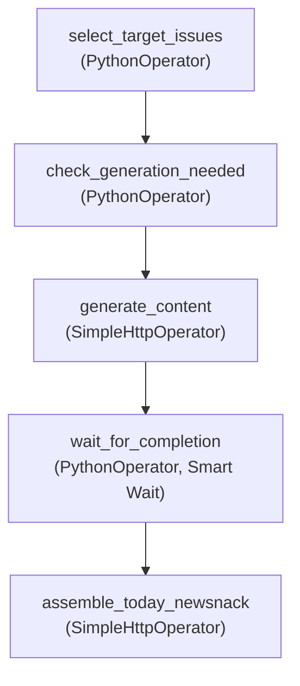

## 들어가며

[**이전 글**](../newsnack-airflow-pipeline)에서는 단일 노드 환경에서 Airflow를 도입하여 뉴스낵의 핵심 데이터 파이프라인을 구축한 경험을 공유했다. 하지만 이 파이프라인은 운영 단계에서 LLM API의 장애 등 통제 불가능한 외부 변수로 인한 한계를 보였다.

이 글에서는 파이프라인의 **단일 장애점과 데이터 정합성 문제**를 해결하기 위해, 시스템의 제어권을 Airflow로 중앙화하고 지능형 대기(Smart Wait) 전략을 도입하여 **장애 허용성(Fault Tolerance)**을 확보한 경험을 공유한다.

## 1. 분산된 제어권과 아키텍처의 한계

초기 파이프라인 구축 시에는 기사 생성 및 조립을 위한 세부 제어를 AI 서버에 위임하는 구조를 택했다. 하지만 실제 운영 환경에서는 이러한 분산된 제어권과 단순한 대기 구조로 인해 세 가지 치명적인 문제가 발생했다.


**문제 1. 경직된 대기 로직 (SqlSensor의 모호함)**

기존에는 AI 서버에 5건의 생성 요청을 비동기로 던진 후, `SqlSensor`를 사용해 DB를 주기적으로 폴링(Polling)하며 대기했다. 이 `SqlSensor`는 **"단 하나라도 생성 완료된 기사가 있으면 통과"**하는 느슨한 기준이거나, 반대로 **"5개가 모두 완료될 때까지"** 대기해야 하는 경직된 구조를 가질 수밖에 없었다.
후자의 경우, 4개의 기사를 완성했으나 마지막 1개가 구글 Rate Limit으로 실패 상태가 된다면 센서는 Timeout이 발생할 때까지 대기하다가 파이프라인 전체를 실패 처리했다. 이로 인해 정상적으로 생성된 4건의 기사들마저 배포되지 못하는 비효율이 발생했다.

**문제 2. 리소스 경합 및 우선순위 부재**

초기 DAG에서는 시급성이 높은 메인 콘텐츠인 'Top 5 기사'와 부차적인 '피드용 Extra 기사' 생성이 제한된 AI 서버와 LLM(Gemini)에 동시에 병렬로 요청됐다. 이로 인해 리소스 경합이 발생했고, 정작 중요한 메인 기사 생성이 지연되거나 타임아웃으로 실패할 위험이 높았다.

**문제 3. '부분 성공' 허용 시 발생하는 데이터 정합성 불일치**

만약 위 문제들을 피하기 위해 Airflow에 타임아웃 발생 시 **'3건 이상만 완료되었어도 다음 단계로 통과'**하는 조건(부분 성공)을 부여한다고 가정해 보자.
초기 설계에서 조립 단계의 AI 서버는 **"자체 기준으로 최근 생성 완료된 기사를 조회하여"** 브리핑을 조립하는 독자적인 제어권을 가지고 있었다. 즉, Airflow가 타임아웃 시점에 생성 완료된 3개의 기사를 기준으로 다음 단계를 진행하더라도, AI 엔진은 모자란 2개의 기사를 채우기 위해 과거에 생성된 기사를 무작위로 조회하여 브리핑에 포함시키게 된다. 이는 결과적으로 Airflow가 의도한 데이터와 실제 생성된 콘텐츠 간의 **데이터 정합성** 불일치를 초래한다.

## 2. 지능형 대기(Smart Wait) 설계와 제어권 중앙화

이러한 문제를 동시에 해결하기 위해 **AI 서버의 이슈 선정 권한을 회수하고, Airflow가 전체 데이터 흐름을 중앙에서 제어하도록** 파이프라인 설계 원칙을 수정했다.



- **선택과 집중**: DAG에서 상대적으로 우선순위가 떨어지는 Extra 기사 병렬 생성 로직을 제거하고, 오로지 핵심 비즈니스 로직인 '오늘의 뉴스낵 브리핑(Top 5)' 생성을 안정적으로 마치는 데 시스템 자원을 집중시켰다. (실행 흐름의 직렬화)
- **유연한 대기**: 기존의 경직된 `SqlSensor`를 제거하고, `PythonOperator`를 활용해 파이썬 기반의 커스텀 폴링 로직(`wait_for_completion`)을 구현했다.
- **명확한 지시**: 조립 API 요청 파라미터에 Airflow가 확정한 이슈 목록(`issue_ids`)을 명시적으로 전달하여 데이터 정합성을 철저히 보장하도록 구조를 개선했다.

### 2-1. Smart Wait 루프 구현

`PythonOperator`를 활용해 타임아웃 한계치 내에서 일부 요청이 실패하더라도 일정 기준 이상을 충족하면 다음 단계를 진행하는 유연한 코드를 작성했다.

```python
# dags/content_generation_dag.py
def wait_for_completion(ti, **context):
    target_ids = ti.xcom_pull(task_ids='select_target_issues', key='target_issues')

    # 하드코딩 제거: Variable을 통해 런타임에 무중단 설정 조절 가능
    timeout = int(Variable.get("CONTENT_GEN_TIMEOUT", default_var=600))         # 최대 10분 대기
    interval = int(Variable.get("CONTENT_GEN_CHECK_INTERVAL", default_var=30))  # 30초마다 폴링
    min_completion_count = int(Variable.get("CONTENT_GEN_MIN_COMPLETION", default_var=3))  # 최소 3개 성공 시 통과

    start_time = time.time()
    
    while time.time() - start_time < timeout:
        # DB에서 성공 처리된 이슈 ID들만 조회
        completed_ids = get_completed_issues(target_ids) 

        # 최적의 시나리오: 모두 성공 → 즉시 통과
        if len(completed_ids) == len(target_ids):
            ti.xcom_push(key='completed_issue_ids', value=completed_ids)
            return True

        logger.info(f"Waiting... Completed {len(completed_ids)}/{len(target_ids)}")
        time.sleep(interval)

    # Timeout(10분) 발생 시 타협 로직
    completed_ids = get_completed_issues(target_ids)
    
    if len(completed_ids) >= min_completion_count:
        # 최소 조건(3개) 이상 완료되었다면 부분 성공으로 간주하여 통과
        logger.warning(f"Timeout reached. {len(completed_ids)} completed. Proceeding.")
        ti.xcom_push(key='completed_issue_ids', value=completed_ids) # 처리 완료된 ID만 반환
        return True
    else:
        # 최소 조건을 충족하지 못하면 품질 저하를 막기 위해 파이프라인 실행을 건너뜀 (DAG Skip)
        raise AirflowSkipException(f"Only {len(completed_ids)} completed ({min_completion_count} required). Skipping.")
```

> **📌 운영 유연성(Zero-Downtime)의 확보**  
> 타임아웃 임계치와 최소 완료 기준 개수를 하드코딩하지 않고 Airflow Variable로 분리했다. 덕분에 외부 LLM API가 유독 느려지는 날에도 파이썬 코드를 재작성하여 서버를 재배포할 필요 없이, Airflow UI 상에서 즉각적으로 타임아웃 시간을 늘리거나 최소 기준을 조절하는 무중단 대응이 가능해졌다.

이 커스텀 루프를 통해 파이프라인은 세 가지 명확한 실행 시나리오를 갖추게 되었다.

| 시나리오 | 조건 | 동작 |
|---|---|---|
| **All Pass** | 기한 내 대상 이슈 모두 완료 | 즉시 다음 단계(브리핑 조립)로 진행 |
| **Timeout Pass** | 타임아웃 경과 후, 완료 수 ≥ 3 | **성공한 이슈만으로** 브리핑 조립 진행 |
| **Skip** | 타임아웃 경과 후, 완료 수 < 3 | 브리핑 발행을 취소하고 DAG 실행을 Skip 처리 |

또한, 타임아웃 발생을 선제적으로 방지하기 위해 오래전에 수집됐으나 미처리로 남은 오염 데이터가 선정되지 않도록, 기사 생성 전 최초 이슈 선정 단계에 `lookback_hours` 조건도 안전망으로 추가했다.

- **All Pass**

  

- **Timeout Pass**

  

- **Skip**

  

  

### 2-2. 정합성 유지: 제어권 중앙화 고도화

위의 Smart Wait 로직을 통과하면, **결과적으로 타임아웃 시점에 어떤 기사들이 성공적으로 처리되었는지는 오직 관리자인 Airflow만이 알 수 있다**. 

따라서 브리핑 최종 조립 컨트롤러(`POST /today-newsnack`)가 자체적으로 DB에서 기사를 선정하던 로직을 모두 제거하고, 이전 단계인 `wait_for_completion` 태스크에서 `xcom_push`를 통해 전달받은 **생성 완료된 이슈 ID 배열(`completed_issue_ids`)을 요청 바디에 명시적으로 주입**했다.


```python
# Task: 처리 완료된 이슈 ID만을 Airflow가 AI 서버 API에 명시적으로 전달
assemble_newsnack = SimpleHttpOperator(
    task_id='assemble_today_newsnack',
    endpoint='/today-newsnack',
    method='POST',
    # Airflow가 확정한 이슈 ID 배열만 조립 API로 전달하여 데이터 정합성 보장
    data='{"issue_ids": {{ task_instance.xcom_pull(task_ids="wait_for_completion", key="completed_issue_ids") | tojson }} }',
    response_check=lambda response: response.status_code == 202,
)
```


이에 맞춰 **AI 서버(FastAPI) 역시 내부 로직을 전면 수정**했다. 기존에 `select_hot_articles_node`에서 자체적으로 DB를 뒤지며 화제성 탑 이슈를 선정하던 코드를 모두 폐기하고, 오직 API로 전달받은 `target_issue_ids`만 정직하게 조회(`fetch_daily_briefing_articles_node`)하도록 연동 규격을 리팩토링했다.

이러한 개선을 기점으로 AI 엔진은 철저히 주어진 데이터를 가공하는 모듈로서의 역할에만 전념하게 되었고, **전체 프로세스 제어와 데이터의 수명 주기를 중앙의 Airflow가 관장**하는 견고한 아키텍처가 완성되었다.

## 마치며

이번 시스템 개선 과정은 단순히 작업을 순차적으로 실행하는 것을 넘어, 타임아웃이나 오류 등 예상치 못한 상황에서도 시스템이 정상적으로 동작할 수 있도록 **복원력**을 구조적으로 설계하는 과정이었다.

단일 장애점을 제거하고 자원을 핵심 비즈니스 로직에 집중시킨 결과, 실행 안정성이 획기적으로 개선되었다. 특히 외부 리소스나 통신 구간(LLM, 서드파티 API 등)을 완벽히 통제할 수 없는 환경에서는 오류가 발생할 수밖에 없다는 사실을 아키텍처 수준에 녹여내는 것이 필수적이다. 장애 발생 시 파이프라인 전체를 중단시키는 완벽주의보다, 일부 기능이라도 보장하는 **장애 허용 시스템**을 설계하는 것이 안정적인 서비스 운영의 핵심임을 체감할 수 있었다.
