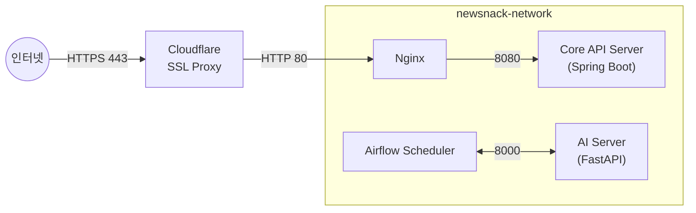

## 들어가며

뉴스낵의 백엔드는 메인 API 서버(Spring Boot), AI 서버(FastAPI), 오케스트레이터(Airflow)라는 성격이 다른 세 시스템이 하나의 DB를 공유하는 구조로 되어있다. 이 복합적인 시스템을 구축하기 위해 **보안·비용·재현성** 세 가지를 동시에 만족하는 인프라 아키텍처를 설계했다.

이 글에서는 초기 VPC 설계부터 Nginx 컨테이너화까지, 뉴스낵의 AWS 인프라를 완성해 나가는 과정을 정리한다.

> 초기에는 서비스별로 `t3.small` 3대를 분리 운영했으나, 유휴 자원 낭비와 비용 문제로 이후 ARM64 기반 `t4g.medium` 단일 인스턴스로 통합했다. 이 과정은 이전 글인 [단일 인프라 환경 구축기](../newsnack-arm64-migration)에 상세히 정리했다. 이 글에서 다루는 네트워크 설계와 Nginx 컨테이너화는 최종 단일 인스턴스 환경을 기준으로 설명한다.

## 1. VPC 설계

우선 인프라를 구축하기 전에 다음과 같은 목표를 세웠다.

> **"외부 위협으로부터 DB를 격리하면서 비용은 최소화한다."**

AWS의 'VPC 등' 생성 마법사를 활용해 2-AZ 기반의 서브넷 분리 구조를 구성했다.

1. **퍼블릭 서브넷 × 2**: 인터넷 게이트웨이(IGW)에 연결되는 공간. 외부와 직접 통신해야 하는 EC2 웹 서버와 백엔드 컨테이너가 위치한다.
2. **프라이빗 서브넷 × 2**: 외부 라우팅이 원천 차단된 공간. RDS가 이 안에 격리된다.

### NAT Gateway를 없앤 이유

원칙적으로 프라이빗 망의 리소스가 외부 통신(S3 업로드 등)을 하려면 NAT Gateway가 필요하다. 그러나 NAT Gateway는 사용 유무와 무관하게 **시간당 고정 요금(월 약 $32)**이 과금된다.

우리 환경을 분석해보면 프라이빗 서브넷의 리소스가 외부에 나갈 일은 딱 하나, **AI 파이프라인에서 생성된 이미지를 S3로 업로드**하는 것뿐이었다. 이를 위해 **S3 Gateway Endpoint**를 프라이빗 라우팅 테이블에 추가했다. 이 엔드포인트는 AWS 내부 전용선을 통해 S3와 통신하므로 **NAT Gateway 없이, 추가 비용 없이** S3 I/O를 해결한다.


_최종 VPC 구조_

## 2. 보안 그룹: 다중 방화벽 설계

네트워크를 공간으로 분리했다면, 그 방을 넘나드는 트래픽의 신원을 엄격히 통제하는 소프트웨어 방화벽이 필요하다. 보안 그룹을 직렬로 연결해 다중 방어선을 구축했다.

### 1차 방화벽: 앱 서버용 퍼블릭 그룹 (`newsnack-common-sg`)

퍼블릭 서브넷의 EC2에 적용한다.


| 포트 | 소스 | 목적 |
|---|---|---|
| **22 (SSH)** | 내 IP | 서버 관리 |
| **80 (HTTP)** | `0.0.0.0/0` | API 관문 (Nginx). Cloudflare 프록시와 통신. |
| **8000, 8081** | 내 IP | `FastAPI` Swagger UI, `Airflow` Web UI 접속. |
| **8080** | - | 인바운드에서 개방 안 함 (도커 네트워크 내부 통신 전용) |

특히 `HTTPS(443)` 통신의 경우 EC2에서 직접 인증서를 관리하지 않고 **Cloudflare 프록시를 통해 SSL Offloading**을 처리하므로, EC2 레벨에서는 Cloudflare와 통신할 `80` 포트 하나만 열어두면 충분했다. 

### 2차 방화벽: RDS 전용 보안 그룹 (`newsnack-rds-sg`)


프라이빗 서브넷의 RDS를 지키는 핵심 방화벽이다. 인바운드 허용 규칙의 소스를 막연한 IP 대역이 아닌, **`newsnack-common-sg` 보안 그룹 ID 자체**로 설정했다. 외부 인터넷은 이미 서브넷 차원에서 막혀 있고, 내부망이라 할지라도 **퍼블릭 방화벽 그룹의 허가를 받은 앱 서버의 트래픽만** DB 접근을 허용하는 것이다.

이렇게 허가받지 않은 내부 접근까지도 원천 차단하는 이중 방어선이 구축됐다.

## 3. S3 퍼블릭 서빙: Bucket Policy와 CORS

AI가 생성한 이미지(뉴스툰)는 S3에 올라간 뒤 프론트엔드에서 `` 태그로 직접 렌더링된다. 이를 가능하게 하기 위한 설정이 두 가지 필요하다.

**1. Bucket Policy (공개 읽기 허용)**

```json
{
    "Version": "2012-10-17",
    "Statement": [{
        "Effect": "Allow",
        "Principal": "*",
        "Action": "s3:GetObject",
        "Resource": "arn:aws:s3:::team-leekim-assets/*"
    }]
}
```

뉴스툰은 해당 기사의 URL만 알아도 누구나 볼 수 있어도 무방한 공개 콘텐츠이므로, Pre-signed URL이나 CloudFront 같은 추가 레이어 없이 버킷 정책으로 단순하게 해결했다.

**2. CORS 설정**

프론트엔드 도메인에서 S3 리소스를 요청할 때 브라우저의 보안 정책(Same-Origin Policy)에 막히지 않도록, `AllowedMethods: ["GET", "HEAD"]`를 허용하는 CORS 규칙을 추가했다.

## 4. Nginx 컨테이너화: 재현성 확보와 망 격리

### 왜 Nginx를 컨테이너로 옮겼는가?

처음에는 빠른 구축을 위해 호스트 EC2에 Nginx를 직접 설치(`apt install nginx`)하여 리버스 프록시로 사용했다. 그러나 점차 다음과 같은 한계가 드러났다.

- **실행 환경의 재현성 부재**: `nginx.conf` 같은 설정 파일을 별도로 백업하더라도, Nginx 프로세스 자체는 EC2 호스트에 종속되어 있어 서버 스펙업이나 장애 시 타이핑 한 번(`docker-compose up`)에 인프라를 복구할 수 있는 상태가 아니었다.
- **호스트 네트워크 종속성**: 호스트 머신의 네트워크를 공용으로 사용하므로, 컨테이너 환경의 가장 큰 장점인 '도커 기반 이름 통신(Internal DNS)' 흐름에 프록시가 적극적으로 개입할 수 없어 통제와 확장이 까다로웠다.

Nginx를 컨테이너로 편입함으로써 `Docker Compose`를 통해 **인프라 실행 환경을 완벽히 재현 가능하게** 만들었다. 또한 프록시 서버를 도커 안으로 편입시켜 **호스트망과 철저히 분리된 컨테이너 전용 사설 통신망**을 구축할 수 있었다.

### 도커 네트워크 구성

복잡한 네트워크 관리를 덜기 위해 백엔드, AI 엔진, 파이프라인(Airflow)까지 모두 **`newsnack-network`라는 단일 브릿지 네트워크**로 묶었다.



단일 네트워크에 소속된 컨테이너들은 별도의 IP 설정 없이 컨테이너 이름(`http://newsnack-api:8080`, `http://newsnack-ai:8000` 등)만으로 서로를 찾아 통신할 수 있는 도커 내장 DNS의 이점을 얻게 된다. 
물리적으로 네트워크를 잘게 쪼개는 대신 **논리적 단일 망 안에서 통신을 유연하게 가져가는 방식**을 택함으로써, 향후 서비스 컴포넌트가 추가되더라도 인프라 설정의 복잡도 없이 언제든 쉽게 도커 네트워크에 편입시킬 수 있는 확장성을 확보했다.

**메인 API 서버의 포트를 바인딩한 이유?**  
메인 API 서버 컨테이너의 경우, CI/CD 배포 스크립트에서 자동화된 헬스체크(`curl http://localhost:8080`)를 매우 간편하게 수행하기 위해 도커 런타임에 호스트 포트를 바인딩(`-p 8080:8080`)해두었다. 앞서 구축한 **AWS 보안 그룹(newsnack-common-sg)**에서 8080 인바운드 트래픽을 원천 차단하고 있으므로 호스트 포트가 열려있음에도 외부 공격 위협은 없다.

### 환경과 설정의 형상 관리

Nginx 설정 및 Docker Compose 기반의 인프라 실행 환경을 통째로 깃에 올리기 위해 `newsnack-infra` 레포지토리를 신설했다. GitHub Actions를 통해 `main` 브랜치에 코드가 푸시되면 자동으로 EC2에 반영된다.

이때 단순 `git pull` 대신 `git fetch + reset --hard` 방식을 선택했다. 서버에서 실수로 설정 파일을 수동으로 건드렸더라도 `git pull` 시 충돌로 배포가 중단되는 것을 방지하기 위해서다. **서버는 항상 GitHub의 상태를 미러링해야 한다**는 원칙을 코드로 강제했다.

- `.github/workflows/deploy.yml`
  
  ```diff
    run: |
      cd ~/newsnack-infra
  -    git pull origin main           # 기존 방식: 충돌 발생 위험 존재
  +    git fetch origin main
  +    git reset --hard origin/main   # 서버 변경사항 무시, GitHub 상태로 강제 동기화
      docker network create newsnack-internal || true   # 네트워크 없으면 생성 (멱등성)
      docker-compose up -d --remove-orphans
      docker exec nginx nginx -s reload
  ```

`docker network create ... || true` 패턴은 Docker Compose가 파일 내 서비스가 사용하지 않는 네트워크를 생성하지 않는 최적화 동작을 보완하기 위한 조치다. 배포 스크립트에서 명시적으로 네트워크 존재 여부를 확인하고 생성하도록 하여 **배포 스크립트의 멱등성**을 확보했다.

## 5. 트러블슈팅: Nginx Upstream Host Not Found

Nginx 컨테이너화 직후 컨테이너가 실행되지 않고 계속 재시작되는 현상이 발생했다.

```text
// Nginx 에러 로그
2026/02/18 08:16:04 [emerg] 1#1: host not found in upstream "newsnack-api"
```

Nginx는 구동 시점에 `nginx.conf`에 정의된 Upstream 호스트(`newsnack-api:8080`)의 DNS를 해석하려 시도한다. 당시 백엔드 컨테이너가 아직 `newsnack-network`에 포함되지 않은 상태였기에 DNS 해석에 실패하고 Nginx 프로세스가 종료된 것이었다.

**해결**: `newsnack-backend` 레포지토리의 CI/CD 배포 스크립트에 `--network newsnack-network` 옵션을 추가하여 백엔드 컨테이너가 공유 네트워크에 속하도록 수정했다. 이후 백엔드 컨테이너를 먼저 정상 실행한 뒤 Nginx를 재시작하여 해결했다.

## 마치며

위와 같은 과정을 거쳐 뉴스낵의 인프라는 다음과 같이 구성되었다.


_뉴스낵 시스템 아키텍처 (v2)_

인프라 아키텍처 수준에서의 엄격한 보안 설정은 상위 애플리케이션 레이어의 취약점을 보완하는 필수적인 요소다. 위와 같은 과정을 거치며 단일 인스턴스 위에서 4개의 서비스 컴포넌트가 강력하게 통제되면서 외부 노출은 단 하나의 관문(80 포트)으로 제한된 인프라를 완성할 수 있었다.

## 참고자료

- [AWS VPC 개요](https://docs.aws.amazon.com/ko_kr/vpc/latest/userguide/what-is-amazon-vpc.html)
- [Amazon S3에서 CORS 구성](https://docs.aws.amazon.com/ko_kr/AmazonS3/latest/userguide/cors.html)
- [Docker Compose 네트워킹](https://docs.docker.com/compose/how-tos/networking/)
