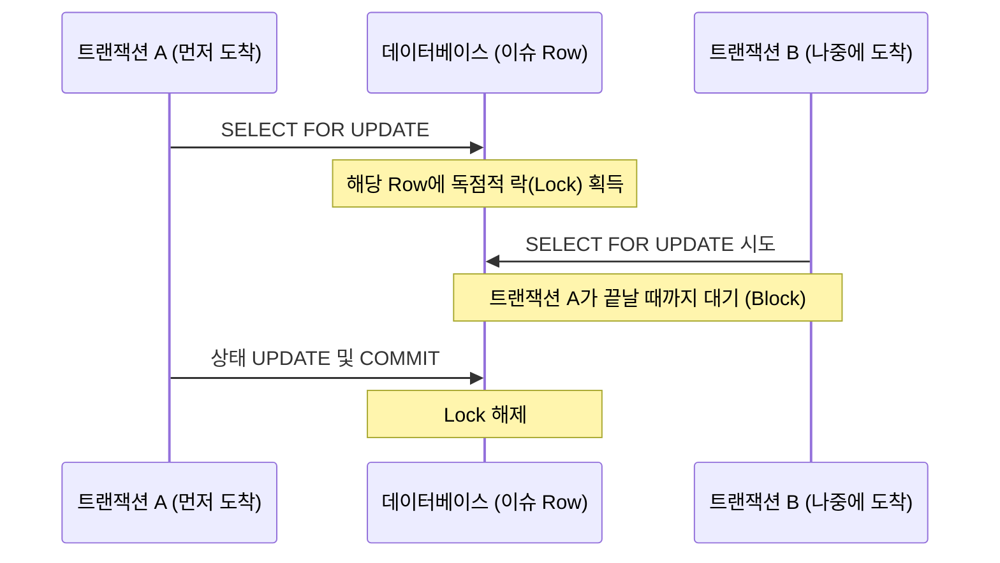
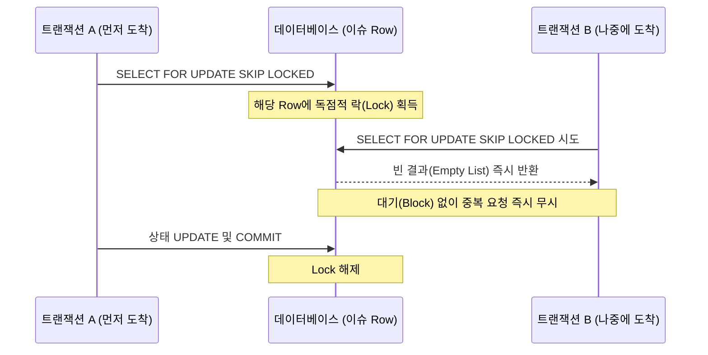

## 배경

|  |  |
|:---:|:---:|
| Airflow Web UI | Swagger UI를 통한 API 호출 |

뉴스낵의 콘텐츠 생성 파이프라인이 안정화되면서 운영 환경은 점차 다양해졌다. 내부적으로 자동 스케줄러인 Airflow가 주기적으로 기사 생성을 스케줄링하는 동시에, 예외 상황에서 운영자가 직접 API를 호출하여 기사 생성을 병렬로 요청할 수 있는 환경을 마주했다.

문제가 발생한 시점은 파이프라인에서 일시적 오류로 실패한 이슈 건들을 복구하기 위해 **재시도** 로직을 추가하면서부터다. 기존에는 유효한 요청(`PENDING`)만 승인하고 하나라도 진행 중인 건이 섞여 있으면 전체 요청을 거부(`409 Conflict`)하여 파이프라인 전체가 막혀버리는 한계가 있었다. 이를 극복하고자 한 번의 묶음(배치) 요청 내에서 처리 가능한 것(`PENDING`, `FAILED`)만 골라내어 작업을 승인하는 **선별적 처리** 방식을 새롭게 도입했다.

하지만 이 유연한 로직을 도입하는 과정에서 AI 서버 측에 심각한 **동시성 문제(경쟁 상태)**가 발견되었다. 밀리초 단위로 겹친 요청들을 제어하지 못해, 동일한 이슈 원본 데이터에 대해 AI가 중복된 콘텐츠를 여러 개 생성해 버리는 치명적인 데이터 무결성 훼손이 일어난 것이다.


이 글에서는 동일한 이슈에 대한 파이프라인의 중복 콘텐츠 생성을 방지하기 위해, 기존에 없었던 **DB 비관적 락(Pessimistic Lock)**을 새롭게 도입하고, 비동기 병목 최적화를 결합하여 동시성 문제를 해결한 과정을 다룬다.

## 원인: 동시성 제어의 부재

파이프라인 설계 당시의 핵심 목표는 멱등성이었다. 한 이슈에 대해 여러 번 생성 요청이 들어와도 AI 기사는 단 1개만 만들어져야 했다.
이를 위해 `issue` 테이블에 명시적 상태 관리를 위한 `processing_status` 컬럼을 추가하고, 상위 K개의 이슈들을 골라내어 뉴스낵 조립의 핵심 단일 진실 공급원으로 삼았다.

하지만 AI 서버에서 선별적 처리를 위해 중복을 검사하고 상태를 갱신하는 기존 로직은 단순했다.

```text
1. 요청된 이슈 ID들의 처리 상태를 DB에서 읽어온다. (조회)
2. 상태가 PENDING 혹은 FAILED인 이슈만 걸러낸다.
3. IN_PROGRESS로 상태를 갱신하고 생성 작업을 비동기 큐에 할당한다. (수정)
```

이러한 **조회 후 액션** 흐름 사이에 밀리초 단위로 두 개의 요청이 동시에 인입될 경우 동시성 문제가 발생한다.
두 요청 모두 1번 단계에서 `PENDING` 상태를 읽게 되며, 결과적으로 AI 서버가 동일한 원본 데이터에 대해 외부 API를 호출하여 2개의 중복된 기사를 생성하면서 **데이터 무결성**이 심각하게 훼손되는 문제가 발생한다.

## 해결 1: `SELECT FOR UPDATE`를 활용한 비관적 락 적용

이 간극을 메우기 위해 애플리케이션 레벨의 확인이 아니라, **DB 레벨의 비관적 락**을 통해 트랜잭션 격리가 필요했다. 가장 확실한 방법은 조회와 상태 변경을 하나의 원자적 연산으로 묶는 **비관적 락 제어 로직**을 구현하는 것이었다.

### 비관적 락(Pessimistic Lock)이란?

관계형 데이터베이스의 동시성 제어 방법 중 하나로, **"데이터 갱신 시 트랜잭션 간의 충돌이 빈번하게 일어날 것이다"**라고 비관적으로(Pessimistically) 가정하는 패턴이다.  
마틴 파울러(Martin Fowler)의 정의에 따르면, 비관적 락은 트랜잭션이 데이터를 사용하기 시작할 때 미리 독점적인 잠금(Exclusive Lock)을 획득하여 다른 트랜잭션의 접근을 원천적으로 차단한다.

기본적으로 비관적 락(`SELECT FOR UPDATE`)을 우리 시스템에 적용하면 아래와 같이 동작하게 된다.



데이터 무결성을 강력하게 보장하지만, **잠금을 유지하는 동안 먼저 온 트랜잭션 A가 끝날 때까지 나중에 온 트랜잭션 B가 하염없이 대기(Block)해야 한다는 단점**이 있다.

이를 기반으로 기존의 단순 상태 조회 로직을 아래와 같이 **락 기반의 로직**으로 1차적으로 개선했다.

- `workflow_service.py`

  ```diff
  -    def check_duplicate_issues(self, issue_ids: List[int]) -> List[int]:
  -        db: Session = SessionLocal()
  -        try:
  -            issues = db.query(Issue).filter(Issue.id.in_(issue_ids)).all()
  -            return [issue.id for issue in issues if issue.processing_status != ProcessingStatusEnum.PENDING]

  +    def occupy_issues(self, issue_ids: List[int]) -> List[int]:
  +        db: Session = SessionLocal()
  +        try:
  +            issues = db.query(Issue).filter(
  +                Issue.id.in_(issue_ids),
  +                Issue.processing_status.in_([
  +                    ProcessingStatusEnum.PENDING,
  +                    ProcessingStatusEnum.FAILED,
  +                ])
  +            ).with_for_update().all()   # 단순 SELECT FOR UPDATE 우선 적용
  +            
  +            occupied_ids = []
  +            for issue in issues:
  +                issue.processing_status = ProcessingStatusEnum.IN_PROGRESS
  +                occupied_ids.append(issue.id)
  +            
  +            db.commit()
  +            return occupied_ids
  ```

이제 먼저 도착한 요청 A가 DB 락을 쥐면, 요청 B는 A의 커밋 직전까지 대기하게 된다. 그 사이 상태는 `IN_PROGRESS`로 변해버려 후속 요청은 자연스레 중복을 감지하고 걸러낼 수 있었다.

## 해결 2: `SKIP LOCKED`로 불필요한 대기 방지

DB 트랜잭션 락은 데이터를 안전하게 보호하지만, 위 설명처럼 후속 요청이 **락 해제 시점까지 하염없이 대기**하는 것은 병렬 처리 환경에서 매우 비효율적이다. 락이 걸려 처리 중인 작업은 다시 처리할 필요가 없기 때문이다. 무한 대기 상태에 빠질 경우 데이터베이스 커넥션 풀이 고갈되는 더 큰 장애로 이어질 위험도 존재한다.

이 문제를 해결하는 방법은 **락이 걸린(=처리 중인) 행을 '바로 포기'**하는 것이다.



아래는 락을 획득하는 쿼리에 **`skip_locked=True` 옵션을 추가**하여 락이 걸린 레코드를 즉시 건너뛰도록 개선한 최종 코드이다.

- `workflow_service.py` (최종 수정본)

  ```python
              issues = db.query(Issue).filter(
                  Issue.id.in_(issue_ids),
                  Issue.processing_status.in_([
                      ProcessingStatusEnum.PENDING,
                      ProcessingStatusEnum.FAILED,
                  ])
              ).with_for_update(skip_locked=True).all() # skip_locked 옵션 추가
  ```

이를 통해 후속 요청은 불필요한 대기 시간 없이 빈 결과를 즉시 반환받게 되며, API 전반의 응답 속도 지연과 커넥션 고갈 문제를 효과적으로 방지할 수 있었다.

## 해결 3: 동기 처리 격리 (`run_in_threadpool`)

마지막 문제는 프레임워크 기반 비동기 환경과 데이터베이스 동기 통신 오버헤드의 결합이었다. FastAPI 같은 비동기 프레임워크에서는 메인 싱글 이벤트 루프가 돌아가는데, 메인 루프에서 특정 자원에 락을 거는 동기 연산 기반의 무거운 트랜잭션을 실행하면 해당 처리가 완료될 때까지 애플리케이션의 이벤트 루프 흐름이 통째로 일시 정지되는 심각한 블로킹 병목이 발생할 수 있다.

이를 방어하기 위해 FastAPI가 제공하는 동시성 제어 유틸리티인 `run_in_threadpool`을 사용하여 동기 데이터베이스 락 블록을 별도의 워커 스레드로 격리하여 실행했다. 변경된 API 응답 로직은 다음과 같이 처리할 수 있는 이슈가 하나도 없는 경우에만 `409 Conflict`를 반환하여 불필요한 파이프라인 실패를 방어한다.

- `contents.py`

  ```diff
  from fastapi import APIRouter, BackgroundTasks, status, HTTPException
  +from fastapi.concurrency import run_in_threadpool

  @router.post("/ai-articles", status_code=202)
  async def create_batch_ai_articles(request: AiArticleBatchGenerationRequest):
  -    non_pending = workflow_service.check_duplicate_issues(request.issue_ids)
  -    if non_pending:
  -        raise HTTPException(status_code=409, detail="처리중 또는 완료된 이슈입니다.")
  +    occupied_ids = await run_in_threadpool(workflow_service.occupy_issues, request.issue_ids)
  +    if not occupied_ids:
  +        raise HTTPException(status_code=409, detail="처리 가능한 이슈가 없습니다.")
  
  -    background_tasks.add_task(workflow_service.run_batch_ai_articles_pipeline, request.issue_ids)
  +    background_tasks.add_task(workflow_service.run_batch_ai_articles_pipeline, occupied_ids)
  ```

## 마치며

배치 스케줄러에 재시도 로직을 도입하고 유효한 요청만 선별적으로 처리하도록 요구사항이 강화되면서 동시성 문제를 마주했다. 이를 해결하며 분산 처리 환경에서의 락 제어를 직접 경험했다.

1. 데이터베이스 레벨의 `FOR UPDATE SKIP LOCKED` 비관적 락 제어로 무결성을 보장했다.
2. 처리할 필요 없는 중복 건에 대한 대기를 없애 커넥션 낭비와 장애를 예방했다.
3. `run_in_threadpool`을 활용한 비동기 서버 내 스레드 격리로 메인 이벤트 루프 블로킹을 방어했다.

단순한 데이터 조작을 넘어, 비동기 프레임워크와 동기 데이터베이스가 어떻게 상호작용하는지 고민하고 견고한 락 정책과 아키텍처를 적용해 동시성 이슈를 해결한 의미 있는 경험이었다.

## 참고 자료

- [Martin Fowler - Pessimistic Offline Lock](https://martinfowler.com/eaaCatalog/pessimisticOfflineLock.html)
- [IBM Documentation - Optimistic and pessimistic record locking](https://www.ibm.com/docs/en/rational-clearquest/10.0.8?topic=clearquest-optimistic-pessimistic-record-locking)
