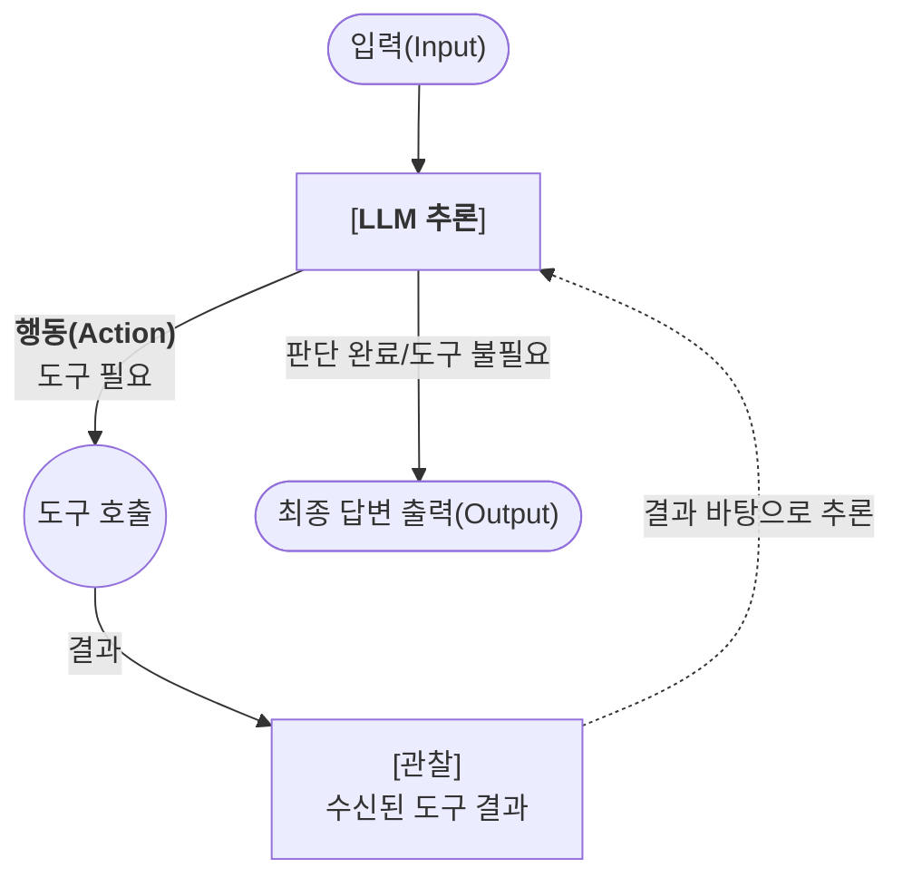
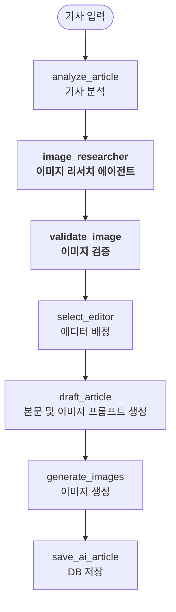

## 배경: 실물 이미지 레퍼런스의 필요성  

뉴스 기사를 기반으로 뉴스툰을 생성하는 파이프라인에서 직면했던 문제 중 하나는 이미지 생성 모델의 **시각적 한계와 환각(Hallucination) 현상**이었다.

뉴스 콘텐츠는 독자에게 정확한 사실을 전달해야 하므로 시각 자료의 사실성 역시 매우 중요하다. 하지만 생성형 AI는 텍스트 프롬프트만으로는 기사에 등장하는 특정 기업의 로고나 실존 인물(정치인, 경영인 등)의 구체적인 얼굴을 정확히 묘사할 수 없었다. 그 결과 실존하지 않는 가짜 로고를 만들어내거나, 기사 내용 속 핵심 인물의 외형과 전혀 다르게 생긴 가상의 인물을 그려내는 등 콘텐츠의 몰입도와 신뢰도를 떨어뜨리는 사례가 반복됐다.

|  |  |
|:---:|:---:|
| 가짜 로고로 그린 경우 | 얼굴을 다르게 그린 경우 |

따라서 단순히 '잘못된 이미지 생성을 막는 것'에 그치지 않고, **실제 기업 로고나 인물의 얼굴을 작업물에 정확하게 반영하여 더 구체적이고 사실적인 시각 자료를 제공하는 것**으로 목표를 확장했다. 모델이 부족한 배경 지식에 의존해 이미지를 임의로 생성하는 대신, **직접 실제 이미지를 찾고, 해당 이미지가 원본 기사에 적합한지 검증한 후, 이를 레퍼런스로 삼아 최종 결과물을 렌더링하도록** 파이프라인을 개편했다.

## 핵심 개념: 에이전트와 LangGraph

본격적인 파이프라인 아키텍처를 살펴보기에 앞서, 본 프로젝트의 뼈대가 되는 에이전트(Agent)와 LangGraph의 동작 원리를 간략히 짚고 넘어간다.

### 에이전트(Agent)란?


일반적인 LLM 호출은 프롬프트를 넣으면 답변이 나오는 **단방향**이다. 반면 **에이전트**는 LLM에 외부 도구(Tool)를 연결하여, 모델이 스스로 어떤 도구를 어떤 순서로 사용할지 결정하며 **반복적으로 목표를 달성**하는 시스템이다.

에이전트의 핵심 실행 패턴은 **ReAct(Reasoning + Acting)** 루프다. 모델은 추론하고, 필요한 도구를 호출하고, 그 결과(Observation)를 다시 추론에 반영하는 과정을 최종 답을 도출할 때까지 반복한다.



본 프로젝트에서 에이전트는 다음과 같이 동작한다.

- **추론**: "이 기사는 카카오모빌리티에 관한 거니까 로고를 찾아야겠어."
- **행동**: `get_company_logo("Kakao Mobility")` 도구 호출
- **관찰**: 반환된 후보 목록 중 `kakaomobility.com` 도메인 확인
- **출력**: `logo_url`을 최종 이미지 URL로 반환

### LangGraph: 에이전트를 제어하는 상태 머신


[콘텐츠 생성 워크플로우 1편](../newsnack-langgraph-workflow-1/)에서 소개했듯, 본 프로젝트는 복잡한 AI 로직을 제어하기 위해 **LangGraph(StateGraph)**를 오케스트레이터로 사용하고 있다. 기존 파이프라인에서는 랭그래프의 '노드(Node)와 엣지(Edge)' 구조를 주로 복잡한 분기(`if-else`) 처리에 활용했다.

반면 이번에는 랭그래프가 **'리서치'와 '검증'을 분리하여 에이전트의 오류 전파를 막는 안전망**으로 그 역할이 확장되었다.

에이전트는 ReAct 루프를 돌며 자율적으로 사고하지만, 때로는 엉뚱한 이미지를 정답으로 확정 짓는 등 오판을 내릴 위험이 존재한다. 만약 단일 에이전트가 리서치와 검증을 모두 책임진다면, 이러한 작은 착오 하나가 잘못된 AI 결과물 생성이라는 치명적인 결함으로 이어질 수 있다.

우리는 LangGraph를 활용해 불확실성이 높은 에이전트의 활동 범위를 단일 노드(`image_researcher`) 내부로만 격리시켰다. 에이전트는 탐색을 완료한 후 최종 '이미지 URL'을 전역 `State`에 남기며, 이후 LangGraph의 흐름에 따라 독립된 검증 노드(`validate_image`)가 이를 전달받아 엄격한 교차 검증을 수행한다. 즉 **에이전트의 실수 가능성을 구조적으로 한 번 더 걸러내는 견고한 파이프라인**을 구축한 것이다.

## 시스템 아키텍처: LangGraph 기반 역할 분리

초기에는 리서치와 검증을 단일 에이전트에서 처리하도록 구성했으나, 프롬프트 복잡도 증가로 인해 지시 이행이 불안정해지는 문제가 발생했다. 이에 **역할 분리 원칙**에 따라 두 개의 독립 노드로 기능을 분리했다.

- `image_researcher`: LLM 에이전트 기반으로, 도구를 반복 호출하며 최적의 이미지 URL을 탐색한다.
- `validate_image`: 멀티모달 모델에 이미지와 기사 맥락을 동시에 입력하여 적합성을 판단한다.

두 노드는 LangGraph 기반의 상태 머신 중 일부를 구성한다.



에이전트는 기사의 컨텍스트를 분석하여 스스로 리서치 수행 여부를 판단한다. '환율 금리 발표'와 같이 실물 레퍼런스가 불필요한 추상적인 주제의 기사는 에이전트가 자체적인 판단으로 즉시 리서치 단계를 종료(`NONE` 반환)하여 불필요한 API 호출을 최소화하는 구조로 설계했다.

## 1. 이미지 검색: ReAct 에이전트와 도구 설계

`image_researcher`는 LangChain의 `create_react_agent`를 사용하여 구성된 ReAct 기반 에이전트다. 에이전트는 세 가지 전용 검색 도구 중 기사 맥락에 일치하는 도구를 스스로 선택하여 호출한다.

|  |  |  |

| 도구 | 대상 | API |
|---|---|---|
| `get_company_logo` | 기업 및 브랜드 로고 | Logo.dev Brand Search API |
| `get_person_thumbnail` | 실존 인물 사진 | Wikipedia REST API |
| `get_fallback_image` | 위 도구 실패 시 대체 이미지 | Daum Image Search API |

`get_company_logo`는 단순히 회사명으로 이미지를 직접 요청하는 대신, 2단계 탐색 구조를 채택했다.

1. **Brand Search API**: 회사명으로 검색하여 `{name, domain}` 형태의 후보 목록을 반환받는다.
2. **Logo URL 조합**: 반환된 각 후보의 `domain` 데이터를 기반으로 완성된 로고 검색 URL을 미리 조립하여 에이전트에게 전달한다.

에이전트가 직접 이미지 URL을 조합할 경우 발생할 수 있는 오타나 파라미터 누락의 위험성을 방지하기 위함이다. 도구가 완성된 URL을 함께 반환하면, 에이전트는 응답받은 후보 목록에서 기사 맥락에 맞는 항목을 **선택**하기만 하도록 책임을 축소했다.

## 2. 에이전트 제어: 명시적 예외 처리와 로직 강화

에이전트에게 원하는 행동을 지시하는 자연스러운 방법은 시스템 프롬프트이다. 그러나 프롬프트 지시만으로는 LLM의 행동을 완전히 제어할 수 없는 상황이 2가지 사례로 나타났다.

### 2.1 코드 레벨에서의 예외 처리 적용

시스템 프롬프트 상단에 `"반드시 영어 공식 명칭으로 검색하라"`고 명시했음에도, LLM이 기사 원문에 등장한 "카카오모빌리티"라는 한글 문자열의 가중치에 편향되어 한글 그대로를 `get_company_logo` 스크립트에 전달하는 현상이 발생했다.

이를 해결하기 위해, 툴 함수 자체에 **방어 로직을 삽입**하는 방식을 적용했다. 파이썬 정규식을 통해 인자에 한글 문자(`[가-힣]`)가 포함되었을 경우, API 호출 전에 코드단에서 호출을 즉시 차단하고 영문 입력을 요구하는 에러 메시지 텍스트를 에이전트에게 응답으로 반환했다.

```python
@tool("get_company_logo")
async def get_company_logo(company_name_in_english: str) -> str:
    # 코드 레벨 제어: 한글이 포함된 입력은 즉시 차단
    if re.search(r'[가-힣]', company_name_in_english):
        return (
            "TOOL_FAILED: You MUST use the OFFICIAL ENGLISH name "
            "(e.g., 'Kakao Mobility', NOT '카카오모빌리티'). "
            "Please translate it and search again."
        )
    # ... 이하 API 호출 로직
```

에이전트는 이 피드백을 '관찰' 단계로 인지하고, 다음 추론 단계에서 영문 명칭으로 번역 루틴을 수행한 후 검색을 재시도한다. 프롬프트 수준의 불확실성을 코드 수준의 통제로 보완한 구조다.

### 2.2 검색 알고리즘 특성을 고려한 프롬프트 강화

도구가 여러 후보를 반환했을 때, 에이전트가 그 목록에서 잘못된 항목을 최종 URL로 책정하는 문제도 나타났다. '이양수 위원장'에 관한 기사를 처리할 때, 에이전트는 **이양수** 본인이 아닌 [**송영길** 정치인의 사진](https://upload.wikimedia.org/wikipedia/commons/thumb/f/f1/Сон_Ен_Гиль.png/330px-Сон_Ен_Гиль.png)을 최종 이미지로 선택했다.

```text
INFO: 18:03:52 - [ImageResearchAgent] Starting research for article: 이양수 위원장, 회의 주재 모습
INFO: 18:03:55 - GET https://ko.wikipedia.org/w/api.php?action=query&list=search&srsearch=이양수+위원장&srlimit=5&srprop=snippet&format=json "HTTP/1.1 200 OK"
INFO: 18:03:55 - GET https://ko.wikipedia.org/api/rest_v1/page/summary/이양수 "HTTP/1.1 200 OK"
INFO: 18:03:56 - GET https://ko.wikipedia.org/api/rest_v1/page/summary/송영길%20%28정치인%29 "HTTP/1.1 200 OK"
INFO: 18:03:56 - GET https://ko.wikipedia.org/api/rest_v1/page/summary/전국민주노동조합총연맹 "HTTP/1.1 200 OK"
INFO: 18:03:56 - GET https://ko.wikipedia.org/api/rest_v1/page/summary/국민의힘 "HTTP/1.1 200 OK"
INFO: 18:03:56 - GET https://ko.wikipedia.org/api/rest_v1/page/summary/송언석 "HTTP/1.1 200 OK"
INFO: 18:03:56 - [get_person_thumbnail] Found 4 candidates for query: '이양수 위원장'
INFO: 18:03:58 - [ImageResearchAgent] Chosen Reference URL: https://upload.wikimedia.org/wikipedia/commons/thumb/f/f1/Сон_Ен_Гиль.png/330px-Сон_Ен_Гиль.png"},
```


이 오류의 원인은 Wikipedia 텍스트 검색 알고리즘에 있었다. 검색어로 `"이양수 위원장"`이 주어졌을 때, 1순위 문서였던 이양수 본인의 페이지에는 추출할 썸네일 이미지가 없어 도구 로직 상 후보 목록에서 제외되었다. 대신 2순위 페이지인 '송영길' 문서 내에 "이양수"와 "위원장" 키워드가 병기되어 썸네일이 추출되었으며, 에이전트는 설명 필드 내용만으로 해당 이미지를 정답으로 오판한 것이다. 이를 개선하기 위해 2가지 프롬프트 제약을 주입했다.

**첫째**, 검색어 전달 시 인물의 직함이나 수식어를 제거한 '이름' 그 자체만 전달하도록 검색 쿼리 지시를 변경했다.
```text
# IMAGE_RESEARCHER_SYSTEM_PROMPT 일부
- Pass ONLY the pure name. Strip ALL titles, honorifics, or roles.
  (e.g., pass "이양수", NOT "이양수 위원장")
```

**둘째**, 반환된 `title` 필드에 해당 인물의 이름이 정확히 일치하지 않는다면 후보를 즉각 거부하도록 명시했다.
```text
- DANGER: Do NOT guess. If the candidate's `title` does NOT contain the person's name,
  REJECT the candidate immediately. → Fall back to get_fallback_image.
```

두 지침을 적용한 개선 이후, 에이전트는 동일 기사에 대하여 다음과 같이 동작했다.

```text
INFO: 18:16:57 - [ImageResearchAgent] Starting research: 이양수 위원장, 의사봉 두드리며 회의 주재
INFO: 18:16:59 - GET https://ko.wikipedia.org/w/api.php?srsearch=이양수&srlimit=5 → 200 OK
INFO: 18:17:01 - [get_person_thumbnail] Found 4 candidates for query: '이양수'
# → 에이전트가 candidates를 검토하고 title 불일치를 감지, get_fallback_image로 전환
INFO: 18:17:03 - GET https://dapi.kakao.com/v2/search/image?query=이양수+위원장 → 200 OK
INFO: 18:17:04 - [ImageResearchAgent] Chosen Reference URL:
  https://t1.daumcdn.net/news/202512/22/NEWS1/20251222092446158etmf.jpg
```

Wikipedia 후보 중 본 문서가 없음을 인지하자, 에이전트는 독자적으로 판단을 전환하여 `get_fallback_image` 도구를 호출했고 정상적인 이미지 리소스를 수급했다.

## 3. 이미지 검증: 멀티모달 기반 교차 검증

로직 제어를 고도화했음에도 불구하고, 유사한 이름의 동음이의어 기업 로고가 반환되는 현상은 프롬프트로 방어하기 어려웠다. 대표적으로 국내 의류 브랜드 '탑텐(TOPTEN)'에 관한 기사의 결괏값 처리였다.

|  |  |
|:---:|:---:|
| 에이전트가 찾은 로고 | 기사 내용에 부합하는 브랜드 로고 |

```json
{
  "final_title": "탑텐, 올해 패션 키워드 'L.E.T.S.G.O' 발표",
  "reference_image_url": "https://img.logo.dev/topten.ai?token=...&size=800&format=png"
}
```

에이전트가 찾은 도메인 `topten.ai`는 국내 브랜드가 아니라 미국의 소프트웨어 스타트업 기업 로고였다. 이처럼 완전히 잘못 판단된 이미지를 생성 모델에 레퍼런스로 주입할 경우, 이미지 전체 품질이 역으로 훼손되는 결과를 낳게 된다.

오판 리스크를 이중으로 방어하기 위해 `validate_image`라는 멀티모달 기반 독립 노드를 추가했다. 멀티모달 모델에 기사 컨텍스트(제목, 요약 내용)와 에이전트가 탐색 해온 이미지를 동시에 전달하여 텍스트-이미지 간의 적합성을 최종 검증한다. 

```python
# app/engine/nodes/image_validation.py

async def validate_image(state: AiArticleState):
    final_url = state.get("reference_image_url")

    if not final_url:
        return {"reference_image_url": None}

    # 이미지를 다운로드하고 Base64로 인코딩하여 멀티모달 입력 데이터 처리
    img = await download_image_from_url(final_url)
    base64_url = image_to_base64_url(img)

    validator_content = [
        {"type": "text", "text": f"News context:\nTitle: {title}\nSummary: {summary}"},
        {"type": "image_url", "image_url": {"url": base64_url}}
    ]

    validator_res = await validator_llm.ainvoke([
        SystemMessage(content=IMAGE_VALIDATOR_SYSTEM_PROMPT),
        HumanMessage(content=validator_content)
    ])

    # 검증 실패 시 reference_image_url 변수를 None으로 교체
    if not validator_res.is_valid:
        return {"reference_image_url": None}
    return {"reference_image_url": final_url}
```

에이전트가 URL을 반환하더라도, 최종적으로 모델의 검증 응답을 거쳐 허가된 경우에만 이후 생성 노드로 전달된다.

## 4. 트러블슈팅

> 이미지 리서치 및 생성 파이프라인에서 발생했던 문제의 해결 과정을 정리했다.

### 4.1. Logo.dev 검색 파라미터 최적화

Logo.dev API 연동 지침 문서에서는 정확한 이름 탐색에 `strategy=match` 쿼리를 권장하고 있었다. 그러나 해당 속성이 활성화된 채 공백이 포함된 명칭(`Kakao Mobility`)을 검색하면 연관 결과값이 현저하게 적게 수신되는 이상 징후가 감지되었다.

API 응답 구조와 파라미터 로그를 대조 분석한 결과, `strategy=match`는 띄어쓰기를 검색어의 종료 구분자로 파악하여 첫 번째 단어인 "Kakao"에만 매칭을 수행하는 내부 동작 결함이 원인이었다. 권장 가이드라인 대신, 실측 데이터 기반으로 공백 문자열을 수용할 수 있었던 기본 알고리즘(`strategy` 파라미터 제거)으로 코드를 교체하여 띄어쓰기 명칭 탐색 효율을 정상화했다.

### 4.2. PIL 변환 시 메타데이터 유실 방지

검증을 통과한 이미지를 로컬에 버퍼링한 뒤, Gemini API에 레퍼런스로 전달하는 과정에서 바이너리 예외가 관찰되었다. 파이썬 `Pillow(PIL)` 모듈의 `img.convert("RGB")` 연산이 원본 파일 포맷 데이터(`JPEG` 등)를 강제로 초기화시키는 것이 원인이었다.

```python
img = Image.open(io.BytesIO(resp.content))
print(img.format)  # "JPEG"로 정상 출력

img = img.convert("RGB")
print(img.format)  # None 
```

포맷 값이 소멸되면 Base64 인코딩 시 MIME Type 식별(`image/None`)이 불가능해져 API 연동 오류로 이어진다. 이를 방어하기 위해 변환 연산 수행 전 포맷 값을 지역 변수로 할당해두고, 연산이 마무리된 뒤 다시 재할당하는 로직으로 문제를 해결했다. 아울러 원본 모듈 자체가 포맷을 찾을 여건이 되지 않을 때를 대비해 HTTP 응답의 `Content-Type` 헤더 속성값을 동적 추론하는 기능도 추가했다.

### 4.3. Gemini API의 암묵적 예외 처리 방어

이미지 생성 태스크 작동 구간 도중 간헐적으로 `TypeError: 'NoneType' object is not iterable` 예외가 발생했다. 외부 서버 503에러로 의심했으나, 503 코드에 대한 처리는 `httpx` 모듈 단에서 우선 발동되어 해당 태스크까지 스택이 전이될 수 없었다. 

근본적 원인은 Gemini API의 필터(Safety Block) 정책 구조에 있었다. 내부 정책 기준선을 넘은 생성 요청이 접수되면 상태 코드는 정상(200 OK) 코드로 반환하되, 실제 생성 객체(`parts` 구조) 내부를 누락시키도록 설계되었다.

```python
# app/engine/tasks/image.py

if not response.parts:  # None과 빈 리스트 형태 동시 검출
    reason = "UNKNOWN"

    prompt_feedback = getattr(response, 'prompt_feedback', None)
    if prompt_feedback and getattr(prompt_feedback, 'block_reason', None):
        block_reason = prompt_feedback.block_reason
        reason = f"PROMPT_BLOCKED ({getattr(block_reason, 'name', str(block_reason))})"

    elif getattr(response, 'candidates', None):
        candidate = response.candidates[0]
        finish_reason = getattr(candidate, 'finish_reason', None)
        if finish_reason:
            reason = getattr(finish_reason, 'name', str(finish_reason))

    # 명시적 ValueError 발생 루틴 생성으로 기존 외부 재시도 데코레이터 발동 유도
    raise ValueError(f"Gemini API returned empty parts for image {idx}. Reason: {reason}")
```

빈 배열 응답을 직접 검출하고 차단 정보 딕셔너리를 판별하여 명시적으로 `ValueError` 예외를 발생시키도록 로직을 교체했다. 이를 통해 외부 라이브러리가 예외를 무시하고 넘어가던 현상을 방지하고, 최상단 외곽에 기설계된 파이프라인 재시도 객체가 예외를 포착하여 정상적으로 후속 재시도 루틴을 이어나갈 수 있게 조치했다.

## 5. 최종 결과

검증 단계까지 통과한 레퍼런스 이미지는 최종 이미지 생성 노드(`generate_images`)에 전달된다. 이후 이미지 생성 노드를 거쳐 만들어진 뉴스툰은 다음과 같다.

|  |  |
|:---:|:---:|
| 올바른 로고로 그린 경우 | 올바른 얼굴로 그린 경우 |

참고로 에이전트가 찾은 이미지는 모든 컷에 주입할 필요는 없다. 이전 [병렬 이미지 생성 최적화](../newsnack-image-parallel-generation/)에서 구축한 '이미지 참조 로직' 덕분에, **0번 컷 생성 시에만 에이전트의 이미지를 활용**하면 나머지 세 컷에는 자연스럽게 그 요소(로고, 얼굴 등)가 반영되기 때문이다.

|  |  |
| :---: | :---: |
| 1컷 | 2컷 |

|  |  |
| :---: | :---: |
| 3컷 | 4컷 |

## 마치며

에이전트가 기사의 내용을 바탕으로 스스로 판단해서 도구를 호출하고, 문제 발생 시 스스로 우회로를 찾으며, 이후 노드에서 멀티모달 모델로 최종 검증을 수행하는 복합 워크플로를 안정적으로 구축했다.

단순히 프롬프트 조작만으로 이미지 생성 모델의 환각을 억제하려는 시도를 넘어서, **모듈화된 파이프라인 구조와 독립적인 리서치·검증 노드를 도입하는 방식**은 두 가지 성과를 가져왔다. 첫째, 실제 인물과 기업 로고 등 팩트 기반의 시각 자료를 렌더링에 직접 활용하여 뉴스 콘텐츠 본연의 사실성과 몰입도를 비약적으로 높일 수 있었다. 둘째, AI 엔지니어링 관점에서 각 기능의 결합도를 낮추고 제어력을 높여, 향후 도구 확장이나 모델 교체 시에도 유연하게 대응할 수 있는 구조를 확보했다.

## 참고 자료

- [LangGraph Docs - Workflows and agents](https://docs.langchain.com/oss/python/langgraph/workflows-agents)
- [Logo.dev Docs](https://www.logo.dev/docs/introduction)
- [Kakao Developers - Daum 검색](https://developers.kakao.com/docs/latest/ko/daum-search/common)
