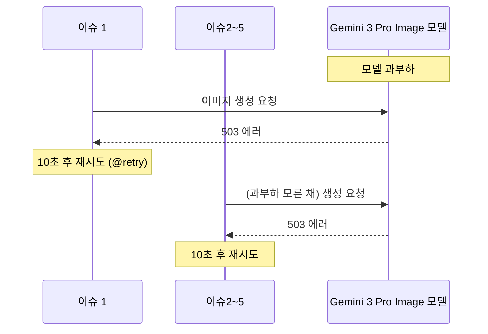
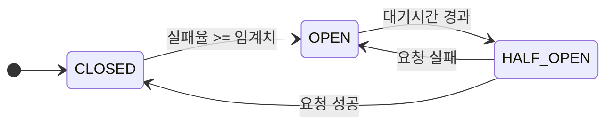

## 들어가며: 급감한 파이프라인 성공률

|  |  |
|:--:|:--:|
| 콘텐츠 생성 DAG run 기록 (최근 10회) | 이미지 생성 관련 Task (분홍색: 이미지 생성 실패) |

뉴스낵 콘텐츠 생성 DAG의 성공률이 최근 들어 60%로 급감했다. 원인은 우리 서버가 아니라 외부에 있었다. 메인으로 연동 중인 이미지 생성 모델(Gemini 3 Pro Image)이 피크 타임 때마다 과부하로 인해 요청을 거부하고 있었기 때문이다.

AI 서버의 로그를 확인해보니 아래와 같은 503 에러가 빈번하게 발생하고 있었다.

```text
ERROR: 11:56:42 - app.engine.tasks.image - Error generating image 0: 503 UNAVAILABLE. {'error': {'code': 503, 'message': 'This model is currently experiencing high demand. Spikes in demand are usually temporary. Please try again later.', 'status': 'UNAVAILABLE'}}
```

이러한 에러는 짧게는 수십 초, 길게는 몇 분간 이어지는 **일시적인 과부하** 형태를 띠고 있었다. 기존에도 애플리케이션 설정에서 환경 변수(`AI_PROVIDER`, `GOOGLE_IMAGE_MODEL` 등)를 제어하여 우회 모델로 전환할 수 있는 구조는 갖춰져 있었다. 하지만 이 방식은 GitHub Secrets를 수정하고 서버를 재배포해야 하는 수동적인 과정이 동반되었다. 단기적인 과부하 상황에서 일일이 관리자가 장애 발생을 인지하고 대응하기에는 긴 시간이 소요되었으며, 매일 Airflow DAG 실행 시간에 맞춰 대기하며 모니터링하는 것도 현실적으로 불가능했다. 결과적으로 수동 재배포 방식은 예측 불가능한 503 에러에 기민하게 대처하기 어려웠으며, **시스템 스스로 장애를 인지하고 자동으로 대응하는 구조**가 절실히 필요했다.

---

## 기존 시스템의 한계: 왜 단순 재시도로는 안 될까?

가장 먼저 고려할 수 있는 해결책은 재시도 횟수나 대기 시간을 늘리는 것이다. 실제로 뉴스낵 코드는 `Tenacity` 라이브러리를 활용해 재시도 로직이 적용되어 있었다. 하지만 뉴스낵의 병렬 처리 아키텍처에서 단순 재시도는 오히려 연쇄적인 병목을 유발했다.

뉴스낵 파이프라인은 한 번에 최대 5개의 이슈를 받아 각각 독립적인 비동기 코루틴으로 쪼개서 이미지 API에 접근한다.



위 다이어그램처럼, 1번 코루틴이 503 에러를 반환받아 10초 대기에 들어가면, 그 사이 2, 3, 4, 5번 코루틴은 **1번 코루틴으로부터 모델의 과부하 사실을 공유받지 못한 채** 무의미한 요청을 계속 보내며 모두 연쇄적인 재시도 루프에 빠지게 된다.

결과적으로 **특정 모델의 지속적 과부하** 상황에서 단순 재시도는 불필요한 API 호출과 대기 시간만 누적시키며 전체 파이프라인의 처리 지연으로 이어진다.

## 대안 탐색: 대체 모델의 부재와 해결의 실마리

이러한 문제(과부하로 인한 지연)는 일찍부터 인지하고 있었다. 기존에 뉴스낵에서 메인 모델로 사용하던 `Gemini 3.0 Pro Image` 모델은 503 과부하 에러 빈도가 높아 파이프라인의 주요 병목 지점이었다. 하지만 서킷 브레이커 같은 동적 라우팅 구조를 도입하기 어려웠는데, **장애 발생 시 트래픽을 넘길 '우회 모델(Fallback Model)'이 없었기 때문이다.**

당시 사용할 수 있었던 하위 모델인 `Gemini 2.5 Flash Image`는 한글 처리 수준이 낮아 실제 서비스에 적용하기 어려웠다. 대안 모델이 부재한 상황에서는 `Tenacity`의 무한 재시도 방식에 의존하여 서버가 자동 복구되기만을 기다릴 수밖에 없었다.


그러던 중 구글이 새로운 모델인 **Nano Banana 2(Gemini 3.1 Flash Image)**를 출시했다는 소식을 접했다. 테스트 결과 한글 렌더링 품질이 비약적으로 향상되어 서비스에 사용 가능한 수준이었다. 우회 모델로 활용할 수 있는 대안이 확보되자마자 파이프라인 과부하 문제의 해결 전략을 찾기 시작했다.

|  |  |
| :--: | :--: |
| 기존 모델(Gemini 2.5 Flash Image) | **신규 모델(Gemini 3.1 Flash Image)** |

## 주요 아키텍처: 메인 모델과 우회 모델 스위칭 전략

대안 모델(`Gemini 3.1 Flash`)이 확보되었으니, 기존처럼 고비용의 `Pro` 모델을 주로 사용하다가 장애 발생 시에 저비용의 `Flash` 모델로 라우팅하는 것이 좋을까?

우리는 각 모델별 스펙을 검토한 결과, 반대로 **두 모델의 역할을 교체하는 편이** 아키텍처적으로 더욱 합리적이라는 결론을 내렸다.


_Gemini 3.1 Flash Image 가격 정보_

| 모델명 | 역할 배치 | 장당 비용 | 특징 |
| --- | --- | --- | --- |
| **Gemini 3.1 Flash Image** | **메인 모델** | $0.045 | 빠르고 저렴하다. 과부하 빈도가 낮다. |
| **Gemini 3.0 Pro Image** | **우회 모델** | $0.134 | 느리고 비싸지만 퀄리티는 우수하다. |

결정 기준은 **비용 절감과 가용성 방어**다. 매일 수십 장의 이미지를 생성하는 파이프라인에서, 평소에는 빠르고 저렴한 `Flash` 모델을 **메인 모델**로 배치하여 리소스를 아낀다. 반면 기존에 병목을 유발했던 비싼 `Pro` 모델은 **우회 모델**로 전환했다. 

만약 메인 모델 쪽에서 예상치 못한 과부하가 발생하더라도(서킷 오픈), 즉시 대기시켜둔 `Pro` 모델로 우회 호출하여 파이프라인 중단을 방어하는 구조이다. 두 모델이 동시에 기능 장애를 겪는 최악의 상황만 아니라면, 역할을 스위칭하는 것만으로 거의 100%의 무중단 가용성을 확보할 수 있다. 타 프로바이더로 전환하여 이미지 스타일의 일관성을 해칠 필요도 없었다.

## 기반 인프라 설계: 분산 Circuit Breaker와 Redis

과부하된 API로의 요청을 즉시 차단하고, 정상 모델로 즉각 라우팅하기 위해 **Circuit Breaker(서킷 브레이커)** 패턴의 도입을 결정했다.

### Circuit Breaker(서킷 브레이커) 패턴이란?

서킷 브레이커 패턴은 전기 회로의 차단기에서 이름을 따온 패턴이다. 과전류가 흐를 때 자동으로 회로를 차단하는 것처럼, 서비스에서 지정된 에러가 임계값을 넘으면 해당 경로를 일시적으로 차단하고 우회 경로로 트래픽을 돌린다.

일반적으로 아래와 같이 동작한다.



- **CLOSED**: 정상 상태. 요청이 원래 경로로 간다.
- **OPEN**: 차단 상태. 요청이 바로 우회 경로로 간다. 기존 경로에는 요청을 보내지 않는다.
- **HALF-OPEN**: 복구 확인 상태. 원래 경로에 시험 요청을 보내보고, 성공하면 CLOSED로 돌아간다.

### Redis를 도입한 이유

문제는 이 서킷 브레이커의 **상태(차단 여부)를 어디에 저장**할 것인지였다. FastAPI 단일 워커의 내부 메모리(변수)에 저장할 수도 있지만, 이 경우 다중 동시 코루틴이나 여러 워커 프로세스 간에 서킷 상태를 공유할 수 없으며 앱 재시작 시 상태가 유실된다.

따라서 어느 코루틴이든, 어느 프로세스든 서킷 상태를 공유하고 실시간으로 대응할 수 있도록 **Redis 기반의 분산 서킷 브레이커 구조**를 채택했다. 이를 위해 `newsnack-infra` 리포지토리에 Redis를 추가하며 몇 가지 핵심적인 인프라 설계를 적용했다.

### 1. 외부 망 격리 보장 (`expose` vs `ports`)

Redis는 메인 API 서버와 AI 서버 등 내부망의 서비스들만 접근하면 된다. 따라서 악의적인 외부 공격 핑을 막기 위해 외부 포트 노출은 전면 차단해야 한다.

```yaml
# docker-compose.yml
services:
  redis:
    image: redis:8-alpine
    # ports: "6379:6379"  # EC2 호스트로 포트를 개방 (X)
    expose:
      - "6379"            # 동일한 도커 네트워크(newsnack-network) 내에서만 오픈 (O)
    networks:
      - newsnack-network
```

호스트→컨테이너로 직접 포트를 뚫는 `ports` 옵션 대신, 동일 네트워크 내부에서만 접근할 수 있는 `expose` 옵션을 사용해 네트워크 토폴로지의 보안을 챙겼다.

### 2. OOM(Out of Memory) 방지를 위한 2중 메모리 제한

서킷 브레이커 상태 저장이 주 용도라 쌓이는 데이터 크기가 매우 작다. 이를 감안해 효율적인 메모리 정책을 수립했다.

```yaml
# docker-compose.yml
services:
  redis:
    command: redis-server --maxmemory 64mb --maxmemory-policy allkeys-lru
    deploy:
      resources:
        limits:
          memory: 128M
```

여기서 중요한 점은 어플리케이션 레벨의 제한(`maxmemory 64mb`)과 컨테이너 레벨의 제한(`limits: memory 128M`)을 다르게 설정했다는 것이다. 
Redis는 순수 데이터 캐싱 외에도 클라이언트 연결 유지, 내부 버퍼 처리 등에 추가적인 메모리를 사용한다. 만약 두 값을 동일하게 `64MB`로 맞춘다면, 가용량을 살짝만 넘겨도 컨테이너 자체가 강제 종료(OOM Killed)될 수 있다. 따라서 어플리케이션 한도보다 도커 컨테이너 한도를 넉넉하게 할당해 안정성을 확보했다.

## 애플리케이션 연결 정책: Fail-Fast와 Hard-Fail

Redis 컨테이너 세팅을 마친 뒤, 어플리케이션 레벨에서 Redis 연결에 실패했을 때 어떻게 대처할 것인지 연결 정책을 고민했다.

처음에는 "Redis는 부가 기능이므로, Redis에 연결할 수 없으면 서킷 브레이커 기능 없이 동작하도록 구성(Soft-Fail)해야 할까?"에 대한 논의도 있었다. 하지만 이는 분기 처리를 과도하게 늘려 코드 복잡도를 높인다. **불완전한 인프라 상태로 서비스 기동을 강행하기보다는, 즉시 실행을 중단하여 빠르게 롤백하는 것**이 견고한 분산 시스템에 적절하다고 판단했다.

따라서 데이터베이스와 동일하게 **연결 실패 시 애플리케이션 기동 자체를 막는 Fail-Fast 방식**을 채택했다. FastAPI의 `lifespan` 훅을 이용해 애플리케이션 기동 전 상태 이상을 사전에 검증한다.

```python
# app/main.py
@asynccontextmanager
async def lifespan(app: FastAPI):
    # 앱 시작 시 — DB와 Redis 초기화 (둘 중 하나라도 실패 시 즉시 종료되는 Fail-Fast)
    init_db()
    await init_redis() # 내부에서 ping 실패 시 Exception 발생
    
    yield
    
    # 앱 종료 시 — 자원 안전 반환
    await close_redis()
    close_db()
```

이러한 **캡슐화**된 구조 덕분에, 메인(`main.py`) 컨텍스트는 내부의 복잡한 연결 테스트나 로깅에 관여하지 않고 오직 컴포넌트들의 생명주기만 깔끔하게 관리할 수 있다.

---

## 마치며

이번 1편에서는 뉴스낵 AI 파이프라인의 이미지 생성 병목과 과부하 에러의 근본 원인을 분석하고, 이를 구조적으로 극복하기 위해 분산 서킷 브레이커의 토대가 된 인프라를 설계한 과정을 다뤘다.  

특히 맹목적인 `Tenacity` 재시도를 넘어서, 모델 간의 경제적인 전환(Routing)을 채택하고 OOM과 외부 노출을 방지하기 위한 이중 메모리 제한 및 네트워크 격리를 통해 회복 탄력성 있는 내부 기반을 다질 수 있었다.

2편에서는 이렇게 구축한 인프라 위에서 파이썬 데코레이터(`@with_circuit_breaker`)를 활용해 실제 서킷 상태 추적 및 Fallback 라우팅 로직을 애플리케이션 코드 레벨에 구현한 과정을 상세히 다룬다.

## 참고 자료

- [Circuit Breaker Design Pattern - Wikipedia](https://en.wikipedia.org/wiki/Circuit_breaker_design_pattern)
