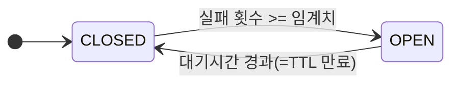
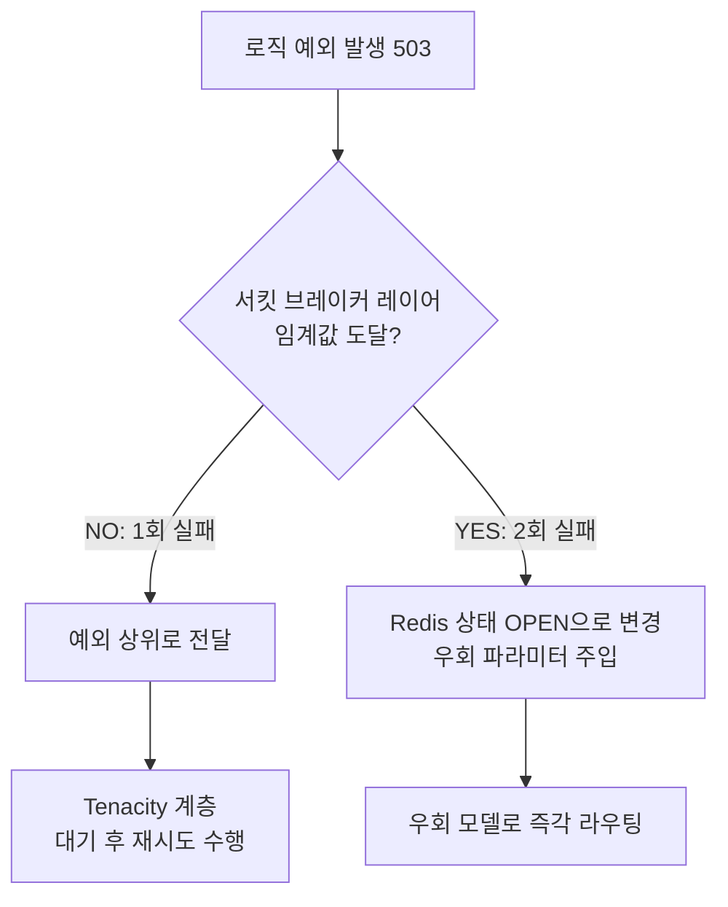

> [**이전 글**](../newsnack-redis-circuit-breaker-1)과 이어지는 글입니다.


## 들어가며

지난 1편에서는 구글 이미지 모델(Gemini 3.0 Pro Image)의 간헐적 과부하가 뉴스 생성 파이프라인 전체를 지연시키는 문제를 해결하기 위해, 새로 출시된 Gemini 3.1 Flash Image 모델로 역할을 스위칭하고 Redis 기반의 분산 인프라를 구축한 배경을 다루었다.

이번 글에서는 앞서 설계한 인프라 구조 위에서, **FastAPI 애플리케이션 레벨의 로직**을 파이썬 데코레이터(`@with_circuit_breaker`)로 구현한 과정과 여러 구조적 트레이드오프를 설명한다.

---

## 상태 전이 로직: 실용주의 기반의 2-State 아키텍처

이전 글에서 설명했듯이 일반적인 서킷 브레이커는 `HALF-OPEN` 단계를 거친다. 하지만 다중 워커 프로세스가 Redis를 공유하는 분산 환경에서 `HALF-OPEN`을 완벽히 구현하려면, 요청 개수를 제한하기 위한 복잡한 분산 락(Lock)이나 Lua 스크립트 기반의 동시성 제어가 요구된다.

트래픽 병렬 처리가 극단적이지 않은 현 시스템 규모에서 이는 오버엔지니어링이라고 판단했다. 따라서 복잡도를 낮추기 위해 **CLOSED (정상)**와 **OPEN (차단)** 두 가지 상태만 가지는 2-State 방식을 채택했다.



- **CLOSED (정상)**: 타깃 에러(429, 500, 503 등)가 발생하면 Redis에 `fail_count`를 누적한다.
- **OPEN (차단)**: 연속 에러가 임계치(예: 2회)를 채우면 서킷이 차단된다. Redis의 TTL 기능을 활용해 `status` 키에 자체 생명주기(3분)를 부여한다. 이 기간 동안 들어오는 모든 요청은 즉시 차단되어 우회 모델(Fallback Model)로 라우팅된다. TTL이 끝나면 상태 키가 만료되어 삭제되면서 자연스럽게 CLOSED 상태로 복귀한다.

## 핵심 로직: `@with_circuit_breaker` 데코레이터 구현

비즈니스 로직(이미지 생성 함수 등)이 Circuit Breaker의 Redis 연결 코드와 뒤섞이지 않게 데코레이터 패턴으로 캡슐화했다. `fallback_kwargs` 인자를 통해 대상 API가 다를 때마다 유연하게 우회 모델 파라미터를 동적으로 주입할 수 있다.

```python
# app/engine/circuit_breaker.py
def with_circuit_breaker(circuit_id: str, fallback_kwargs: dict = None, ...):
    def decorator(func: Callable):
        @wraps(func)
        async def wrapper(*args, **kwargs):
            redis_client = await RedisClient.get_instance()
            
            # 1. 서킷 상태 확인 — OPEN이면 즉시 우회 모델 호출
            status = await redis_client.get(status_key)
            if status == "OPEN":
                if fallback_kwargs: 
                    kwargs.update(fallback_kwargs)
                return await func(*args, **kwargs)

            # 2. 메인 로직 수행
            try:
                return await func(*args, **kwargs)
            except Exception as e:
                # 3. 타깃 에러 선별 로직 (503, 500 등) 생략
                if not is_target_error(e, target_errors): 
                    raise e
                
                # 4. 카운트 누적 및 Threshold 도달 시 OPEN 전환
                fail_count = await redis_client.incr(count_key)
                if fail_count >= failure_threshold:
                    await redis_client.set(status_key, "OPEN", ex=recovery_timeout_secs)
                    
                    if fallback_kwargs: # 우회 파라미터로 즉시 교체
                        kwargs.update(fallback_kwargs)
                        return await func(*args, **kwargs)

                raise e # 1회성 간헐적 실패는 상위 예외로 전달하여 @retry 유도
        return wrapper
    return decorator
```

### 타깃 에러 필터링과 우회 모델 라우팅
모든 예외에 대해 서킷을 열어서는 안 된다. 잘못된 파라미터로 인한 `400 Bad Request` 에러는 서버 과부하가 아니라 우리 로직의 버그 혹은 클라이언트의 오입력이므로 카운트 대상에서 제외해야 한다. 구글 API 등 외부 HTTP 라이브러리의 에러 객체에서 직접 상태 코드를 추출하거나, 속성이 없는 경우 시스템 메세지 텍스트를 파싱하여 통신 장애와 직결되는 특정 에러(`503`, `500`, `429`)만 선별하여 처리했다.

임계치에 도달해 서킷이 `OPEN`되는 즉시, 사전에 주입받은 `fallback_kwargs`로 요청 파라미터를 교체(Override)하고 원본 함수를 우회 호출한다. 과부하 상태인 기존 모델(Flash)에는 단 한 번도 요청 프록시가 가지 않아 불필요한 재시도와 대기를 방지한다.

## 두 레이어 간의 상호작용: `@retry` 계층과의 공존

이 데코레이터를 실제 이미지 생성 애플리케이션 로직인 `generate_google_image_task`에 부착해 본다.

```python
# app/engine/tasks/image.py
@retry(
    stop=stop_after_attempt(3),
    wait=wait_random_exponential(multiplier=1, max=10) # Tenacity 재시도 레이어
)
@with_circuit_breaker(
    circuit_id="google_image_api",
    fallback_kwargs={
        "override_model_name": settings.GOOGLE_IMAGE_MODEL_FALLBACK,
        "override_image_size": settings.GOOGLE_IMAGE_MODEL_FALLBACK_SIZE
    },
    failure_threshold=2
)
async def generate_google_image_task(
    idx: int, prompt: str, ...,
    override_model_name: str = None, # 서킷 브레이커의 진입점
    override_image_size: str = None  
) -> Image.Image:
    
    # 전달받은 파라미터가 없으면 메인 모델(Flash), 있다면 해당 우회 모델(Pro)을 사용
    model_name = override_model_name or settings.GOOGLE_IMAGE_MODEL_PRIMARY
    image_size = override_image_size or settings.GOOGLE_IMAGE_MODEL_PRIMARY_SIZE
    ...
```

파이썬 데코레이터는 코드 상에서 아래에서 위로 감싸며 실행된다. 이는 `Circuit Breaker` 계층이 내부 함수 로직과 가장 가깝게 배치되어 가장 먼저 장애 상황을 감지하고 처리한다는 의미다. 이 레이어 분리로 인한 계층 간 상호작용은 다음과 같은 흐름을 가진다.



- **일시적 장애 방어 (Tenacity):** 1회성(Threshold 미달) 예외가 발생하면 서킷은 닫힌 상태(CLOSED)를 유지하며 에러를 상위 예외로 전달한다(`raise e`). 이후 바로 바깥의 `@retry`가 이를 잡아내 지연 대기 후 본래의 대상(`Flash` 모델)으로 재시도를 수행한다.
- **장기 장애 우회 (Circuit Breaker):** 재시도 이후에도 503이 이어져 Redis의 연속 실패 횟수가 임계치(`failure_threshold=2`)를 넘기면 즉각 서킷이 차단된다(`OPEN`). 데코레이터 바깥의 빈틈없는 감시 덕에 병렬로 처리 중이던 다른 이슈(코루틴) 요청들은 더 이상 재시도 체인에 갇히지 않고, Tenacity의 대기 시간(Sleep) 소모 없이 즉시 우회 서버(`Pro` 모델)로 라우팅된다.

## 아키텍처의 한계와 트레이드오프

### 1. Tenacity 백오프 잠복기 지연 현상
재시도(`@retry`)와 서킷 브레이커를 별도의 데코레이터로 분리하는 구조적 특성으로 인해 발생하는 지연 현상이다. 
앞서 도착한 병렬 태스크 '이슈 A'가 연쇄 에러를 겪고 서킷을 완전히 열었다고 가정해 보자. 그 직전 태스크인 '이슈 B'는 간발의 차이로 `Flash`를 호출하다 1회성 503 에러를 만나 `@retry` 계층의 10초 대기열에 진입한 상태일 수 있다. 이 경우 이미 다른 코루틴에 의해 서킷이 `OPEN` 상태가 되었음에도, '이슈 B'는 10초 대기가 모두 끝나고 재시도를 시작하는 시점이 되어서야 서킷 상태를 인지하고 우회 경로로 이동하는 지연을 겪는다. 로직 계층을 구조적으로 강하게 결합하지 않는 한, 이러한 일시적인 응답 지연은 분리된 모듈 디자인상 불가피한 트레이드오프다.

### 2. 동시성 제어 최소화
실제 에러 카운트를 올리고 상태를 차단(`OPEN`)으로 바꾸는 과정은 `incr` → `expire` → `set` → `delete`로 이어지는 여러 단위의 Redis 명령어로 이루어져 있다.
완벽한 단위 트랜잭션을 보장하기 위해선 결국 **Lua 스크립트**를 도입해야만 한다. 하지만 현 시스템의 트래픽 규모에서는 여러 코루틴이 동시에 임계치를 넘겨 서킷 상태를 강제로 중복 설정(`set`)하는 일이 발생하더라도 동일한 `OPEN` 상태값을 덮어쓸 뿐이므로 시스템 안정성에 미치는 영향은 미미하다. 따라서 불필요한 복잡도와 오버엔지니어링을 피하기 위해 별도의 동시성 제어 로직은 제외하는 타협안을 선택했다.

---

## 마치며


_서킷 브레이커 도입 이후 DAG Run 기록 (최근 10회)_

이번 트러블슈팅은 외부 API의 장애 및 과부하 위기 상황에서 특정 병렬 파이프라인의 에러가 다른 코루틴으로 불필요하게 전파되지 않도록 견고하게 격리하는 중요한 과정이었다.

무엇보다 초기에는 이미지 품질(특히 한글 표현력)이 떨어지는 모델들밖에 없어 적용할 수 있는 대안 모델(우회 경로)이 전무했기 때문에 우회 구현을 보류했었다. 하지만 `Gemini 3.1 Flash Image` 출시라는 시기적절한 패러다임 변화를 적극 활용하여 '비용은 극적으로 낮추면서 결과물의 가용성은 방어하는 전략적 스위칭 브레이커 구조'를 적용한 점이 가치 있는 성과였다. 도입 이후 지속적인 트래픽 과부하 상황에서도 전체 병렬 파이프라인 실패율을 0%로 억제해내는 견고한 시스템 안정성을 확보할 수 있었다.
