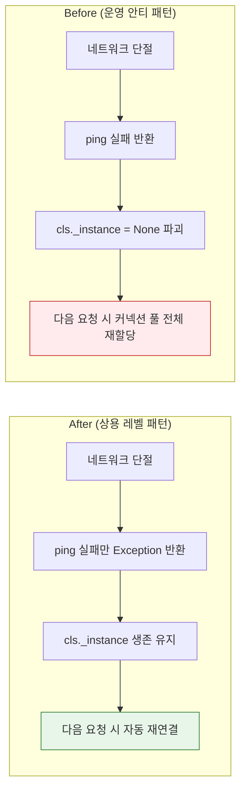

## 배경

뉴스낵 AI 서버 개발 초기에는 애플리케이션 진입점(`main.py`) 파일에 로깅 제어, 외부 자원 초기화 등 여러 책임이 혼재되어 있었다. 또한 클라우드 환경에서 운영을 하면서 다음과 같은 세 가지 한계가 드러났다.

1. **로깅 추적의 한계**: 에러 발생 시 로그에 시간(`H:M:S`)만 있고 날짜와 타임존 정보가 없어 시점 파악이 불가능했다. 게다가 비동기 환경 특성상 동시다발적인 요청 로그가 뒤섞여 개별 요청의 흐름을 추적할 수 없었다.
2. **블로킹 취약점**: 싱글 스레드 이벤트 루프를 사용하는 FastAPI 특성상, 초기화 단계에서 동기 통신 모듈(SQLAlchemy)이 전체 서버 동작을 지연시키는 현상이 있었다.
3. **불안정한 자원 관리**: 네트워크 단절 시 일시적인 `ping()` 실패 때문에 캐시 싱글톤 풀 인스턴스 자체가 파괴(`None` 초기화)되는 구조적 안티 패턴이 존재했다.

이러한 문제들을 해결하고 유지보수성과 관측성을 완벽하게 확보하기 위해 전면적인 리팩토링을 진행한 과정을 공유한다.

---

## 1. 관측성 확보: 비동기 로그 추적과 포맷 고도화

### 문제 상황


최근 뉴스낵의 핵심 기능인 'AI 콘텐츠 생성 파이프라인'에서 에러가 발생했다. 원인을 파악하기 위해 시스템 로그를 열었으나, 수많은 로그가 `08:34:38`처럼 시간만 표시된 채 쌓여 있었다.

```text
# 문제점 1: 날짜/타임존 없음, 로거별 포맷 혼재
INFO: 08:34:38 - uvicorn.access - 172.25.0.7:45906 - "POST / today-newsnack HTTP/1.1" 202
INFO: 08:35:40 - app.services.workflow_service - [TodayNewsnackWorkflow] Today's Newsnack Pipeline Completed
```

이 로그가 오늘 남겨진 것인지 며칠 전 장애의 흔적인지 도무지 구분할 방법이 없었다.

이와 함께 FastAPI 특유의 비동기 환경도 문제를 키웠다. 하나의 스레드(`MainThread`)가 수십 개의 요청을 번갈아 가며 처리하기 때문에, 에러 로그 위아래로 찍혀 있는 내용들이 해당 에러를 발생시킨 사용자의 요청 흐름인지 다른 사용자의 정상 요청인지 맥락을 전혀 파악할 수 없었다. 게다가 기본으로 제공되는 Uvicorn 로그와 비즈니스 코드의 로그 포맷마저 통일되지 않아 로그 파이프라인의 파편화가 심각했다.

### 기술적 의사결정

"서버 로그는 날짜와 타임존 정보가 담긴 구조화된 형태여야 하며, 모든 로그 라인에서 개별 요청을 고유하게 식별할 수 있어야 한다"는 목표를 세우고 개편을 준비했다. 이 과정에서 여러 문서를 참고하며 다음과 같은 결정을 내렸다.

1.  **외부 라이브러리(`structlog` 등) 미도입**: 여러 문서에서 고급 로깅을 위해 `structlog`와 같은 외부 라이브러리 도입을 권장했다. 하지만 우리의 현재 요구사항(텍스트 형태의 포맷 통일, Request ID 주입)은 파이썬 내장 `logging` 모듈과 `contextvars`만으로도 완벽하게 구현이 가능했다. 외부 의존성을 늘리지 않고 가볍게 직접 구현하는 방식을 택했다.
2.  **민감 정보 필터(`SensitiveDataFilter`) 기각**: 로그에서 민감 정보(토큰 등)를 정규식으로 찾아 마스킹해 주는 필터 구조도 고려했다. 그러나 로그 출력 시마다 모든 문자열을 정규식으로 검사하는 행위는 런타임 성능 저하로 직결될 위험이 크다고 판단했다. 복잡한 필터를 추가하기보다, 애초에 민감한 정보가 로그로 찍히지 않도록 비즈니스 로직 레벨에서 통제하는 방향으로 타협했다.

### 해결 방법

이러한 판단을 바탕으로 아래 세 단계를 거쳐 통합 로깅 시스템을 구축했다.

1. **포맷 고도화**: 기존의 하드코딩된 `basicConfig` 대신 설정 및 확장에 용이한 `dictConfig`를 도입했다. 로그 출력 포맷을 ISO 8601 표준을 벤치마킹하여 날짜, 밀리초 단위 시간, 타임존(`Z`)이 모두 포함되도록 개선했다.
2. **ContextVar 기반 Request ID 부여**: 앞서 채택한 `contextvars` 모듈을 사용해 비동기 환경에서도 안전한 `request_id_var` 공간을 만들었다. 그리고 `logging.Filter`를 상속받은 커스텀 필터를 통해 모든 로그에 이 Request ID 값이 자동으로 주입되게 구성했다.
3. **통합 커스텀 미들웨어 구현**: 모든 HTTP 요청을 가로채서 8자리의 짧은 고유 식별자(UUID)를 발급하고, 정교한 접속 로그(소요 시간 포함)를 출력했다. 기본 제공되어 중복 로그를 만드는 `uvicorn.access` 등의 프레임워크 로그들은 파이썬의 '설정과 구현 분리' 원칙에 따라 코드 내부에서 강제로 끄지 않고, `dictConfig` 설정 객체 내부에 선언적으로 명시하여 깔끔하게 제어했다.

```python
# app/core/middleware.py

logger = logging.getLogger("app.middleware")

async def logging_middleware(request: Request, call_next):
    # 매 HTTP 요청마다 8자리의 짧고 고유한 UUID 발급
    req_id = str(uuid.uuid4())[:8]
    # 비동기 컨텍스트(ContextVar)에 세팅하여 하위 패키지에서도 로그에 값을 꺼내 쓸 수 있도록 적용
    token = request_id_var.set(req_id)
    start_time = time.perf_counter()

    try:
        response = await call_next(request)
        duration_ms = (time.perf_counter() - start_time) * 1000
        
        # 헬스체크 등 의미 없는 핑 노이즈 로그는 제외 필터링
        if request.url.path not in EXCLUDE_PATHS:
            client_ip = get_client_ip(request) # 프록시 헤더 추출
            logger.info(
                f'{client_ip}:{request.client.port} - "{request.method} {request.url.path}" {response.status_code} ({duration_ms:.2f}ms)'
            )
            
        # 프론트엔드 측에서도 에러 ID를 식별할 수 있도록 응답 헤더에 포함
        response.headers["X-Request-ID"] = req_id
        return response
    except Exception as e:
        # 예상치 못한 500 서버 장애 발생 시, 원인 추적을 위해 에러 내용과 콜스택을 함께 로깅
        duration_ms = (time.perf_counter() - start_time) * 1000
        client_ip = get_client_ip(request)
        logger.exception(
            f'{client_ip}:{request.client.port} - "{request.method} {request.url.path}" 500 ({duration_ms:.2f}ms)'
        )
        raise e
    finally:
        request_id_var.reset(token)
```

이 작업을 통해 파편화되어 있던 기존 로그가 다음과 같이 상용 서버 수준의 명확한 운영 로그로 탈바꿈했다.

```text
# 변경 후: 날짜/UTC시간 포함, 고유 Request ID(23d620c7) 주입, 응답 소요 시간 측정
2026-03-10T13:40:21.047Z INFO  66215 --- [23d620c7] app.middleware       : 203.0.113.1:53166 - "GET /test" 404 (0.55ms)
2026-03-10T13:40:22.102Z ERROR 66215 --- [23d620c7] app.engine.nodes     : generate_image_task failed
```

이제 에러가 발생해도 모니터링 과정에서 시간대 파악에 혼선이 없게 되었다. 또한 Request ID(`23d620c7`)만 복사해서 검색 필터에 넣으면, 그 사용자의 요청 시작부터 DB 입출력, AI 워크플로우, 장애 발생 지점까지의 모든 흐름을 단일 문맥으로 추적할 수 있는 환경이 구축되었다.

## 2. 클라우드 네이티브 헬스체크: Liveness vs Readiness 격리

### 문제 상황

기존의 `/health` API는 단순히 애플리케이션 프로세스가 실행되었는지만 응답하는 제한적인 역할만 수행했다. 클라우드 인프라의 로드밸런서 환경에서는 **프로세스의 생존 여부(Liveness)**뿐만 아니라, DB 및 Redis와 같은 핵심 외부 자원과 연결되어 **실제 비즈니스 트래픽을 처리할 준비(Readiness)**가 되었는지 분리해서 점검해야 한다.

### 해결 방법

시스템 진단을 위한 라우터를 비즈니스 인증망에서 독립시키기 위해 `app/api/health.py` 파일로 완전히 분리했다.

```python
# app/api/health.py

router = APIRouter(tags=["System"])

@router.get("/health")
async def liveness_check():
    """서버 프로세스의 정상 구동 여부 진단 (Liveness)"""
    return {"status": "UP"}

@router.get("/health/ready")
async def readiness_check():
    """비즈니스 트래픽 수신 가능 여부 진단 (Readiness)"""
    try:
        await run_in_threadpool(check_db_connection)
        await check_redis_connection()
    except Exception as e:
        # 콘솔에는 구체적인 에러를 찍되, 외부에는 503 HTTP 에러만 노출
        raise HTTPException(
            status_code=status.HTTP_503_SERVICE_UNAVAILABLE,
            detail="외부 의존성 연결 실패"
        )
    return {"status": "READY"}
```

핵심은 Readiness 체크 성공 시의 `logger.info` 로그를 제거했다는 점이다. 초 단위로 호출되는 진단 요청 특성상, 빈번한 I/O 발생을 억제하여 정상 상태에서는 불필요한 로그 산출을 줄였다.

## 3. 이벤트 루프 수호: 비동기 블로킹 방어

### 배경 지식: 이벤트 루프와 블로킹

FastAPI는 파이썬의 `async/await` 코루틴 기반으로 동작하며, 싱글 스레드 안에서 "이벤트 루프"가 수많은 I/O 요청을 비블로킹 방식으로 중계한다.

그러나 이벤트 루프 내부에서 동기적 패키지인 SQLAlchemy를 직접 호출하면, DB 작업이 끝날 때까지 서버의 **이벤트 루프가 통째로 멈추게** 된다. 이로 인해 다른 API 요청들까지 처리가 지연되는 심각한 병목이 발생한다.

### 해결 방법

`run_in_threadpool`을 사용하여 무거운 동기 DB 작업을 별도의 스레드 풀로 위임했다. 서버 수명 주기를 관리하는 `lifespan` 컨텍스트 매니저 안에서 이를 적용하여, 서버 시작과 종료 양방향 모두에서 이벤트 루프를 보호했다.

```python
# app/core/lifespan.py
from contextlib import asynccontextmanager
from fastapi.concurrency import run_in_threadpool

@asynccontextmanager
async def lifespan(_app: FastAPI):
    # 동기 함수인 DB 접근은 워커 스레드로 오프로딩 → 메인 이벤트 루프 블로킹 방어
    await run_in_threadpool(check_db_connection)

    # 비동기 드라이버를 활용하는 Redis는 이벤트 루프에서 직접 await
    await check_redis_connection()

    yield  # 앱 실행 구간

    # 안전한 종료: 시작과 대칭적인 종료 처리
    await close_redis_connection()
    await run_in_threadpool(close_db_connection)
```

## 4. 단일 책임 원칙(SRP)에 기반한 커넥션 풀 관리

### 문제 상황

기존 Redis 싱글톤 초기화 과정에서는 풀 인스턴스 생성과 상태 검증용 `ping()` 오류 처리 로직이 결합되어 있었다. 일시적인 네트워크 단절 시, 기껏 생성한 싱글톤 객체 자체를 `None`으로 파괴하는 구조였다.

```python
# ❌ 기존 안티 패턴 (개념적 예시)
@classmethod
async def get_instance(cls):
    if cls._instance is None:
        cls._instance = Redis.from_url(...)
    try:
        await cls._instance.ping()
    except Exception:
        cls._instance = None  # 일시적 장애에 싱글톤 파괴!
    return cls._instance
```

이후 네트워크가 회복되더라도 다음 요청 시 커넥션 풀 전체를 메모리에서 재할당해야 하는 불필요한 오버헤드가 발생하는 것이 문제였다.

### 해결 방법



객체를 생성하는 행위와 연결 상태를 진단하는 행위를 철저히 분리했다.

```python
# app/core/redis.py

class RedisClient:
    _instance = None

    @classmethod
    async def get_instance(cls) -> Redis:
        """단일 책임 원칙 준수: 순수 커넥션 풀 객체 할당 로직만 담당"""
        if cls._instance is None:
            cls._instance = Redis.from_url(settings.REDIS_URL, decode_responses=True)
        return cls._instance

async def check_redis_connection():
    """진단 및 예외 보고 책임 위임: 풀 인스턴스 파괴 없이 예외만 던짐"""
    try:
        redis = await get_redis()
        await redis.ping()
    except Exception as e:
        logger.error(f"Redis connection failed: {e}")
        raise e  # 인스턴스는 유지, 예외만 상위로 전파
```

이와 더불어 DB 및 Redis 모듈의 진단 및 종료 함수명을 대칭적 네이밍 형태(`check_*_connection()`, `close_*_connection()`)로 엄격하게 통일하여 코드베이스 일관성을 높였다.

---

## 마치며

이러한 리팩토링 덕분에 비대했던 `main.py`는 애플리케이션 컴포넌트를 조립하는 책임만 갖는 형태로 간결해졌다.

```python
# app/main.py

# 1. 인프라 공통 설정 바인딩
setup_logging()

# 2. FastAPI 인스턴스 조립 및 수명 주기 위임
app = FastAPI(title=settings.PROJECT_NAME, lifespan=lifespan)

# 3. 로깅 미들웨어 주입: 모든 HTTP 요청의 접속 로그와 고유 ID 추적
app.middleware("http")(logging_middleware)

# 4. Auth 제외 라우터(헬스 체크용) 등록
app.include_router(health.router)

# 5. Auth 포함 라우터 등록
app.include_router(contents.router, dependencies=[Security(verify_api_key)])
app.include_router(debug.router, dependencies=[Security(verify_api_key)])
```

비동기 스레드 특성을 이해하고 단일 책임 원칙에 따라 각 모듈의 책임을 독립시키는 작업을 통해 상용 레벨의 리팩토링을 경험할 수 있었다.

---

## 참고 자료

- [Production-Grade Logging for FastAPI Applications - Medium](https://medium.com/@laxsuryavanshi.dev/production-grade-logging-for-fastapi-applications-a-complete-guide-f384d4b8f43b)
- [[Backend] Logging in Python and Applied to FastAPI - Medium](https://medium.com/@v0220225/backend-logging-in-python-and-applied-to-fastapi-7b47118d1d92)
- [Python 공식 문서 - contextvars](https://docs.python.org/ko/3/library/contextvars.html)
