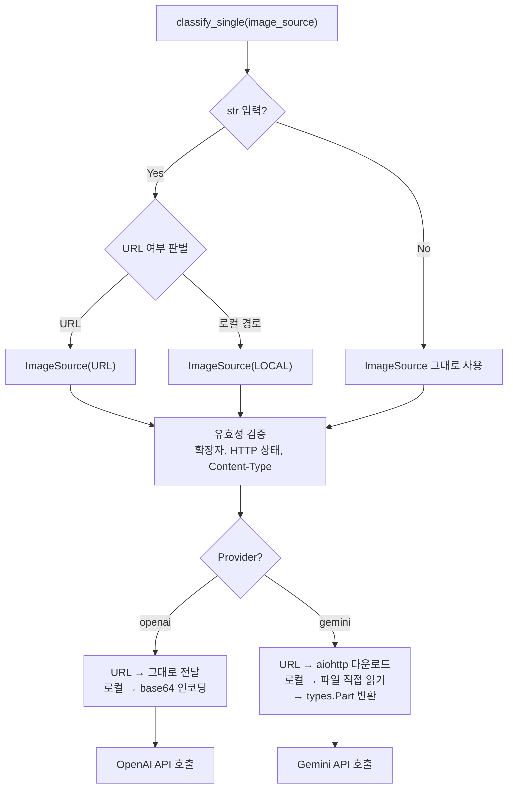

## 배경

초기 OutfitAI는 로컬 파일 경로를 통해서만 이미지를 입력받았다. `classify_single("path/to/image.jpg")`처럼 파일 시스템에 저장된 이미지를 읽어 API에 넘기는 구조였다.

하지만 실제 앱에서는 이미지가 로컬 파일보다 URL로 존재하는 경우가 더 많았다. S3에 업로드한 사용자의 옷 사진, 제품 상세 이미지 모두 URL로 관리되고 있었다. 이를 처리하려면 매번 호출 코드에서 이미지를 직접 다운로드한 뒤 임시 파일로 저장하거나, 별도 처리를 해야 했다.

한편 OpenAI와 Gemini는 이미지를 다루는 방식이 근본적으로 다르다.

- **OpenAI**: URL은 그대로 전달 가능. 로컬 파일은 base64 인코딩 후 data URL 형식으로 전달.
- **Gemini**: URL을 직접 전달하는 방식을 지원하지 않음. URL이든 로컬 파일이든 이미지 바이트를 직접 읽어 `types.Part` 객체로 변환해야 함.

이 두 가지 문제를 해결하기 위해 이미지 입력 레이어를 설계했다. 목표는 **호출자가 URL인지 파일인지, 어떤 프로바이더를 쓰는지 신경 쓰지 않아도 되는 구조**였다.

## ImageSource: 입력 방식의 추상화

먼저 이미지 입력의 종류를 타입으로 명확히 정의한다. `ImageSourceType`은 입력이 로컬 파일인지 URL인지를 나타내는 `Enum`이고, `ImageSource`는 이 타입과 실제 경로(또는 URL)를 묶는 데이터클래스다.

```python
# utils/image_processor.py
class ImageSourceType(Enum):
    LOCAL = "local"
    URL = "url"

@dataclass
class ImageSource:
    type: ImageSourceType
    path: str
```

`ImageSource`는 단순한 값 객체다. 직접 생성해서 넘길 수도 있고, 문자열을 넘기면 `ImageProcessor` 내부에서 자동으로 변환한다.

```python
async def process_image(self, image_source: Union[str, ImageSource]):
    # 문자열로 들어오면 URL 여부를 판별해 ImageSource로 변환
    if isinstance(image_source, str):
        source_type = ImageSourceType.URL if self._is_url(image_source) else ImageSourceType.LOCAL
        image_source = ImageSource(type=source_type, path=image_source)

    await self._validate_source(image_source)

    if self.settings.OUTFITAI_PROVIDER == "openai":
        return await self._process_for_openai(image_source)
    else:
        return await self._process_for_gemini(image_source)
```

URL 판별은 `urlparse`로 scheme과 netloc이 모두 존재하는지 확인하는 방식이다.

```python
@staticmethod
def _is_url(path: str) -> bool:
    try:
        result = urlparse(path)
        return all([result.scheme, result.netloc])
    except ValueError:
        return False
```

## 처리 흐름 전체 구조

입력부터 API 호출 직전까지의 전체 흐름을 정리하면 다음과 같다.



`ImageProcessor`는 이 흐름의 중간 레이어 역할을 한다. 호출자(`OpenAIClassifier`, `GeminiClassifier`)는 입력 타입과 프로바이더별 처리 방식을 전혀 알 필요가 없다.

## 프로바이더별 이미지 처리 분기

`process_image`는 `ImageSource`를 받아 프로바이더에 맞는 형식으로 변환한다. 변환 로직은 각 프로바이더에 완전히 독립적으로 구현한다.

### OpenAI: URL은 그대로, 로컬은 base64

OpenAI API는 `image_url` 타입 콘텐츠로 URL 문자열 또는 base64 data URL을 모두 받는다. URL 입력은 변환 없이 그대로 전달하면 되고, 로컬 파일만 인코딩이 필요하다.

```python
async def _process_for_openai(self, source: ImageSource) -> str:
    if source.type == ImageSourceType.URL:
        return source.path  # URL은 그대로 반환
    else:
        return f"data:image/jpeg;base64,{self._encode_image(source.path)}"
```

### Gemini: 항상 바이트로 변환

Gemini는 URL을 직접 받지 않는다. 로컬 파일이든 URL이든 이미지 바이트를 읽어 `types.Part` 객체를 만들어야 한다. URL의 경우 `aiohttp`로 비동기 다운로드를 수행한다.

```python
async def _process_for_gemini(self, source: ImageSource) -> types.Part:
    if source.type == ImageSourceType.LOCAL:
        with open(source.path, 'rb') as image_file:
            image_bytes = image_file.read()
    else:
        async with aiohttp.ClientSession() as session:
            async with session.get(source.path) as response:
                if response.status != 200:
                    raise ImageProcessingError(
                        f"Failed to fetch image from URL: {source.path}")
                image_bytes = await response.read()

    extension = Path(source.path).suffix.lower()
    mime_type = f"image/{extension[1:]}" if extension != '.jpg' else "image/jpeg"

    return types.Part.from_bytes(data=image_bytes, mime_type=mime_type)
```

두 메서드의 반환 타입이 다르다(`str` vs `types.Part`). 그러나 각 분류기(`OpenAIClassifier`, `GeminiClassifier`)는 자신이 기대하는 타입을 그대로 받으므로 문제가 없다. 이 타입 차이는 `ImageProcessor` 내부에서 완전히 캡슐화되고, 분류기 바깥으로는 노출되지 않는다.

## URL 유효성 검증

URL을 받았을 때 단순히 형식만 검사하는 것으로는 부족하다. 잘못된 URL이나 이미지가 아닌 리소스를 가리키는 URL을 API 호출 전에 걸러내야 한다.

`_validate_url`은 실제로 해당 URL에 `HEAD` 요청을 보내 두 가지를 확인한다.

```python
async def _validate_url(self, url: str) -> None:
    if not self._is_url(url):
        raise ImageProcessingError("Invalid URL format")

    path = urlparse(url).path
    ext = Path(path).suffix.lower()
    if ext not in self.SUPPORTED_EXTENSIONS:
        raise ImageProcessingError(f"Unsupported file extension in URL: {ext}")

    async with aiohttp.ClientSession() as session:
        try:
            async with session.head(url) as response:
                if response.status != 200:
                    raise ImageProcessingError(f"Failed to access URL: {url}")

                content_type = response.headers.get("content-type", "")
                if not content_type.startswith("image/"):
                    raise ImageProcessingError(
                        f"URL does not point to an image: {url}")
        except aiohttp.ClientError as e:
            raise ImageProcessingError(f"Failed to validate URL: {str(e)}")
```

- **확장자 검사**: URL 경로에서 확장자를 추출해 지원 목록과 대조한다.
- **HTTP 상태 검사**: 404나 403처럼 접근 불가능한 URL을 사전에 탐지한다.
- **Content-Type 검사**: 확장자가 없거나 리다이렉트를 거치는 URL의 경우, 응답 헤더의 `Content-Type`이 `image/`로 시작하는지 확인한다.

`HEAD` 요청을 사용하는 이유는 응답 바디를 받지 않아 실제 이미지 다운로드 없이도 URL의 유효성을 빠르게 확인할 수 있기 때문이다.

## lru_cache로 로컬 파일 중복 로딩 방지

같은 이미지 파일을 반복해서 처리하는 배치 시나리오에서, 동일한 파일을 매번 디스크에서 읽는 것은 낭비다. `_load_image`는 `lru_cache`를 통해 최근 10개의 이미지를 메모리에 캐싱한다.

```python
@lru_cache(maxsize=10)
def _load_image(self, image_path: Union[str, Path]) -> ImageFile:
    try:
        with Image.open(image_path) as img:
            return img.copy()
    except Exception as e:
        raise ImageProcessingError(f"Failed to load image: {str(e)}")
```

`Image.open`은 컨텍스트 매니저를 벗어나면 파일 핸들을 닫기 때문에, 캐싱할 때는 `img.copy()`로 픽셀 데이터를 메모리에 올려 반환한다.

## 비동기 배치 처리

`BaseClassifier.classify_batch`는 `asyncio.gather`를 활용해 배치 내 이미지들을 동시에 처리한다.

```python
# classifier/base.py
async def classify_batch(self, image_paths, batch_size=None) -> List[Dict[str, Any]]:
    batch_size = batch_size or self.settings.BATCH_SIZE

    # 디렉토리 경로면 이미지 파일 목록으로 변환
    if isinstance(image_paths, (str, Path)):
        path = Path(image_paths)
        if path.is_dir():
            image_paths = [
                p for p in path.glob("*")
                if p.suffix.lower() in ['.jpg', '.jpeg', '.png', '.webp', 'gif']
            ]

    results = []
    for i in range(0, len(image_paths), batch_size):
        batch = image_paths[i:i + batch_size]
        tasks = [self.classify_single(path) for path in batch]
        batch_results = await asyncio.gather(*tasks, return_exceptions=True)

        for result in batch_results:
            if isinstance(result, Exception):
                self.logger.error(f"Error in batch processing: {str(result)}")
                results.append({"error": str(result)})
            else:
                results.append(result)

    return results
```

`asyncio.gather`에 `return_exceptions=True`를 넘기면, 개별 이미지 처리 중 예외가 발생하더라도 나머지 이미지 처리가 중단되지 않는다. 실패한 항목은 `{"error": "..."}` 형태로 결과 목록에 포함되고, 성공한 항목은 정상적으로 반환된다.

OpenAI, Gemini API 호출은 모두 `await`가 붙은 비동기 호출이므로, `asyncio.gather`를 쓰면 여러 이미지의 API 응답 대기 시간이 겹쳐 실질적인 처리 시간이 단축된다.

## CLI에서의 URL 지원

CLI에서는 `click`의 `argument`에 기본적으로 파일 시스템 존재 여부를 검사하는 제약이 붙는다. URL은 파일로 존재하지 않으므로 이 제약을 제거하고, 대신 커스텀 검증 콜백(`validate_image_path`)을 달았다.

```python
# cli.py
def validate_image_path(ctx, param, value):
    # URL이면 바로 통과
    result = urlparse(value)
    if all([result.scheme, result.netloc]):
        return value

    # 로컬 경로면 존재 여부 확인
    path = Path(value)
    if not path.exists():
        raise click.BadParameter(f"File or directory not found: {value}")
    return str(path)

@cli.command()
@click.argument('image_path', callback=validate_image_path)
...
```

이 콜백은 URL과 로컬 경로를 동일한 인자로 받으면서, 각각에 맞는 검증 로직을 적용한다. CLI 사용자는 파일 경로와 URL을 구분하지 않고 동일한 명령어 형식으로 사용할 수 있다.

```bash
# 로컬 파일
outfitai path/to/image.jpg

# URL
outfitai https://example.com/outfit.jpg
```

## 마치며

이미지 입력 레이어를 `ImageSource`로 추상화하면서 세 가지를 달성했다.

- **호출자 단순화**: 분류기를 사용하는 쪽은 파일인지 URL인지, 어떤 프로바이더를 쓰는지 신경 쓰지 않아도 된다.
- **프로바이더 차이 캡슐화**: OpenAI와 Gemini의 이미지 처리 방식 차이는 `ImageProcessor` 내부에서 완전히 숨겨진다.
- **확장 용이성**: 새 프로바이더가 추가되거나 새 입력 방식(예: S3 경로)이 필요해지면, `ImageSourceType`과 프로바이더별 처리 메서드만 추가하면 된다.

다음 글에서는 CLI·라이브러리 이중 인터페이스 설계, `pydantic-settings` 기반 설정 관리, PyPI 배포 자동화까지 OutfitAI를 완성된 패키지로 만든 과정을 다룬다.
