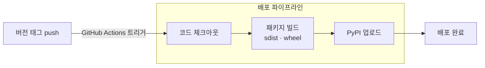

## 들어가며

분류 로직과 이미지 처리 레이어가 완성되었다면, 이제 이걸 '쓸 수 있는 도구'로 만드는 작업이 남았다. 코드가 아무리 잘 설계되어 있어도 설치와 사용이 불편하면 재사용되지 않는다.

이 글에서는 OutfitAI를 완성된 파이썬 패키지로 만들기까지의 과정을 다룬다. `pydantic-settings` 기반 설정 관리, CLI와 라이브러리 이중 인터페이스 설계, `setuptools_scm`을 이용한 버전 관리, 그리고 GitHub Actions로 구성한 PyPI 배포 자동화다.

## 설정 관리: pydantic-settings

### 세 가지 입력 방식을 하나로

OutfitAI는 설정을 세 가지 방법으로 주입할 수 있어야 했다.

1. **환경 변수**: 서버 환경에서 일반적으로 사용
2. **`.env` 파일**: 로컬 개발 환경에서 편리
3. **코드에서 직접 전달**: 테스트나 라이브러리 통합 시 유용

이 세 가지를 직접 구현하면 우선순위 로직, 파일 파싱, 타입 변환 등을 모두 처리해야 한다. `pydantic-settings`는 이를 선언적으로 처리한다.

```python
# config/settings.py
from pydantic_settings import BaseSettings

class Settings(BaseSettings):
    OUTFITAI_PROVIDER: str = "openai"
    OPENAI_API_KEY: Optional[str] = None
    GEMINI_API_KEY: Optional[str] = None
    OPENAI_MODEL: str = "gpt-4o-mini"
    GEMINI_MODEL: str = "gemini-2.5-flash"
    OPENAI_MAX_TOKENS: int = 300
    BATCH_SIZE: int = 10
    LOG_LEVEL: str = "INFO"

    class Config:
        env_file = ".env"
        env_file_encoding = "utf-8"
```

`BaseSettings`를 상속하는 것만으로 환경 변수와 `.env` 파일을 자동으로 읽는다. 코드에서 직접 인자를 넘기면 그 값이 최우선이 된다. 세 방식의 우선순위 처리는 `pydantic-settings`가 알아서 관리한다.

```python
# 환경 변수 또는 .env 파일에서 자동 로드
settings = Settings()

# 코드에서 직접 전달 (테스트, CI 환경에 적합)
settings = Settings(
    OUTFITAI_PROVIDER="gemini",
    GEMINI_API_KEY="AI...",
)

# 딕셔너리로 전달
settings = Settings.from_dict({
    "OUTFITAI_PROVIDER": "openai",
    "OPENAI_API_KEY": "sk-...",
})
```

### 조기 실패 설계

잘못된 설정으로 API 호출이 시작된 후에야 에러를 알게 되면 불필요한 비용과 시간이 낭비된다. `Settings.__init__`은 초기화 시점에 프로바이더에 맞는 API 키가 있는지를 즉시 검증한다.

```python
def __init__(self, **kwargs):
    super().__init__(**kwargs)
    self._validate_api_keys()

def _validate_api_keys(self):
    if self.OUTFITAI_PROVIDER == 'openai' and not self.OPENAI_API_KEY:
        raise ValueError(
            "OPENAI_API_KEY must be provided when using OpenAI provider"
        )
    elif self.OUTFITAI_PROVIDER == 'gemini' and not self.GEMINI_API_KEY:
        raise ValueError(
            "GEMINI_API_KEY must be provided when using Gemini provider"
        )
```

`OUTFITAI_PROVIDER=gemini`로 설정했는데 `GEMINI_API_KEY`가 없다면, `classifier.classify_single()`을 호출하기 전에 이미 `ValueError`가 발생한다. 잘못된 설정이 프로그램 깊숙이 전파되기 전에 차단하는 것이 목적이다.

프로바이더 값 자체는 `@field_validator`로 허용된 값(`openai`, `gemini`)인지 검사한다. 빈 문자열이 들어오면 기본값 `openai`로 처리한다.

```python
@field_validator('OUTFITAI_PROVIDER')
@classmethod
def validate_provider(cls, v: str, info: FieldValidationInfo) -> str:
    if v == '':
        return 'openai'
    if v not in ['openai', 'gemini']:
        raise ValueError('OUTFITAI_PROVIDER must be either "openai" or "gemini"')
    return v
```

## 라이브러리 인터페이스

라이브러리로 배포할 때 `__init__.py`에서 공개 API를 명시적으로 선언한다.

```python
# __init__.py
from .config.settings import Settings
from .classifier.factory import ClassifierFactory

__all__ = ['Settings', 'ClassifierFactory']
```

`__all__`에 `Settings`와 `ClassifierFactory`만 포함한다. 내부 구현 클래스(`OpenAIClassifier`, `GeminiClassifier`, `ImageProcessor` 등)는 공개 인터페이스가 아니다. 라이브러리 사용자는 이 두 클래스만 알면 OutfitAI의 모든 기능을 사용할 수 있다.

```python
from outfitai import Settings, ClassifierFactory
import asyncio

classifier = ClassifierFactory.create_classifier()

async def main():
    result = await classifier.classify_single("path/to/image.jpg")
    print(result)

asyncio.run(main())
```

`classify_single`과 `classify_batch`는 모두 코루틴이다. 라이브러리를 비동기 코드에 통합할 때는 `await`로 직접 호출하고, 동기 코드에서는 `asyncio.run()`으로 감싼다.

## CLI 인터페이스

### click 기반 명령어 구조

CLI는 `click`으로 구현했다. `@click.group()`으로 최상위 그룹 `cli`를 정의하고, `classify` 서브커맨드를 달았다.

```python
# cli.py
@click.group()
def cli():
    """OutfitAI: AI-powered clothing image classification tool."""
    pass

@cli.command()
@click.argument('image_path', callback=validate_image_path)
@click.option('--batch', '-b', is_flag=True, help='Process multiple images from directory')
@click.option('--output', '-o', type=click.Path(), help='Output file path')
def classify(image_path: str, batch: bool, output: Optional[str]):
    """Classify clothing items in images"""
    settings = Settings()
    results = asyncio.run(
        process_images(ClassifierFactory, settings, image_path, batch)
    )
    save_results(results, output)
```

CLI는 동기 환경이므로 `asyncio.run()`으로 비동기 처리 함수를 감싸 실행한다.

결과 출력은 `save_results`가 담당한다. `--output` 옵션이 있으면 JSON 파일로 저장하고, 없으면 터미널에 출력한다.

```python
def save_results(results: list, output_path: Optional[str]) -> None:
    if output_path:
        with open(output_path, 'w', encoding='utf-8') as f:
            json.dump(results, f, indent=2, ensure_ascii=False)
        click.echo(f"Results saved to {output_path}")
    else:
        click.echo(json.dumps(results, indent=2, ensure_ascii=False))
```

### 진입점 설계

`__main__.py`는 두 가지 실행 방식을 지원하기 위해 존재한다.

```python
# __main__.py
from .cli import cli

def main():
    return cli()

if __name__ == '__main__':
    main()
```

`setup.py`의 `entry_points`에 `main` 함수를 등록하면 `outfitai` 명령어가 생성된다.

```python
# setup.py
entry_points={
    'console_scripts': [
        'outfitai=outfitai.__main__:main',
    ],
},
```

이 설정으로 두 가지 방식이 모두 동작한다.

```bash
# 설치 후 CLI 명령어로 실행
outfitai image.jpg

# 패키지를 직접 실행
python -m outfitai image.jpg
```

## PyPI 배포 자동화


### setuptools_scm으로 버전 관리

`setup.py`에 버전 문자열을 직접 쓰지 않는다. `setuptools_scm`이 git 태그에서 버전을 자동으로 추출한다.

```python
# setup.py
setup(
    name="outfitai",
    use_scm_version=True,
    setup_requires=['setuptools_scm'],
    ...
)
```

`git tag v1.0.0`를 달고 push하면 그 태그를 기반으로 패키지 버전이 `1.0.0`로 결정된다.


### GitHub Actions 워크플로우

배포 트리거는 `v`로 시작하는 태그가 push될 때다.


```yaml
# .github/workflows/publish.yml
name: Publish to PyPI

on:
  push:
    tags:
      - 'v*'

jobs:
  deploy:
    runs-on: ubuntu-latest
    steps:
    - uses: actions/checkout@v3

    - name: Set up Python
    # ...

    - name: Install dependencies
    # ...

    - name: Build package
      run: python -m build

    - name: Publish package
      env:
        TWINE_USERNAME: __token__
        TWINE_PASSWORD: ${{ secrets.PYPI_API_TOKEN }}
      run: python -m twine upload dist/*
```

`python -m build`는 sdist(소스 배포)와 wheel 두 가지 형식으로 패키지를 빌드한다. `twine`은 빌드된 파일을 PyPI에 업로드한다. API 토큰은 GitHub 저장소 Secrets에 `PYPI_API_TOKEN`으로 등록해두면 된다.

배포 흐름은 다음과 같다.




_PyPI에 새로운 버전이 배포된 모습_

PR 머지나 main 브랜치 push에는 워크플로우가 반응하지 않는다. 배포 의도가 명확한 태그 push에만 반응하도록 설계해 실수로 미완성 버전이 배포되는 것을 방지한다.

## 마치며

이 글로 OutfitAI 시리즈를 마무리한다. 돌아보면 OutfitAI는 기술적으로 복잡한 시스템은 아니다. 하지만 작은 규모에서도 다음 설계 원칙들을 실험해볼 수 있었다.

- **스키마 우선 설계**: 출력 형식을 먼저 정의하고 AI 모델을 그에 맞춰 제약하는 방식
- **추상화와 팩토리 패턴**: 프로바이더 차이를 호출 코드에서 완전히 숨기는 구조
- **레이어별 책임 분리**: 입력 추상화(`ImageProcessor`), 분류 로직(`BaseClassifier`), 설정 관리(`Settings`)를 독립적으로 설계
- **DX를 고려한 패키지 설계**: 설치부터 설정, 실행까지 최소한의 마찰로 쓸 수 있는 인터페이스

사이드 프로젝트에서 필요한 기능 개발로 시작되었지만, 독립된 라이브러리로 분리하고 PyPI에 올려두면서 다른 프로젝트에서도 `pip install outfitai` 한 줄로 재사용할 수 있는 도구가 되었다.

## 참고 자료

- [pydantic-settings 공식 문서](https://docs.pydantic.dev/latest/concepts/pydantic_settings/)
- [setuptools_scm 공식 문서](https://setuptools-scm.readthedocs.io/en/latest/)
- [PyPI 패키지 배포 가이드](https://packaging.python.org/en/latest/tutorials/packaging-projects/)
- [GitHub Actions 공식 문서](https://docs.github.com/en/actions)
