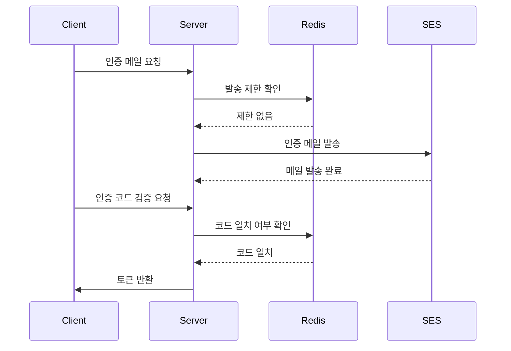

이 글에서는 AWS SES를 사용한 이메일 발송, Redis를 이용한 인증코드 저장 및 만료 관리, 일일 발송 및 인증 횟수 제한 구현 방법 등을 다룬다.

## 배경

기존 시대생 앱에서는 어카운트 서버를 사용한 포털 인증으로 유저가 재학생임을 확인하였다. 하지만 이번 프로젝트는 어카운트 서버를 사용하지 않기로 결정하였기 때문에 별도의 인증 기능을 구현해야 했다. 또한 올해 상반기에 포털이 개편되면서 SSO를 사용할 수 없게 되었다. 따라서 대학 웹메일 인증을 통해 재학생임을 확인하기로 했다.

## 요구사항 분석

**이메일 인증 기능의 주요 요구사항**은 다음과 같다:

- 사용자가 입력한 이메일로 인증코드를 발송한다.
- 사용자가 인증코드를 입력해 유효성을 검증한다.
- 이메일 주소는 반드시 `@uos.ac.kr` 도메인을 사용해야 한다.
- 인증코드는 일정 시간(10분)이 지나면 만료되어야 한다.
- 일일 이메일 발송 횟수(5회)와 인증코드 검증 시도 횟수(5회)를 제한한다.

## 기능 설계

1. **사용자 요청 흐름**:
    - **인증 메일 발송**
        - 사용자가 이메일 인증을 요청하면 서버에서 인증코드를 생성해 Redis에 저장한다.
        - 이후 AWS SES를 이용해 사용자가 입력한 이메일로 인증코드를 포함한 메일을 발송한다.
    - **인증 코드 검증**
        - 사용자가 인증코드를 입력하면 서버가 Redis에서 저장된 인증코드를 조회해 유효성을 검증한다.
        - 인증에 성공하면 Redis에서 관련 데이터를 삭제한다.
2. **주요 기술 스택**:
    - **AWS SES**: 인증 메일 발송용 서비스.
    - **Redis**: 인증코드 및 사용량 데이터 관리.

### Redis 사용

**선택한 이유**

- **속도와 효율성**: Redis는 인메모리 데이터 저장소로, 인증코드와 같은 **휘발성 데이터**를 빠르게 읽고 쓰기에 적합하다.
- **TTL 지원**: Redis의 TTL 기능을 통해 **인증코드 만료 시간**을 손쉽게 설정하고 관리할 수 있다.
- **단순한 키-값 구조**: 이메일 인증에서 필요한 **발송 횟수** 및 **인증 시도 횟수**를 관리하기에 적합하다.

**키 설계**

- `email_verification_code:{email}`: 인증 코드 저장 및 TTL 설정.
- `email_send_count:{email}:{date}`: 일일 발송 횟수 관리.
- `verification_attempts:{email}:{date}`: 일일 인증 시도 횟수 관리.

### 인증 프로세스



## 주요 기능 구현

### AWS SES 설정


AWS 콘솔에서 SES를 이용하는데 필요한 기본적인 설정은 이미 되어 있었기 때문에 IAM 사용자 생성 외에 추가적인 설정은 하지 않았다.

- `application.yml`

```yaml
aws:
    access-key-id: ${AWS_SES_ACCESS_KEY}
    secret-access-key: ${AWS_SES_SECRET_KEY}
    region: ap-northeast-2
    ses:
        email:
            title: UOSLIFE 인증 메일입니다.
            from: 시대생팀 <no-reply@uoslife.team>
```

- `AwsSesConfig.kt`

```kotlin
@Configuration
class AwsSesConfig(
    @Value("\${aws.access-key-id}") private val accessKeyId: String,
    @Value("\${aws.secret-access-key}") private val secretAccessKey: String,
    @Value("\${aws.region}") private val region: String
) {

    @Bean
    fun amazonSimpleEmailService(): AmazonSimpleEmailService {
        val awsCredentials = createAwsCredentials()
        return AmazonSimpleEmailServiceClientBuilder.standard()
            .withCredentials(AWSStaticCredentialsProvider(awsCredentials))
            .withRegion(region)
            .build()
    }

    private fun createAwsCredentials(): BasicAWSCredentials {
        return BasicAWSCredentials(accessKeyId, secretAccessKey)
    }
}
```

### Redis 설정

- `RedisConfig.kt`

```kotlin
@Configuration
class RedisConfig(
    @Value("\${spring.data.redis.host}") private val redisHost: String,
    @Value("\${spring.data.redis.port}") private val redisPort: Int,
) {

    @Bean
    fun redisConnectionFactory(): RedisConnectionFactory {
        return LettuceConnectionFactory(redisHost, redisPort)
    }

    @Bean
    fun redisTemplate(): RedisTemplate<String, Any> {
        return RedisTemplate<String, Any>().apply {
            setConnectionFactory(redisConnectionFactory())
            keySerializer = StringRedisSerializer()
            valueSerializer = StringRedisSerializer()
            hashKeySerializer = StringRedisSerializer()
            hashValueSerializer = StringRedisSerializer()
        }
    }
}
```

### 인증 메일 발송


- **API 엔드포인트**: `POST /api/verification/send-email`
- **구현 내용**:
    - 사용자가 입력한 이메일의 형식을 검증하고 `@uos.ac.kr` 도메인 여부를 확인한다.
    - **인증코드를 생성**하여 Redis에 저장하고 만료 시간을 설정한다.
    - AWS SES를 통해 사용자에게 인증코드가 포함된 **메일을 발송**한다.
    - **일일 발송 횟수**를 Redis를 통해 관리하고, 초과 시 에러를 반환한다.
- 관련 코드
    
  ```kotlin
  fun sendVerificationEmail(email: String): SendVerificationEmailResponse {
      // 이메일 형식 검증
      validateEmail(email)

      // 발송 제한 확인
      validateSendCount(email)

      // 인증 코드 생성 및 저장
      val verificationCode = generateVerificationCode()
      saveVerificationCode(email, verificationCode)

      // 발송 횟수 증가
      incrementSendCount(email)

      // 이메일 전송
      sendEmail(email, verificationCode)

      // 코드 만료 시각 계산
      val expirationTime = calculateExpirationTime()

      return SendVerificationEmailResponse(
          expirationTime = expirationTime,
          validDuration = codeExpiry
      )
  }
  ```
    
- 응답 예시
    
  ```json
  {
      "expirationTime": 1734123014092,
      "validDuration": 600
  }
  ```
    

### 인증 코드 검증

- **API 엔드포인트**: `POST /api/verification/verify-email`
- **구현 내용**:
    - 사용자가 입력한 이메일과 인증코드를 검증한다.
    - Redis에서 해당 이메일의 인증코드를 조회하고 만료 여부를 확인한다.
    - 검증 성공 시 Redis에서 인증코드를 삭제한다.
    - 인증 시도 횟수를 관리하여, 초과 시 에러를 반환한다.

**관련 코드**

```kotlin
fun verifyEmail(email: String, code: String) {
    // 인증 횟수 확인
    validateVerificationAttempts(email)
    incrementVerificationAttempts(email)

    // 인증 코드 검증
    val redisCode = getVerificationCode(email)
    validateVerificationCode(redisCode, code)

    // 인증 성공한 코드 삭제
    clearVerificationData(email)
}
```

### 사용량 제한 구현

**일일 발송 횟수 제한**

- Redis 키에 일일 발송 횟수를 저장하고 하루 뒤 만료되도록 설정하였다.
    
  ```kotlin
  private fun incrementSendCount(email: String) {
      val sendCountKey = VerificationUtils.generateRedisKey(VerificationConstants.SEND_COUNT_PREFIX, email, true)
      redisTemplate.opsForValue().increment(sendCountKey)
      redisTemplate.expire(sendCountKey, Duration.ofDays(1))
  }
  ```
    
- 예시
    
  ```
  127.0.0.1:6379> keys *
  1) "email_send_count:example@uos.ac.kr:20241212"
  ```
    
- 이후 이메일 전송 요청을 받으면 Redis에서 발송 횟수를 확인하였다.
    
  ```kotlin
  private fun validateSendCount(email: String) {
      val sendCountKey = generateRedisKey(SEND_COUNT_PREFIX, email, true)
      val currentCount = redisTemplate.opsForValue().get(sendCountKey)?.toString()?.toInt() ?: 0
      if (currentCount >= dailySendLimit) {
          throw DailyEmailSendLimitExceededException()
      }
  }
  ```
    

**일일 인증 시도 횟수 제한**

- 동일한 방식으로 인증 시도 횟수를 관리하였다.
- Redis 키에 일일 인증 시도 횟수를 저장하고 제한 초과 시 예외를 발생시키도록 하였다.
    
  ```kotlin
  private fun validateVerificationAttempts(email: String) {
      val attemptsKey =
          VerificationUtils.generateRedisKey(
              VerificationConstants.VERIFY_COUNT_PREFIX,
              email,
              true
          )
      val attempts = redisTemplate.opsForValue().get(attemptsKey)?.toString()?.toInt() ?: 0
      if (attempts >= codeVerifyLimit) {
          throw DailyVerificationAttemptLimitExceededException()
      }
  }
  ```
    

### 에러 처리


- **예외 상황**
    - **이메일 형식**이 잘못된 경우.
    - 이메일이 **대학 도메인**이 아닌 경우.
    - **일일 발송 한도**를 초과한 경우.
    - 인증 코드가 **일치하지 않는** 경우.
    - 인증코드가 **만료**된 경우.
    - **일일 인증 한도**를 초과한 경우.
- 에러코드 설정

  ```kotlin
  EMAIL_INVALID_FORMAT("E01", "Invalid email format.", HttpStatus.BAD_REQUEST.value()),
  EMAIL_INVALID_DOMAIN("E02", "Email domain is not allowed.", HttpStatus.BAD_REQUEST.value()),
  EMAIL_VERIFICATION_CODE_MISMATCH("E03", "Verification code does not match.", HttpStatus.BAD_REQUEST.value()),
  EMAIL_DAILY_SEND_LIMIT_EXCEEDED("E04", "Daily email send limit exceeded.", HttpStatus.TOO_MANY_REQUESTS.value()),
  EMAIL_DAILY_VERIFY_LIMIT_EXCEEDED("E05", "Daily verification attempt limit exceeded.", HttpStatus.TOO_MANY_REQUESTS.value()),
  EMAIL_SEND_FAILED("E06", "Failed to send email.", HttpStatus.INTERNAL_SERVER_ERROR.value()),
  EMAIL_VERIFICATION_CODE_EXPIRED("E06", "Verification code expired.", HttpStatus.BAD_REQUEST.value()),
  ```
    
- **예외 클래스 설정**
    
  ```kotlin
  class DailyEmailSendLimitExceededException :
      EmailLimitExceededException(ErrorCode.EMAIL_DAILY_SEND_LIMIT_EXCEEDED)
  ```
    

### 개발 중 겪은 문제

- **인증 메일 요청 시간 문제**: 비동기 처리를 적용하여 개선하였다. (다음 글에서 다룰 예정)
- 다양한 케이스의 예외를 구분하지 않음: 인증코드가 일치하지 않는 경우와 만료된 경우 등의 예외처리를 추가하였다.

## 마치며

이메일 인증 기능은 이번 시대팅 개발에서 제일 먼저 구현했던 기능이다. 이메일 전송 기능 자체는 SES API를 사용하여 간단하게 구현이 가능했지만 인증 코드 검증, 인증 제한 관리 등을 구현하는 과정에서 했던 다양한 고민이 의미있었던 것 같다.

### 추가 개선 방향

지금의 시스템은 보안성에 있어 강화의 여지가 있다. 우선 인증코드의 복잡성을 높이고 암호화하여 저장하는 방식을 도입할 수 있다. 또한 인증코드를 직접 입력하는 대신 인증 링크를 통해 이메일을 확인하는 방식도 고려해볼 만하다.

더불어 **악성 유저에 대한 대응책**도 강화할 필요가 있다. 현재는 **이메일 주소**별로 발송 횟수를 제한하고 있어 동일한 이메일로의 과도한 요청은 차단할 수 있다. 하지만 악의적인 사용자가 타인의(혹은 존재하지 않는) 이메일로 인증 요청을 보내는 경우는 차단하지 못한다.

이를 해결하기 위해 프로젝트 초기에 **IP 주소 기반**의 제한을 고려하였으나, 교내 와이파이 네트워크의 특성상 다수의 학생이 동일한 IP를 사용하는 상황에서는 유저를 구별하기 힘들고 정상적인 사용자들의 이용에도 불편이 생길 수 있다는 문제가 있어 도입하지 않기로 했었다. 하지만 **IP 주소와 User Agent 정보를 조합**한다면 유저를 충분히 구별할 수 있을 것이라 생각한다. 이를 통해 교내 네트워크 사용자들의 정상적인 이용은 보장하면서도 악성 유저의 비정상적인 요청 패턴을 감지하고 차단할 수 있을 것이다.

## 참고자료

- [Sending email through Amazon SES using an AWS SDK - Amazon Simple Email Service](https://docs.aws.amazon.com/ses/latest/dg/send-an-email-using-sdk-programmatically.html)
- [Spring - Redis를 사용해보자 — 개발하는 콩](https://green-bin.tistory.com/69)
- [Spring kotlin RedisTemplate 사용법 \| Yoon Sung's Blog](https://unluckyjung.github.io/spring/2023/03/11/spring-redisTemplate/)
