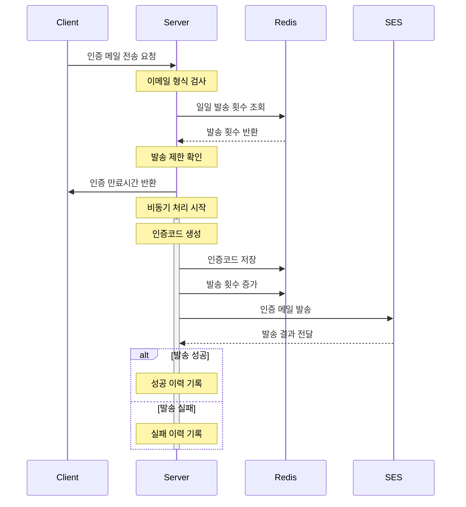

## 배경


_기존 API 호출 시간_

[기존 이메일 인증 기능](../sidaeting5-aws-ses-email-verification/)에서는 동기 처리 방식으로 인해 응답 시간이 길어지는 문제가 있었다. 이로 인해 사용자 경험이 저하되고 서버의 부담이 가중될 우려가 있었다. Amazon SES를 사용하여 인증 이메일을 전송하는 동안 API 요청이 차단되었고, 인증 코드 생성 및 Redis 저장 작업도 동기적으로 처리되어 전반적인 성능에 부정적인 영향을 미쳤다.

## 성능 문제 분석

1. **이메일 전송의 동기 처리**
    - Amazon SES API의 응답을 기다리는 동안 API 호출이 차단되었다.
    - 이메일 전송에 약 1초 이상의 시간이 소요되며, 이는 전체 API 응답 시간을 증가시키는 주요 요인이었다.
2. **순차적인 인증 코드 처리**
    - 인증 코드 생성과 Redis 저장 작업이 순차적으로 이루어지면서 블로킹이 발생하였다.
    - API 요청 하나가 처리되는 동안 다른 요청이 대기 상태에 놓이는 문제가 발생하였다.
3. **서버 자원의 비효율적 사용**
    - 동기 처리로 인해 서버 스레드가 불필요하게 점유되었다.

## 개선 사항

### 이메일 전송 비동기 처리

비동기 처리를 위해 Spring의 `@Async` 어노테이션을 사용하였다. `@Async`는 메서드 실행을 별도의 스레드에서 처리하도록 지원하는 기능으로, 이를 통해 이메일 전송 작업을 API 요청의 응답과 분리하여 동작하게 할 수 있다.

**비동기 처리의 원리**

- `@Async`는 Spring의 AOP(Aspect-Oriented Programming) 기반으로 동작하며, **별도의 스레드 풀**을 사용해 작업을 처리한다. 이는 호출자와 작업이 서로 다른 스레드에서 실행됨을 의미한다.
    - 호출 메서드는 기본적으로 메인 스레드에서 실행되고, `@Async`로 지정된 메서드는 스레드 풀 내의 다른 스레드에서 실행된다.
    - 결과적으로, 두 작업이 병렬적으로 실행되어 메인 스레드가 작업 완료를 기다릴 필요가 없다.
- 비동기 처리를 활성화하려면 `@EnableAsync` 어노테이션을 사용해야 한다. 이 어노테이션은 Spring이 비동기 메서드를 실행하기 위해 필요한 설정을 자동으로 처리한다.
    
  ```kotlin
  @EnableAsync
  class ServerMeetingApplication
  ```
    
- 스레드 풀은 `ThreadPoolTaskExecutor`를 기본 구현체로 사용하며, 이를 명시적으로 설정하면 비동기 작업의 성능과 안정성을 더욱 향상시킬 수 있다.
    - **Core Pool Size**: 스레드 풀에서 기본적으로 유지되는 스레드 개수.
    - **Max Pool Size**: 필요한 경우 생성될 수 있는 최대 스레드 개수.
    - **Queue Capacity**: 처리 대기 중인 작업의 허용 개수.
    
  ```kotlin
  @Configuration
  class AsyncConfig : AsyncConfigurer {
      override fun getAsyncExecutor(): Executor {
          val executor = ThreadPoolTaskExecutor()
          executor.corePoolSize = 5
          executor.maxPoolSize = 10
          executor.queueCapacity = 50
          executor.setThreadNamePrefix("CustomAsyncExecutor-")
          executor.initialize()
          return executor
      }
  }
  ```

**메일 전송 플로우차트**



**관련 코드**

```kotlin
@Service
class EmailVerificationService(
    ...
) {
    fun sendVerificationEmail(
        email: String,
        requestInfo: RequestInfoDto
    ): SendVerificationEmailResponse {

        // 이메일 형식 검증
        validateEmail(email)
        // 발송 제한 확인
        validateSendCount(email)
        // 비동기 이메일 전송
        val asyncResult = asyncEmailService.sendEmailAsync(email)

        asyncResult.whenComplete { _, exception ->
            if (exception != null) {
                logger.warn("[이메일 전송 실패] email: $email, $requestInfo")
            } else {
                logger.info("[이메일 전송 성공] email: $email, $requestInfo")
            }
        }
        // 코드 만료 시각 계산
        val expirationTime = VerificationUtils.calculateExpirationTime(codeExpiry)

        return SendVerificationEmailResponse(
            expirationTime = expirationTime,
            validDuration = codeExpiry
        )
    }
}
```

**주의사항**

**클래스 내부**에서 `@Async` 메서드를 호출할 경우, AOP 프록시가 적용되지 않아 **비동기로 실행되지 않는다.** 이를 해결하기 위해 `AsyncEmailService`를 별도의 빈으로 선언하고 외부에서 호출하도록 설계하였다.

```kotlin
@Service
class AsyncEmailService(
    ...
) {
    @Async
    fun sendEmailAsync(email: String): CompletableFuture<Unit> {
        return try {
            val verificationCode = VerificationUtils.generateVerificationCode()
            saveVerificationCode(email, verificationCode)
            sendEmail(email, verificationCode)
            incrementSendCount(email)
            CompletableFuture.completedFuture(Unit)
        } catch (exception: Exception) {
            CompletableFuture.failedFuture(exception)
        }
    }
}
```

**성능 개선 결과**

비동기 처리를 적용한 결과, API 응답 시간이 90% 이상 단축되었다.

- **기존 방식:** 1417ms
- **개선된 방식:** 136ms


_개선된 API 호출 시간_


### 기타 개선 사항

**로직 분리**

- 이메일 전송 관련 로직은 `AsyncEmailService`로 분리하여 비동기 처리와 관련된 코드를 별도로 관리하였다.
- 인증 관련 유틸리티 함수는 `VerificationUtils`로, 상수는 `VerificationConstants`로 분리하여 코드의 가독성과 재사용성을 향상시켰다.

```kotlin
object VerificationUtils {
    fun generateRedisKey(prefix: String, email: String, isDate: Boolean = false): String

    fun generateVerificationCode(): String

    fun calculateExpirationTime(codeExpiry: Long): Long
}
```

```kotlin
@Component
object VerificationConstants {
    const val CODE_PREFIX = "email_verification_code:"
    const val SEND_COUNT_PREFIX = "email_send_count"
    const val VERIFY_COUNT_PREFIX = "verification_attempts:"
    const val UOS_DOMAIN = "@uos.ac.kr"
}
```

## 결론

1. **성능 개선:** 이메일 전송 비동기 처리를 통해 API 응답 시간을 단축시켰다.
2. **안정성 향상:** 비동기 작업 실패 시 로깅 및 재처리 기능을 추가하여 신뢰성을 확보하였다.
3. **코드 구조 개선:** 로직 분리와 유틸리티화를 통해 코드 유지보수가 용이하도록 하였다.

## 참고자료

- [Getting Started \| Creating Asynchronous Methods](https://spring.io/guides/gs/async-method/)
- [Common mistakes to avoid when using @Async in Spring \| by Swastik \| Medium](https://medium.com/@kswastik29/common-mistakes-to-avoid-when-using-async-in-spring-1eef0e8d15fb)
- [[Spring] @Async와 스레드풀 — 좋은 경험 훔쳐먹기](https://xxeol.tistory.com/44)