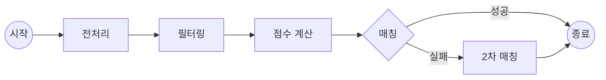

## 들어가며

이번 시대팅 시즌5에서 중요한 역할을 한 매칭 알고리즘의 개발 과정을 공유하고자 한다. 이번에는 1대1 매칭과 3대3 매칭으로 역할을 나누어 개발을 진행했으며, 나는 그중 **1대1 매칭 알고리즘** 개발을 담당했다. 특히 이번 개발은 이전 시즌(시즌4) 알고리즘을 리팩토링하고 새로운 요구사항을 반영하는 데 중점을 두었다. 이 글에서는 1대1 매칭 알고리즘의 개발 과정, 주요 변경 사항, 그리고 개선해야 할 부분들을 자세히 논하고자 한다.

### 매칭 절차


_시대팅 매칭 절차_

시대팅의 매칭은 신청기간동안 참가 신청을 한 사용자들의 데이터를 추출하여 로컬 환경에서 매칭 알고리즘을 실행한 뒤, 실행 결과를 다시 데이터베이스에 저장하는 방식으로 진행된다.

## 요구사항 분석


_선호 항목 질문 페이지_

이번 시즌에는 신청자들로부터 아래의 일곱 가지 항목의 선호 정보를 받도록 하였다.

1. **얼굴상(appearance)**: 또렷/중간/순한 중에서 중복 선택
2. **쌍꺼풀(eyelid)**: 유쌍/속쌍/무쌍 중에서 중복 선택
3. **나이(age)**: -5/-3/동갑/+3/+5 중 최소, 최대를 선택
4. **키(height)**: 150~190 범위에서 10 단위로 선택
5. **흡연(smoking)**: 연초/전자담배/비흡연 중에서 중복 선택
6. **MBTI(mbti)**: I/E, N/S, T/F, P/J 중에서 중복 선택
7. **기피 대상**: 기피학과(avoidanceDepartment), 기피학번(avoidanceNumber)

### 이전 시즌과의 차이점

시즌4에서는 유저가 응답한 모든 항목들에 대해 100% 만족하는 상대를 매칭시켜주도록 **모든 항목에 대해 필터링**을 적용했다. 즉, 모든 항목을 만족하지 않는다면 매칭 상대에서 제외되는 방식이었다. 하지만 이러한 방식은 매칭 성공률을 낮출 가능성이 존재한다.

따라서 이번 시즌에는 유저가 응답한 항목들은 **점수 계산에만 반영**되도록 하였다. 또한 유저가 가장 중요하다고 선택한 한 가지 항목에 대해서는 점수 계산시 **가중치를 부여**하여 계산하도록 하였다.


### 요구사항 변경

위의 요구사항에 따라 알고리즘을 개발한 결과, 유저가 선택했던 **핵심 항목이 매칭 시에 충분히 반영되지 않는 문제**가 발생하였다. 해당 알고리즘으로 모의 데이터를 매칭한 결과를 분석해보니 이러한 문제점이 두드러졌다. 그래서 핵심 항목을 필터링에 포함하는 방식으로 알고리즘을 수정하였는데, 매칭 품질이 크게 향상되었다.


_알고리즘별 매칭 품질 분석_

이에 요구사항의 변경이 필요하다고 판단하여 슬랙에 **요구사항 변경을 제안**하는 글을 게시하였다. 주된 내용은 **핵심 항목 필터링**과 **가중치 강화**의 필요성이었다. 팀원들은 요구사항 변경에 동의하였지만, 한편으로는 **매칭 성공률이 감소**하고 **핵심 항목 외의 항목이 적게 반영**될 것을 우려하였다. 따라서 가중치는 기존의 3에서 지나치게 높이지 않도록 4로 조정하였고, 첫 번째 매칭에서 실패한 인원들을 대상으로 한 **2차 매칭**을 추가하였다.


_요구사항 변경 제안_

## 매칭 알고리즘 구현

### 전체 로직



### 1차 매칭

1. **전처리**
    1. 여러 항목이 쉼표로 구분된 문자열을 리스트로 변환한다.
    2. 문자열 값을 숫자로 변환한다.
    
  ```python
  def preprocessing(df):
      df['prefer_appearance'] = df['prefer_appearance'].apply(
          lambda x: x.split(','))
  
      df['height'] = pd.to_numeric(df['height'], errors='coerce')
  ```
    
2. **필터링**
    1. 핵심 선호 항목을 만족하지 않거나 기피 대상인 유저를 필터링한다.
        
        ```python
        def filter_by_avoidance(user, potential_match):
            return not (
                (potential_match['department'] == user['prefer_avoidance_department'] and
                 str(potential_match['student_number']) == str(user['prefer_avoidance_number']))
            )
        
        filtering_functions = {
            'age': filter_by_age,
            'height': filter_by_height,
            'appearance': filter_by_appearance,
            'eyelid': filter_by_eyelid,
            'smoking': filter_by_smoking,
            'mbti': filter_by_mbti
        }
        
        def find_matches(user, potential_matches):
            user_prefer_weight = user['prefer_weight']
            matches = potential_matches[
                potential_matches.apply(lambda x:
                                        filter_by_avoidance(user, x) and
                                        (user_prefer_weight not in filtering_functions or
                                         filtering_functions[user_prefer_weight](user, x)),
                                        axis=1)]
            return matches['team_id'].tolist() if not matches.empty else []
        ```
        
    2. **상호 선호도 확인**: 남녀 양쪽 모두 서로를 매칭 대상으로 선택했는지 확인한다.
        
        ```python
        for man in list(men_preferences.keys()):
            men_preferences[man] = [woman for woman in men_preferences[man]
                                    if man in women_preferences.get(woman, [])]
            if not men_preferences[man]:
                del men_preferences[man]
        ```
        
3. **점수 계산**
    1. 선호 항목 만족 여부를 고려하여 점수를 계산한다.
        
        ```python
        def scoring(pivot, other):
            score = 0
        
            # 얼굴상 매칭
            if other['appearance'] in pivot['prefer_appearance']:
                score += 1
        
            # 쌍꺼풀 매칭
            if other['eyelid'] in pivot['prefer_eyelid']:
                score += 1
        ```
        
    2. 점수를 기준으로 상대방을 정렬한다.
        
        ```python
        for team_id in men_preferences:
            scored_preferences = [
                (scoring(
                    df_m.loc[df_m["team_id"] == team_id].iloc[0],
                    df_w.loc[df_w["team_id"] == woman_team_id].iloc[0]
                ), woman_team_id)
                for woman_team_id in men_preferences[team_id]
            ]
            men_preferences[team_id] = [
                id for _, id in sorted(scored_preferences, reverse=True)]
        ```
        
4. **매칭**
    1. Hospital Resident 알고리즘을 적용하여 매칭을 진행한다.
        
        ```python
        from matching.games import HospitalResident
        
        game = HospitalResident.create_from_dictionaries(
            men_preferences, women_preferences, capacities)
        matching = game.solve()
        ```
        
    2. 매칭 결과를 데이터프레임으로 저장한다.
        
        ```python
        result = [[male_id, female_id] for female_id, male_ids in matching.items() for male_id in male_ids]
        result_df = pd.DataFrame(result, columns=['male_team_id', 'female_team_id'])
        ```
        

### 2차 매칭

1. **매칭 대상자 선별**: 1차 매칭에서 매칭에 실패한 유저를 선별한다.
    
    ```python
    result_df['female_team_id'] = result_df['female_team_id'].astype(str)
    df_w['team_id'] = df_w['team_id'].astype(str)
    
    result_df['male_team_id'] = result_df['male_team_id'].astype(str)
    df_m['team_id'] = df_m['team_id'].astype(str)
    
    matched_men = set(result_df['male_team_id'].tolist())
    matched_women = set(result_df['female_team_id'].tolist())
    
    unmatched_men = df_m[~df_m['team_id'].isin(matched_men)].copy()
    unmatched_women = df_w[~df_w['team_id'].isin(matched_women)].copy()
    ```
    
2. **필터링**: 기피 대상에 대해서만 필터링을 적용한다.
3. **점수 계산**: 선호 항목 만족 여부에 따라 점수를 계산한다. 핵심 선호 항목은 가중치를 부여해서 계산한다.
    
    ```python
    def second_round_scoring(pivot, other):
        score = 0
        total_weights = 0
    
        weights = {
            'appearance': 1,
            'eyelid': 1,
            'age': 1,
            'height': 1,
            'smoking': 1,
            'mbti': 1
        }
    
        # 유저가 선택한 조건에 가중치 부여
        prefer_weight = pivot['prefer_weight'].lower()
        if prefer_weight in weights:
            weights[prefer_weight] *= WEIGHT_MULTIPLIER
    ```
    
4. **매칭**: 매칭 결과를 데이터프레임으로 변환한 후 기존 결과와 합쳐 csv 파일로 저장한다.
    
    ```python
    second_result = [[male_id, female_id]
                     for female_id, male_ids in second_matching.items() for male_id in male_ids]
    second_result_df = pd.DataFrame(
        second_result, columns=['male_team_id', 'female_team_id'])
    
    final_result_df = pd.concat([result_df, second_result_df])
    final_result_df.to_csv("../output/single_match_result.csv", index=False)
    ```
    

## 마치며

이번 매칭 알고리즘 개발을 통해 당초 목표로 하였던 **여성 매칭률 100%**를 1대1 매칭과 3대3 매칭 모두에서 달성했고, **핵심 항목 반영률** 또한 100%를 기록하며 높은 만족도를 이끌어냈다. 구체적인 통계는 다음과 같다.

- **1대1 매칭:** 신청 716명 (남성 540명, 여성 176명), 매칭 176건. 남성 매칭률 32.59%, 여성 매칭률 100.00%.
- **3대3 매칭:** 신청 318명 (남성 80팀, 여성 26팀), 매칭 26건. 남성 매칭률 32.50%, 여성 매칭률 100.00%.
- **만족도:** 선호사항 반영률: 96.97%, 핵심 항목 반영률: 100%.

특히, **2단계 매칭** 도입은 만족도 향상에 크게 기여했다. 이를 통해 전체 항목 반영률은 0.7%, 핵심 항목 반영률은 5%가 추가적으로 상승하는 효과를 보였으며, 궁극적으로 남녀 모두의 만족도를 높이는데 성공했다.


이번 프로젝트를 통해 기존 코드를 리팩토링하는 귀중한 경험을 할 수 있었다. 기존 코드를 분석하고 새로운 요구사항에 맞춰 수정하는 과정은 평소에 하기 힘든 경험이었기에 더욱 의미있었다. 또한 시대팅의 핵심 기능인 매칭에 직접적으로 관여하여 실제 사용자들에게 영향을 미치는 경험은 정말 흥미로웠다.

### 개선 과제

하지만 이번 매칭 알고리즘 개발은 몇 가지 개선의 여지도 존재한다. 우선 **알고리즘 효율성** 측면에서의 개선이 필요하다. 또한 **매칭 성공률의 편중 문제**도 존재한다. 매칭 후반부에 신청한 유저들의 성공률이 초반부에 비해 월등히 높게 나타났다. 이는 Hospital-Resident 알고리즘의 입력 순서 의존성을 포함하여 다양한 요인이 복합적으로 작용한 결과로 보인다.


_구간별 매칭 성공률 (좌측 상단)_

다음 시즌에는 이러한 문제점을 해결하기 위해 다음과 같은 개선 방향을 고려하면 좋을 것 같다.

- **매칭 순서 랜덤화**
  - 신청 순서에 따른 영향을 줄이기 위해 유저를 랜덤하게 섞은 후 매칭을 진행해야 한다. 이를 통해 신청 순서에 따른 성공률의 차이를 완화시킬 수 있다.
- **선호도 집계 방식 개선**
  - 단순히 선호도 목록을 정렬하는 방식 대신, 각 유저별 **선호도 점수를 함께 반영**하는 방식을 고려해볼 수 있다. 이를 통해 각 매칭 후보별로 선호의 강도를 정확하게 반영할 수 있다.
- **매칭 알고리즘 고도화**
  - Hospital-Resident 알고리즘 외에 다른 매칭 알고리즘을 적용하거나, 알고리즘 자체를 개선하여 매칭 효율성을 높이는 방법을 연구해야 한다.

### 신청자 통계

이번 시즌 신청자 통계는 다음과 같다. 재밌었던 점은 남녀 모두 선호 MBTI로 ENFJ를 가장 많이 선택했다는 사실이다. 핵심 항목으로는 남성의 경우 얼굴상(또렷/중간/순한)을, 여성은 키를 가장 많이 선택했다. 참가자 학번은 예상대로 1학년인 24학번이 제일 많았으나, 2, 3등이 각각 21학번과 20학번으로 나타났다.

**남성**

- 평균 키: 175.4cm
- 평균 나이: 23.8세
- 선호 얼굴상: 중간
- 선호 쌍꺼풀: 유쌍
- 선호 MBTI: ENFJ
- 핵심 항목 선택 Top 3: 얼굴상(33%), 흡연 여부(21%), 나이(19%)

**여성**

- 평균 키: 162.5cm
- 평균 나이: 22.5세
- 선호 얼굴상: 중간
- 선호 쌍꺼풀: 속쌍
- 선호 MBTI: ENFJ
- 핵심 항목 선택 Top 3: 키(45%), 나이(18%), 흡연 여부(17%)

**전체**

- 주요 학번 Top 3: 24학번, 21학번, 20학번
- 주요 학과 Top 3: 경영학부, 전자전기컴퓨터공학부, 경제학부


_유저들이 작성한 데이트 코스를 워드클라우드로 분석한 결과_